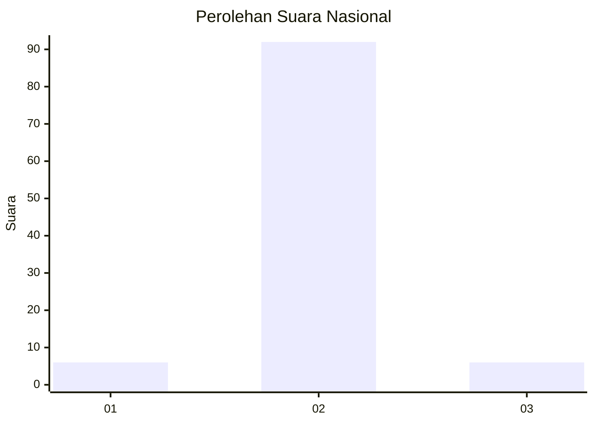
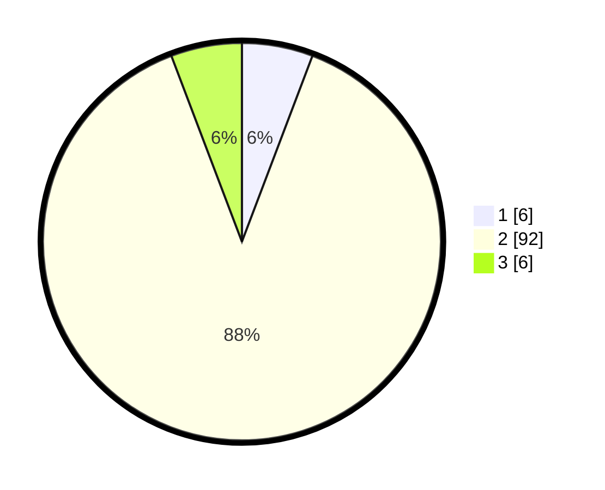

# Hasil

## Grafik

## Tabel

| No.    | Nama Paslon    | Suara | Suara (raw) | Persentase |
|:------ |:-------------- | -----:| -----------:| ----------:|
| 100025 | ANIES MUHAIMIN | 6     | [6][p-1]    | 5,77       |
| 100026 | PRABOWO GIBRAN | 92    | [92][p-2]   | 88,46      |
| 100027 | GANJAR MAHFUD  | 6     | [6][p-3]    | 5,77       |

[p-1]: https://github.com/gigit-pemilu/pemilu-2024/blob/main/pilpres/hitung-suara/sub/31-dki-jakarta/sub/73-jakarta-barat/sub/06-kalideres/sub/1005-pegadungan/sub/250-tps/sub/paslon-1.txt
[p-2]: https://github.com/gigit-pemilu/pemilu-2024/blob/main/pilpres/hitung-suara/sub/31-dki-jakarta/sub/73-jakarta-barat/sub/06-kalideres/sub/1005-pegadungan/sub/250-tps/sub/paslon-2.txt
[p-3]: https://github.com/gigit-pemilu/pemilu-2024/blob/main/pilpres/hitung-suara/sub/31-dki-jakarta/sub/73-jakarta-barat/sub/06-kalideres/sub/1005-pegadungan/sub/250-tps/sub/paslon-3.txt

## Foto C Plano

https://sirekap-obj-formc.kpu.go.id/0f01/pemilu/ppwp/31/73/06/10/05/3173061005250-20240214-200452--2d86f7d2-1b9a-41bf-8e40-f97c2f10cc5c.jpg

https://sirekap-obj-formc.kpu.go.id/0f01/pemilu/ppwp/31/73/06/10/05/3173061005250-20240214-200541--1ef49140-9985-4ae9-a748-73b1a91bd69a.jpg

https://sirekap-obj-formc.kpu.go.id/0f01/pemilu/ppwp/31/73/06/10/05/3173061005250-20240214-200622--ca0bde19-567d-4348-9ee7-5a9003370409.jpg

## Metadata

| Key        | Value               |
| ---------- | ------------------- |
| Time Stamp | 2024-02-19 16:00:00 |

