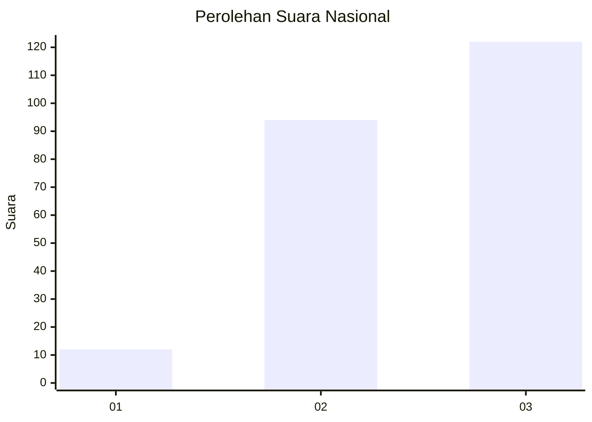
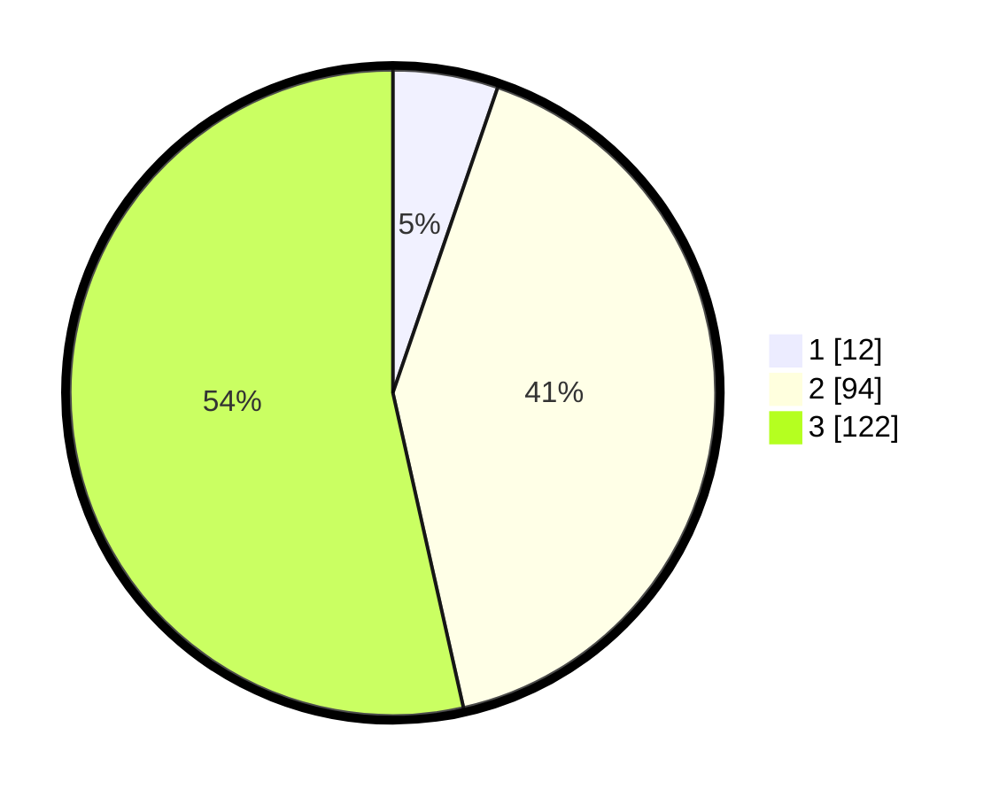

# Hasil

## Grafik

## Tabel

| No.    | Nama Paslon    | Suara | Suara (raw) | Persentase |
|:------ |:-------------- | -----:| -----------:| ----------:|
| 100025 | ANIES MUHAIMIN | 12    | [12][p-1]   | 5,26       |
| 100026 | PRABOWO GIBRAN | 94    | [94][p-2]   | 41,23      |
| 100027 | GANJAR MAHFUD  | 122   | [122][p-3]  | 53,51      |

[p-1]: https://github.com/gigit-pemilu/pemilu-2024/blob/main/pilpres/hitung-suara/sub/31-dki-jakarta/sub/73-jakarta-barat/sub/06-kalideres/sub/1005-pegadungan/sub/260-tps/sub/paslon-1.txt
[p-2]: https://github.com/gigit-pemilu/pemilu-2024/blob/main/pilpres/hitung-suara/sub/31-dki-jakarta/sub/73-jakarta-barat/sub/06-kalideres/sub/1005-pegadungan/sub/260-tps/sub/paslon-2.txt
[p-3]: https://github.com/gigit-pemilu/pemilu-2024/blob/main/pilpres/hitung-suara/sub/31-dki-jakarta/sub/73-jakarta-barat/sub/06-kalideres/sub/1005-pegadungan/sub/260-tps/sub/paslon-3.txt

## Foto C Plano

https://sirekap-obj-formc.kpu.go.id/a551/pemilu/ppwp/31/73/06/10/05/3173061005260-20240214-222441--263fa781-8464-4a67-9714-666ee4da089f.jpg

https://sirekap-obj-formc.kpu.go.id/a551/pemilu/ppwp/31/73/06/10/05/3173061005260-20240214-222543--9a2ad3c2-d020-4c03-99f6-42298914bb7d.jpg

https://sirekap-obj-formc.kpu.go.id/a551/pemilu/ppwp/31/73/06/10/05/3173061005260-20240214-222636--11114090-e3cd-41ea-91e4-df82198db145.jpg

## Metadata

| Key        | Value               |
| ---------- | ------------------- |
| Time Stamp | 2024-02-19 15:00:00 |

