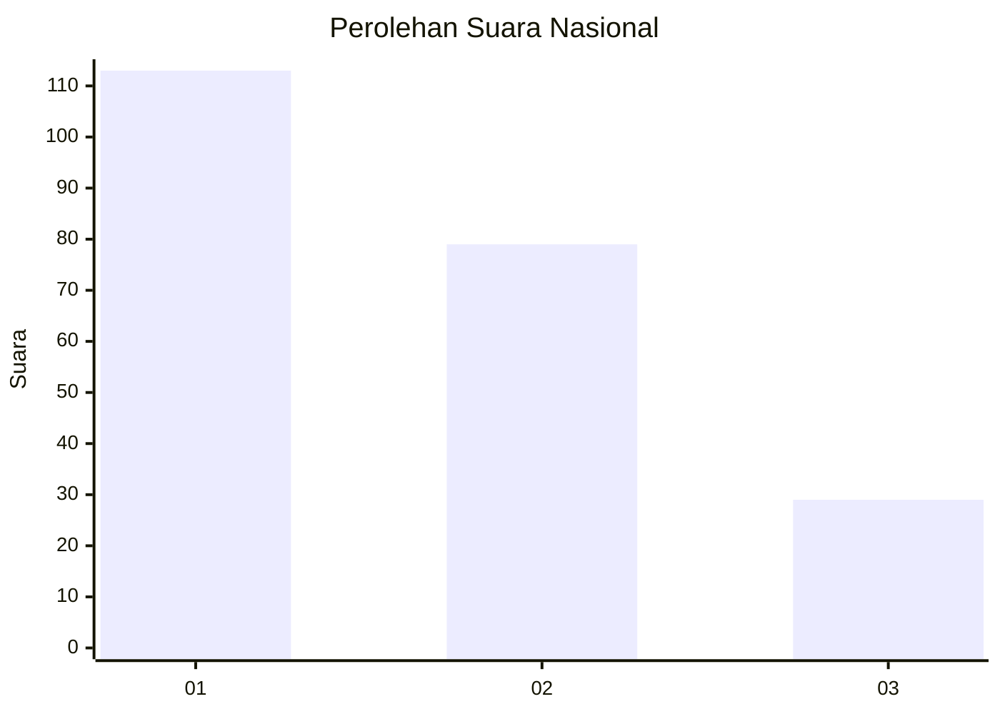
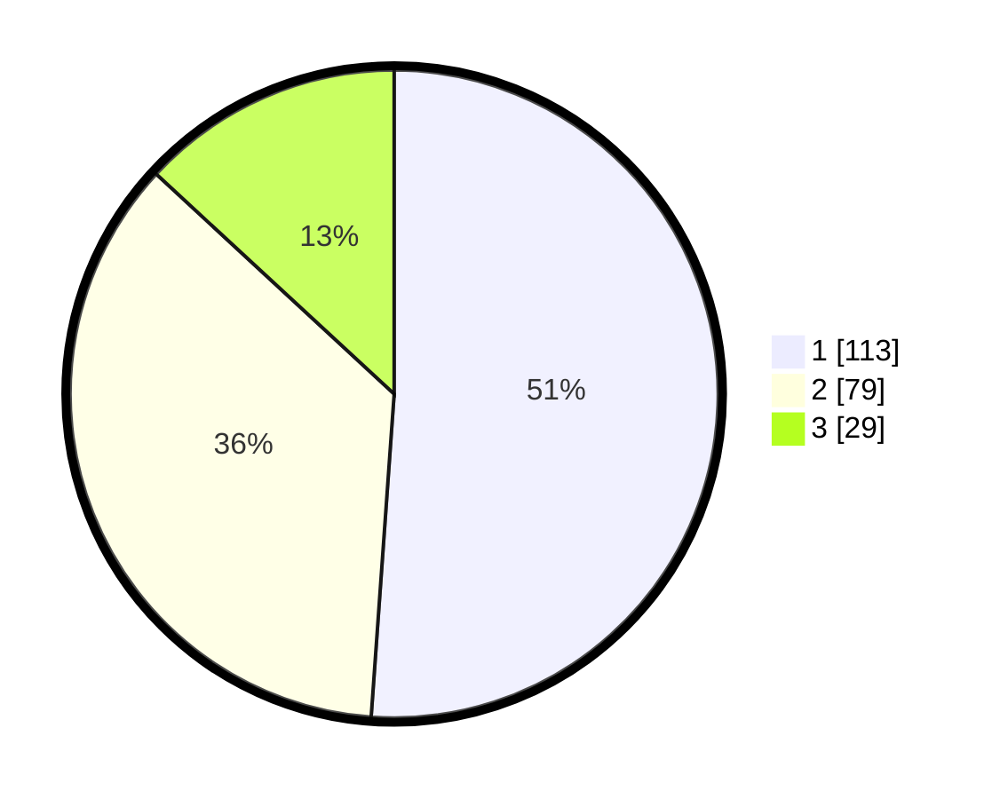

# Hasil

## Grafik

## Tabel

| No.    | Nama Paslon    | Suara | Suara (raw) | Persentase |
|:------ |:-------------- | -----:| -----------:| ----------:|
| 100025 | ANIES MUHAIMIN | 113   | [113][p-1]  | 51,13      |
| 100026 | PRABOWO GIBRAN | 79    | [79][p-2]   | 35,75      |
| 100027 | GANJAR MAHFUD  | 29    | [29][p-3]   | 13,12      |

[p-1]: https://github.com/gigit-pemilu/pemilu-2024/blob/main/pilpres/hitung-suara/sub/31-dki-jakarta/sub/73-jakarta-barat/sub/07-pal-merah/sub/1001-palmerah/sub/006-tps/sub/paslon-1.txt
[p-2]: https://github.com/gigit-pemilu/pemilu-2024/blob/main/pilpres/hitung-suara/sub/31-dki-jakarta/sub/73-jakarta-barat/sub/07-pal-merah/sub/1001-palmerah/sub/006-tps/sub/paslon-2.txt
[p-3]: https://github.com/gigit-pemilu/pemilu-2024/blob/main/pilpres/hitung-suara/sub/31-dki-jakarta/sub/73-jakarta-barat/sub/07-pal-merah/sub/1001-palmerah/sub/006-tps/sub/paslon-3.txt

## Foto C Plano

https://sirekap-obj-formc.kpu.go.id/d1e1/pemilu/ppwp/31/73/07/10/01/3173071001006-20240214-160120--cd1cd8df-a9bc-4f4e-96bc-1732856c9fad.jpg

https://sirekap-obj-formc.kpu.go.id/d1e1/pemilu/ppwp/31/73/07/10/01/3173071001006-20240214-160054--c4595647-ea6d-447f-b673-e0bcf2f8744b.jpg

https://sirekap-obj-formc.kpu.go.id/d1e1/pemilu/ppwp/31/73/07/10/01/3173071001006-20240214-155249--e499d6f9-8170-43df-8bfe-1014cd84ad02.jpg

## Metadata

| Key        | Value               |
| ---------- | ------------------- |
| Time Stamp | 2024-02-15 23:29:50 |

