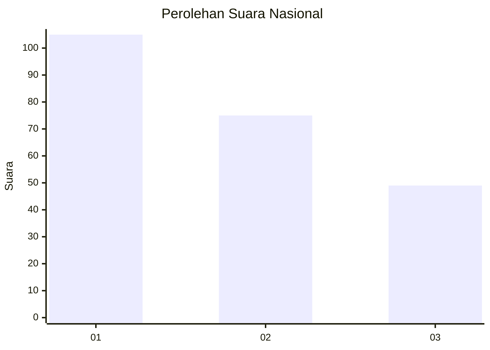
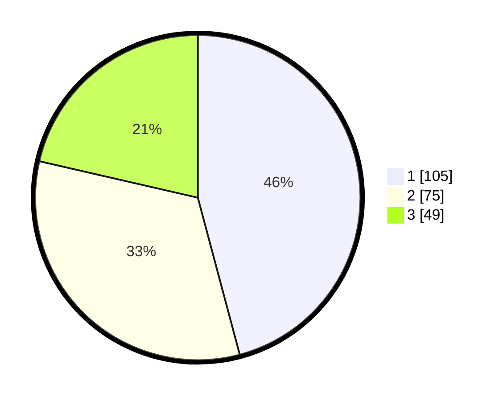

# Hasil

## Grafik

## Tabel

| No.    | Nama Paslon    | Suara | Suara (raw) | Persentase |
|:------ |:-------------- | -----:| -----------:| ----------:|
| 100025 | ANIES MUHAIMIN | 105   | [105][p-1]  | 45,85      |
| 100026 | PRABOWO GIBRAN | 75    | [75][p-2]   | 32,75      |
| 100027 | GANJAR MAHFUD  | 49    | [49][p-3]   | 21,40      |

[p-1]: https://github.com/gigit-pemilu/pemilu-2024/blob/main/pilpres/hitung-suara/sub/31-dki-jakarta/sub/73-jakarta-barat/sub/07-pal-merah/sub/1001-palmerah/sub/008-tps/sub/paslon-1.txt
[p-2]: https://github.com/gigit-pemilu/pemilu-2024/blob/main/pilpres/hitung-suara/sub/31-dki-jakarta/sub/73-jakarta-barat/sub/07-pal-merah/sub/1001-palmerah/sub/008-tps/sub/paslon-2.txt
[p-3]: https://github.com/gigit-pemilu/pemilu-2024/blob/main/pilpres/hitung-suara/sub/31-dki-jakarta/sub/73-jakarta-barat/sub/07-pal-merah/sub/1001-palmerah/sub/008-tps/sub/paslon-3.txt

## Foto C Plano

https://sirekap-obj-formc.kpu.go.id/7ed4/pemilu/ppwp/31/73/07/10/01/3173071001008-20240214-220119--2a18f01b-5544-40cb-8e39-2036c4ca7125.jpg

https://sirekap-obj-formc.kpu.go.id/7ed4/pemilu/ppwp/31/73/07/10/01/3173071001008-20240214-215147--0e0b06df-1387-4b43-abc8-d43c7bc8daab.jpg

https://sirekap-obj-formc.kpu.go.id/7ed4/pemilu/ppwp/31/73/07/10/01/3173071001008-20240214-220015--b23ec3a8-11b7-4805-975b-1623433680e2.jpg

## Metadata

| Key        | Value               |
| ---------- | ------------------- |
| Time Stamp | 2024-02-16 02:00:27 |

