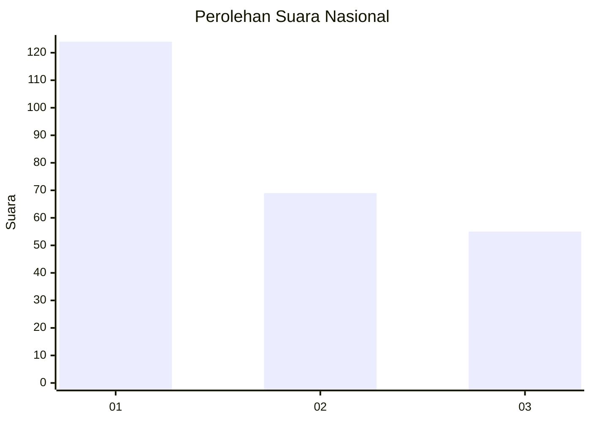
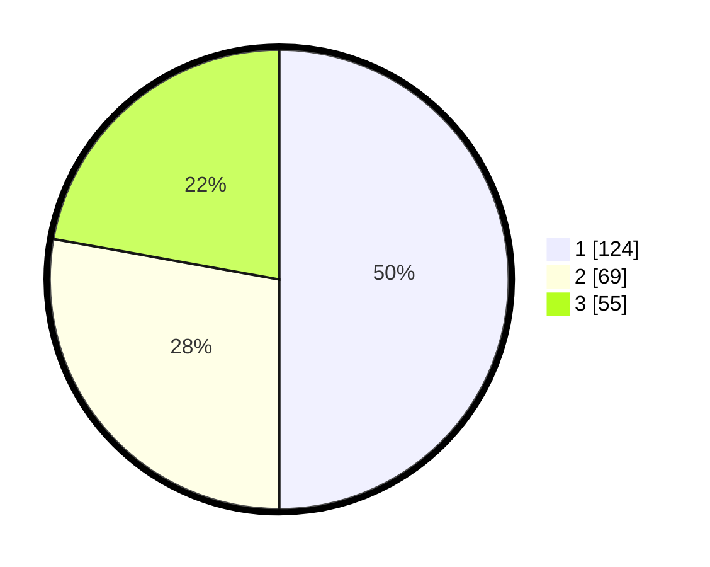

# Hasil

## Grafik

## Tabel

| No.    | Nama Paslon    | Suara | Suara (raw) | Persentase |
|:------ |:-------------- | -----:| -----------:| ----------:|
| 100025 | ANIES MUHAIMIN | 124   | [124][p-1]  | 50,00      |
| 100026 | PRABOWO GIBRAN | 69    | [69][p-2]   | 27,82      |
| 100027 | GANJAR MAHFUD  | 55    | [55][p-3]   | 22,18      |

[p-1]: https://github.com/gigit-pemilu/pemilu-2024/blob/main/pilpres/hitung-suara/sub/31-dki-jakarta/sub/73-jakarta-barat/sub/07-pal-merah/sub/1001-palmerah/sub/013-tps/sub/paslon-1.txt
[p-2]: https://github.com/gigit-pemilu/pemilu-2024/blob/main/pilpres/hitung-suara/sub/31-dki-jakarta/sub/73-jakarta-barat/sub/07-pal-merah/sub/1001-palmerah/sub/013-tps/sub/paslon-2.txt
[p-3]: https://github.com/gigit-pemilu/pemilu-2024/blob/main/pilpres/hitung-suara/sub/31-dki-jakarta/sub/73-jakarta-barat/sub/07-pal-merah/sub/1001-palmerah/sub/013-tps/sub/paslon-3.txt

## Foto C Plano

https://sirekap-obj-formc.kpu.go.id/36e3/pemilu/ppwp/31/73/07/10/01/3173071001013-20240215-011221--a9a1c5e2-0224-4cf6-aebd-064868235612.jpg

https://sirekap-obj-formc.kpu.go.id/36e3/pemilu/ppwp/31/73/07/10/01/3173071001013-20240215-011345--e31682d8-d97d-4095-bb74-3ecef89365a5.jpg

https://sirekap-obj-formc.kpu.go.id/36e3/pemilu/ppwp/31/73/07/10/01/3173071001013-20240215-011629--3f6e75cd-a298-456e-b9c8-7703c61be1f7.jpg

## Metadata

| Key        | Value               |
| ---------- | ------------------- |
| Time Stamp | 2024-02-17 18:00:00 |

