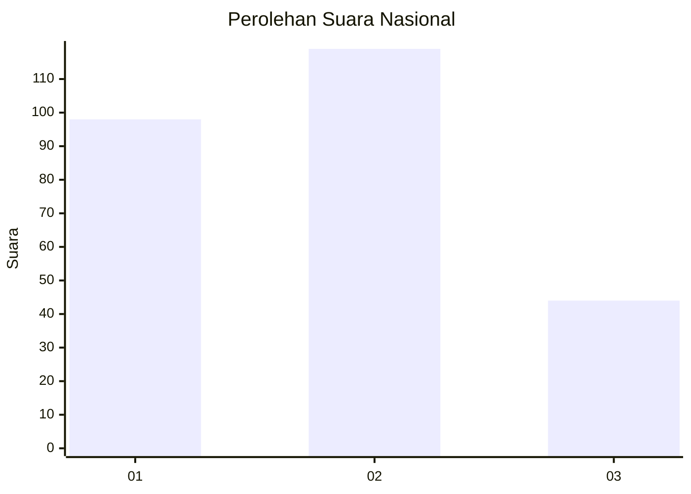
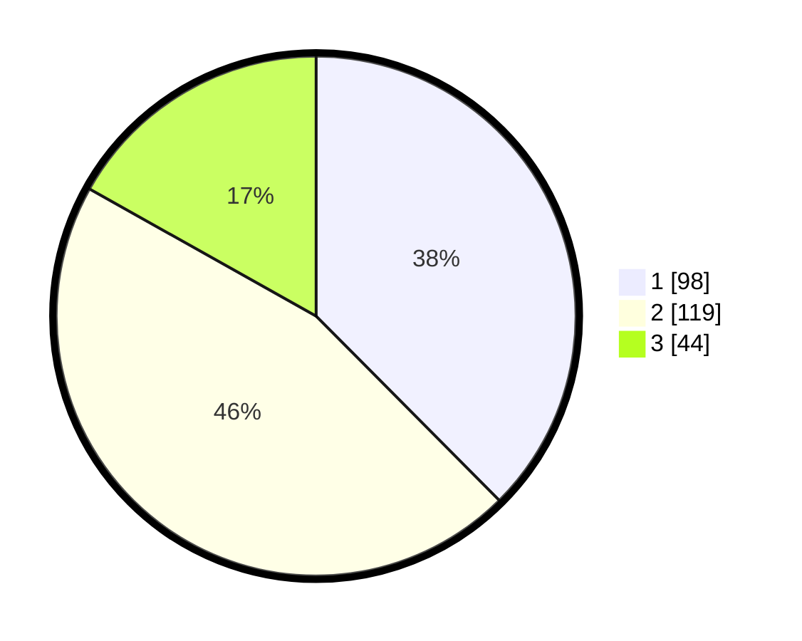

# Hasil

## Grafik

## Tabel

| No.    | Nama Paslon    | Suara | Suara (raw) | Persentase |
|:------ |:-------------- | -----:| -----------:| ----------:|
| 100025 | ANIES MUHAIMIN | 98    | [98][p-1]   | 37,55      |
| 100026 | PRABOWO GIBRAN | 119   | [119][p-2]  | 45,59      |
| 100027 | GANJAR MAHFUD  | 44    | [44][p-3]   | 16,86      |

[p-1]: https://github.com/gigit-pemilu/pemilu-2024/blob/main/pilpres/hitung-suara/sub/31-dki-jakarta/sub/73-jakarta-barat/sub/07-pal-merah/sub/1001-palmerah/sub/016-tps/sub/paslon-1.txt
[p-2]: https://github.com/gigit-pemilu/pemilu-2024/blob/main/pilpres/hitung-suara/sub/31-dki-jakarta/sub/73-jakarta-barat/sub/07-pal-merah/sub/1001-palmerah/sub/016-tps/sub/paslon-2.txt
[p-3]: https://github.com/gigit-pemilu/pemilu-2024/blob/main/pilpres/hitung-suara/sub/31-dki-jakarta/sub/73-jakarta-barat/sub/07-pal-merah/sub/1001-palmerah/sub/016-tps/sub/paslon-3.txt

## Foto C Plano

https://sirekap-obj-formc.kpu.go.id/ffd9/pemilu/ppwp/31/73/07/10/01/3173071001016-20240214-230555--d70b5d01-c22d-442c-bf37-d515a05f1b29.jpg

https://sirekap-obj-formc.kpu.go.id/ffd9/pemilu/ppwp/31/73/07/10/01/3173071001016-20240214-230711--a525fe12-578a-45d0-829f-05e607362876.jpg

https://sirekap-obj-formc.kpu.go.id/ffd9/pemilu/ppwp/31/73/07/10/01/3173071001016-20240214-230836--c3771ce4-775a-4272-a29e-589fe1512c7e.jpg

## Metadata

| Key        | Value               |
| ---------- | ------------------- |
| Time Stamp | 2024-02-19 06:16:00 |

