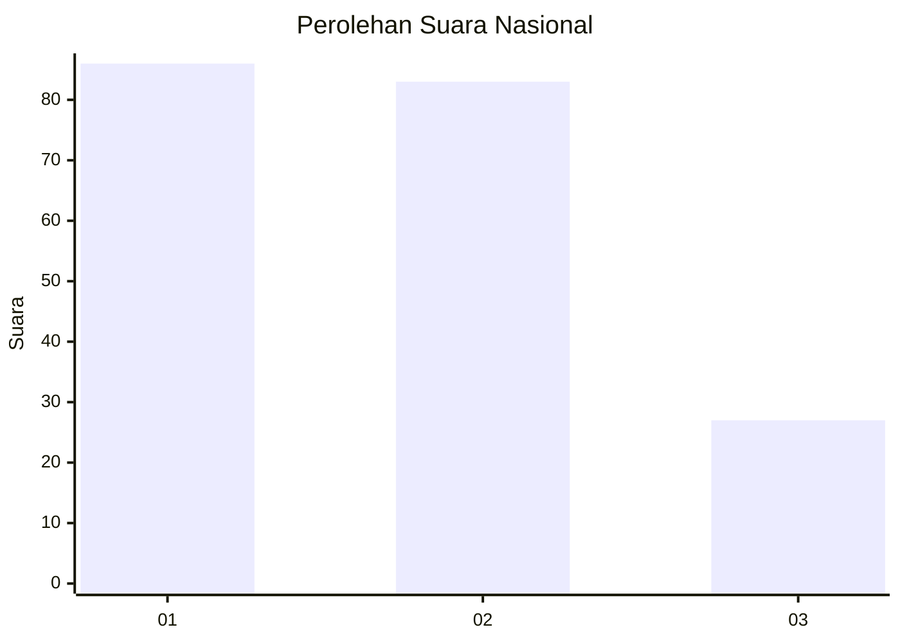
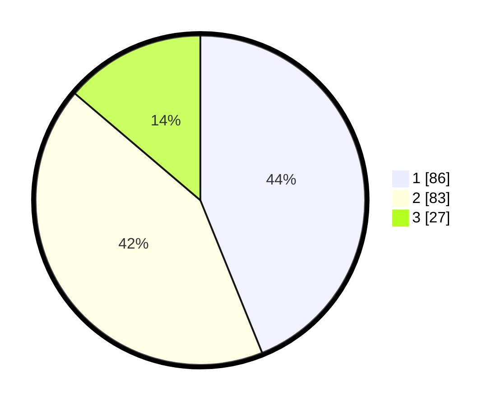

# Hasil

## Grafik

## Tabel

| No.    | Nama Paslon    | Suara | Suara (raw) | Persentase |
|:------ |:-------------- | -----:| -----------:| ----------:|
| 100025 | ANIES MUHAIMIN | 86    | [86][p-1]   | 43,88      |
| 100026 | PRABOWO GIBRAN | 83    | [83][p-2]   | 42,35      |
| 100027 | GANJAR MAHFUD  | 27    | [27][p-3]   | 13,78      |

[p-1]: https://github.com/gigit-pemilu/pemilu-2024/blob/main/pilpres/hitung-suara/sub/31-dki-jakarta/sub/73-jakarta-barat/sub/07-pal-merah/sub/1001-palmerah/sub/021-tps/sub/paslon-1.txt
[p-2]: https://github.com/gigit-pemilu/pemilu-2024/blob/main/pilpres/hitung-suara/sub/31-dki-jakarta/sub/73-jakarta-barat/sub/07-pal-merah/sub/1001-palmerah/sub/021-tps/sub/paslon-2.txt
[p-3]: https://github.com/gigit-pemilu/pemilu-2024/blob/main/pilpres/hitung-suara/sub/31-dki-jakarta/sub/73-jakarta-barat/sub/07-pal-merah/sub/1001-palmerah/sub/021-tps/sub/paslon-3.txt

## Foto C Plano

https://sirekap-obj-formc.kpu.go.id/7cc9/pemilu/ppwp/31/73/07/10/01/3173071001021-20240214-221434--05594db5-c904-4cd6-b432-de84a993ea0f.jpg

https://sirekap-obj-formc.kpu.go.id/7cc9/pemilu/ppwp/31/73/07/10/01/3173071001021-20240214-230626--3af8e7cc-dfbd-4956-9833-44bab53d2a5e.jpg

https://sirekap-obj-formc.kpu.go.id/7cc9/pemilu/ppwp/31/73/07/10/01/3173071001021-20240214-230657--ba9882b8-b830-4acf-81ef-8f0f986fc08c.jpg

## Metadata

| Key        | Value               |
| ---------- | ------------------- |
| Time Stamp | 2024-02-19 14:00:00 |

