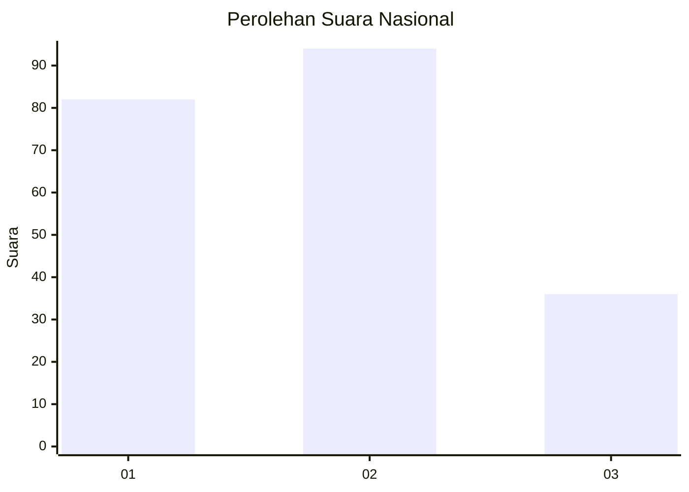
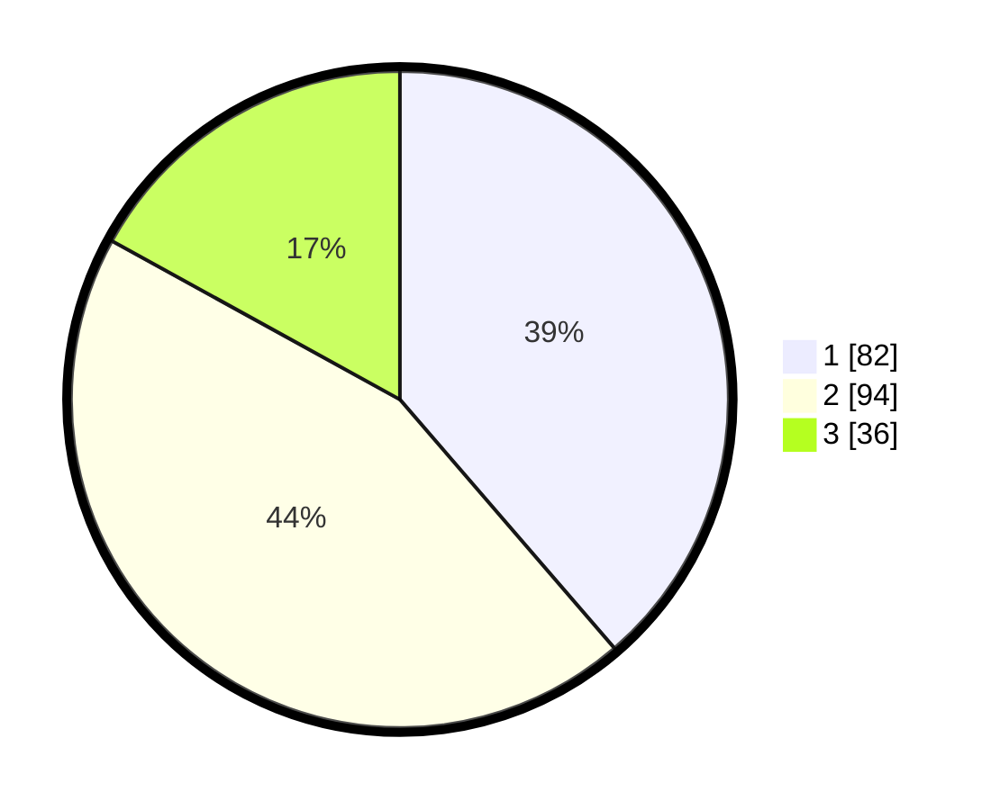

# Hasil

## Grafik

## Tabel

| No.    | Nama Paslon    | Suara | Suara (raw) | Persentase |
|:------ |:-------------- | -----:| -----------:| ----------:|
| 100025 | ANIES MUHAIMIN | 82    | [82][p-1]   | 38,68      |
| 100026 | PRABOWO GIBRAN | 94    | [94][p-2]   | 44,34      |
| 100027 | GANJAR MAHFUD  | 36    | [36][p-3]   | 16,98      |

[p-1]: https://github.com/gigit-pemilu/pemilu-2024/blob/main/pilpres/hitung-suara/sub/31-dki-jakarta/sub/73-jakarta-barat/sub/07-pal-merah/sub/1001-palmerah/sub/030-tps/sub/paslon-1.txt
[p-2]: https://github.com/gigit-pemilu/pemilu-2024/blob/main/pilpres/hitung-suara/sub/31-dki-jakarta/sub/73-jakarta-barat/sub/07-pal-merah/sub/1001-palmerah/sub/030-tps/sub/paslon-2.txt
[p-3]: https://github.com/gigit-pemilu/pemilu-2024/blob/main/pilpres/hitung-suara/sub/31-dki-jakarta/sub/73-jakarta-barat/sub/07-pal-merah/sub/1001-palmerah/sub/030-tps/sub/paslon-3.txt

## Foto C Plano

https://sirekap-obj-formc.kpu.go.id/2aa6/pemilu/ppwp/31/73/07/10/01/3173071001030-20240214-213414--f89070a9-0b4e-4eba-9909-aae4e412a445.jpg

https://sirekap-obj-formc.kpu.go.id/2aa6/pemilu/ppwp/31/73/07/10/01/3173071001030-20240214-213501--d499e79e-896b-4d52-a5c1-4708e03c162d.jpg

https://sirekap-obj-formc.kpu.go.id/2aa6/pemilu/ppwp/31/73/07/10/01/3173071001030-20240214-213613--3e1be998-db60-45c2-a8af-8369484cfba8.jpg

## Metadata

| Key        | Value               |
| ---------- | ------------------- |
| Time Stamp | 2024-02-16 16:25:10 |

