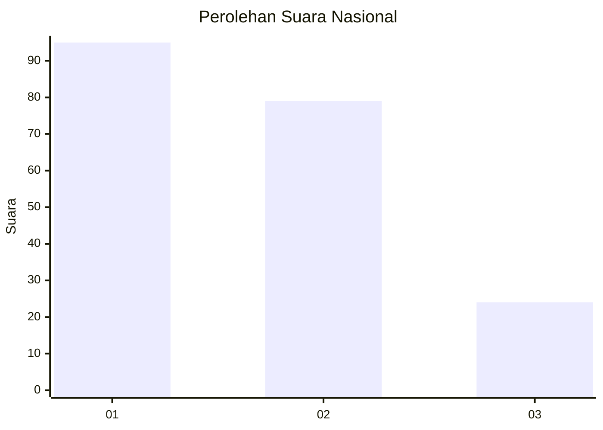
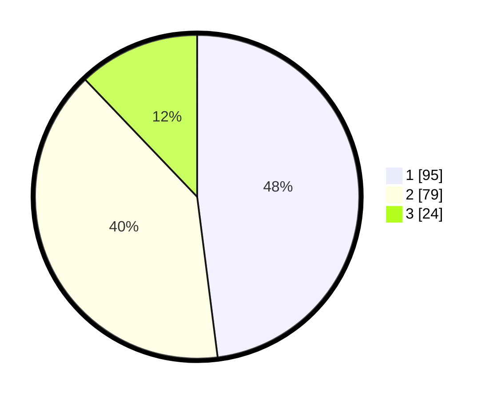

# Hasil

## Grafik

## Tabel

| No.    | Nama Paslon    | Suara | Suara (raw) | Persentase |
|:------ |:-------------- | -----:| -----------:| ----------:|
| 100025 | ANIES MUHAIMIN | 95    | [95][p-1]   | 47,98      |
| 100026 | PRABOWO GIBRAN | 79    | [79][p-2]   | 39,90      |
| 100027 | GANJAR MAHFUD  | 24    | [24][p-3]   | 12,12      |

[p-1]: https://github.com/gigit-pemilu/pemilu-2024/blob/main/pilpres/hitung-suara/sub/31-dki-jakarta/sub/73-jakarta-barat/sub/07-pal-merah/sub/1001-palmerah/sub/044-tps/sub/paslon-1.txt
[p-2]: https://github.com/gigit-pemilu/pemilu-2024/blob/main/pilpres/hitung-suara/sub/31-dki-jakarta/sub/73-jakarta-barat/sub/07-pal-merah/sub/1001-palmerah/sub/044-tps/sub/paslon-2.txt
[p-3]: https://github.com/gigit-pemilu/pemilu-2024/blob/main/pilpres/hitung-suara/sub/31-dki-jakarta/sub/73-jakarta-barat/sub/07-pal-merah/sub/1001-palmerah/sub/044-tps/sub/paslon-3.txt

## Foto C Plano

https://sirekap-obj-formc.kpu.go.id/58ed/pemilu/ppwp/31/73/07/10/01/3173071001044-20240214-222639--26999504-94fc-4c50-b7eb-40769b8e1557.jpg

https://sirekap-obj-formc.kpu.go.id/58ed/pemilu/ppwp/31/73/07/10/01/3173071001044-20240214-222435--af030c90-5b94-4fa2-8374-c64a77875a6e.jpg

https://sirekap-obj-formc.kpu.go.id/58ed/pemilu/ppwp/31/73/07/10/01/3173071001044-20240214-222920--fe8f1ed3-cd0f-4808-8bde-ac412fc1c555.jpg

## Metadata

| Key        | Value               |
| ---------- | ------------------- |
| Time Stamp | 2024-02-16 16:25:10 |

