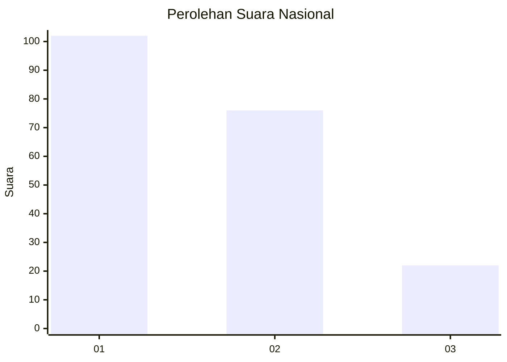
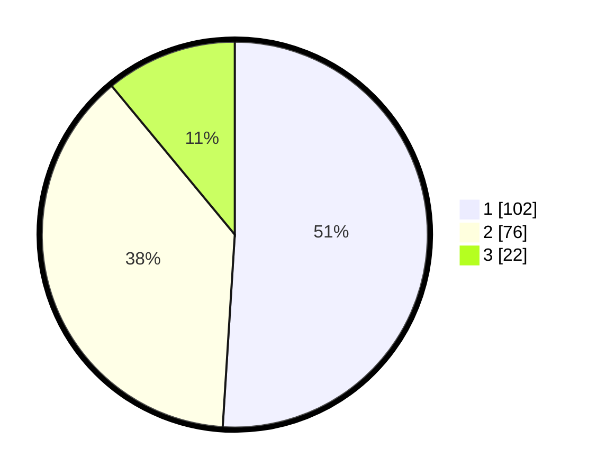

# Hasil

## Grafik

## Tabel

| No.    | Nama Paslon    | Suara | Suara (raw) | Persentase |
|:------ |:-------------- | -----:| -----------:| ----------:|
| 100025 | ANIES MUHAIMIN | 102   | [102][p-1]  | 51,00      |
| 100026 | PRABOWO GIBRAN | 76    | [76][p-2]   | 38,00      |
| 100027 | GANJAR MAHFUD  | 22    | [22][p-3]   | 11,00      |

[p-1]: https://github.com/gigit-pemilu/pemilu-2024/blob/main/pilpres/hitung-suara/sub/31-dki-jakarta/sub/73-jakarta-barat/sub/07-pal-merah/sub/1001-palmerah/sub/045-tps/sub/paslon-1.txt
[p-2]: https://github.com/gigit-pemilu/pemilu-2024/blob/main/pilpres/hitung-suara/sub/31-dki-jakarta/sub/73-jakarta-barat/sub/07-pal-merah/sub/1001-palmerah/sub/045-tps/sub/paslon-2.txt
[p-3]: https://github.com/gigit-pemilu/pemilu-2024/blob/main/pilpres/hitung-suara/sub/31-dki-jakarta/sub/73-jakarta-barat/sub/07-pal-merah/sub/1001-palmerah/sub/045-tps/sub/paslon-3.txt

## Foto C Plano

https://sirekap-obj-formc.kpu.go.id/ff7d/pemilu/ppwp/31/73/07/10/01/3173071001045-20240214-231615--7fe5ef1a-b44c-4666-8895-08545bfa023a.jpg

https://sirekap-obj-formc.kpu.go.id/ff7d/pemilu/ppwp/31/73/07/10/01/3173071001045-20240214-231725--ef9cf8d5-c44f-470b-9496-0ca94c8fdccb.jpg

https://sirekap-obj-formc.kpu.go.id/ff7d/pemilu/ppwp/31/73/07/10/01/3173071001045-20240214-231803--c2916520-781c-44f2-9d0e-8ffe0211cdfc.jpg

## Metadata

| Key        | Value               |
| ---------- | ------------------- |
| Time Stamp | 2024-02-19 15:00:00 |

