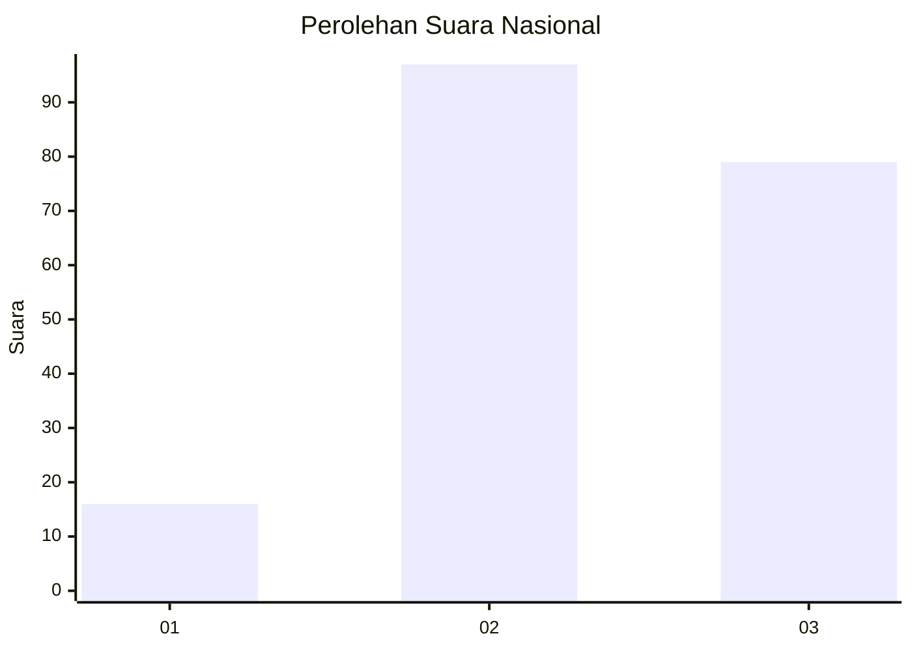
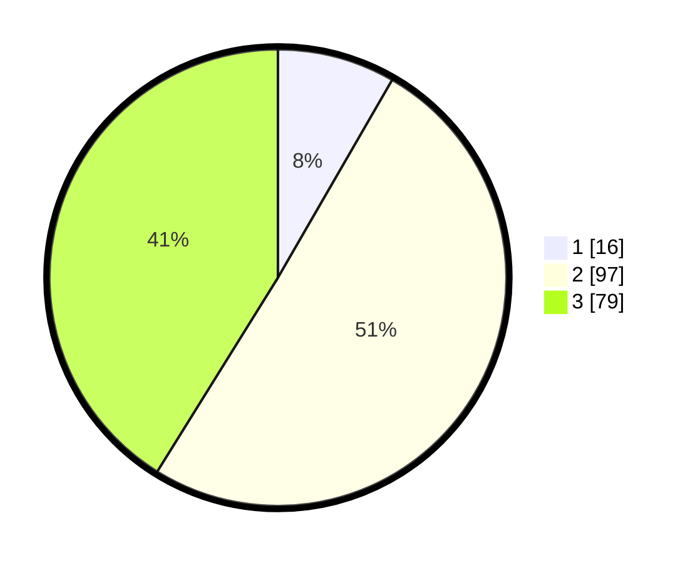

# Hasil

## Grafik

## Tabel

| No.    | Nama Paslon    | Suara | Suara (raw) | Persentase |
|:------ |:-------------- | -----:| -----------:| ----------:|
| 100025 | ANIES MUHAIMIN | 16    | [16][p-1]   | 8,33       |
| 100026 | PRABOWO GIBRAN | 97    | [97][p-2]   | 50,52      |
| 100027 | GANJAR MAHFUD  | 79    | [79][p-3]   | 41,15      |

[p-1]: https://github.com/gigit-pemilu/pemilu-2024/blob/main/pilpres/hitung-suara/sub/31-dki-jakarta/sub/73-jakarta-barat/sub/07-pal-merah/sub/1001-palmerah/sub/056-tps/sub/paslon-1.txt
[p-2]: https://github.com/gigit-pemilu/pemilu-2024/blob/main/pilpres/hitung-suara/sub/31-dki-jakarta/sub/73-jakarta-barat/sub/07-pal-merah/sub/1001-palmerah/sub/056-tps/sub/paslon-2.txt
[p-3]: https://github.com/gigit-pemilu/pemilu-2024/blob/main/pilpres/hitung-suara/sub/31-dki-jakarta/sub/73-jakarta-barat/sub/07-pal-merah/sub/1001-palmerah/sub/056-tps/sub/paslon-3.txt

## Foto C Plano

https://sirekap-obj-formc.kpu.go.id/9302/pemilu/ppwp/31/73/07/10/01/3173071001056-20240214-225009--17ea8854-b938-451e-bc23-af19edef8e98.jpg

https://sirekap-obj-formc.kpu.go.id/9302/pemilu/ppwp/31/73/07/10/01/3173071001056-20240214-220855--befcd8c8-7a6c-4139-8dd5-a92ee63c209c.jpg

https://sirekap-obj-formc.kpu.go.id/9302/pemilu/ppwp/31/73/07/10/01/3173071001056-20240214-213644--2dcece74-9f91-4e3a-8dce-d995493e4688.jpg

## Metadata

| Key        | Value               |
| ---------- | ------------------- |
| Time Stamp | 2024-02-19 15:00:00 |

