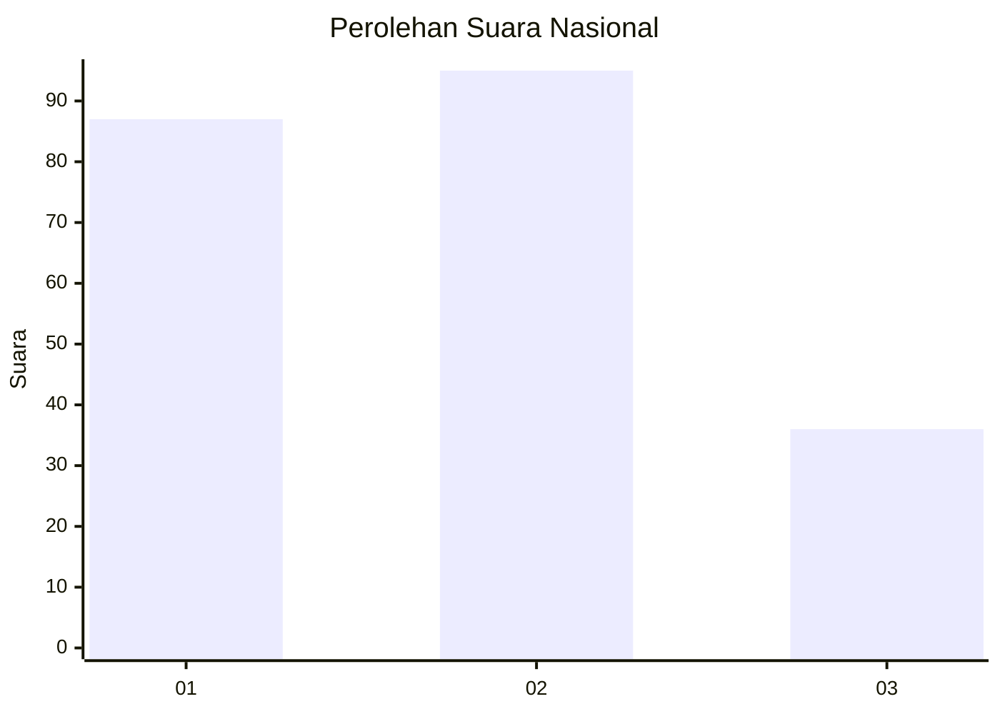
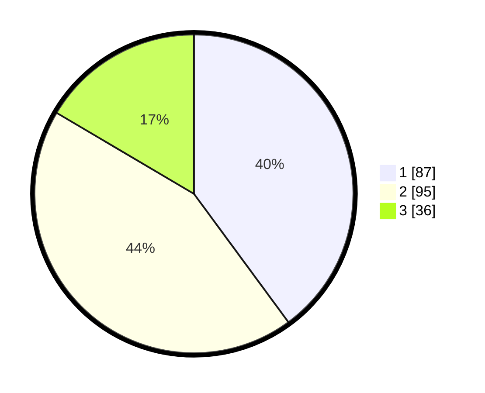

# Hasil

## Grafik

## Tabel

| No.    | Nama Paslon    | Suara | Suara (raw) | Persentase |
|:------ |:-------------- | -----:| -----------:| ----------:|
| 100025 | ANIES MUHAIMIN | 87    | [87][p-1]   | 39,91      |
| 100026 | PRABOWO GIBRAN | 95    | [95][p-2]   | 43,58      |
| 100027 | GANJAR MAHFUD  | 36    | [36][p-3]   | 16,51      |

[p-1]: https://github.com/gigit-pemilu/pemilu-2024/blob/main/pilpres/hitung-suara/sub/31-dki-jakarta/sub/73-jakarta-barat/sub/07-pal-merah/sub/1001-palmerah/sub/058-tps/sub/paslon-1.txt
[p-2]: https://github.com/gigit-pemilu/pemilu-2024/blob/main/pilpres/hitung-suara/sub/31-dki-jakarta/sub/73-jakarta-barat/sub/07-pal-merah/sub/1001-palmerah/sub/058-tps/sub/paslon-2.txt
[p-3]: https://github.com/gigit-pemilu/pemilu-2024/blob/main/pilpres/hitung-suara/sub/31-dki-jakarta/sub/73-jakarta-barat/sub/07-pal-merah/sub/1001-palmerah/sub/058-tps/sub/paslon-3.txt

## Foto C Plano

https://sirekap-obj-formc.kpu.go.id/a441/pemilu/ppwp/31/73/07/10/01/3173071001058-20240214-223729--40affc9c-bab0-446b-b0c9-26bfcba0afe1.jpg

https://sirekap-obj-formc.kpu.go.id/a441/pemilu/ppwp/31/73/07/10/01/3173071001058-20240214-223821--72626ef5-a751-432d-b1fe-2ec6275b7573.jpg

https://sirekap-obj-formc.kpu.go.id/a441/pemilu/ppwp/31/73/07/10/01/3173071001058-20240214-223933--1df8269a-cc41-4e0d-8904-50ed0f0427c5.jpg

## Metadata

| Key        | Value               |
| ---------- | ------------------- |
| Time Stamp | 2024-02-19 15:00:00 |

