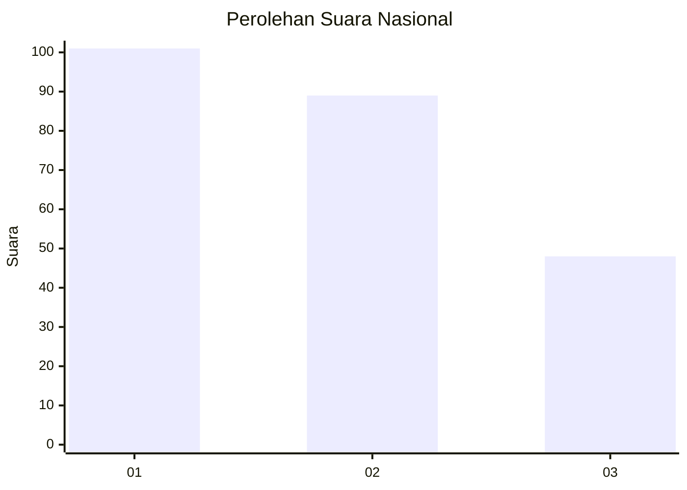
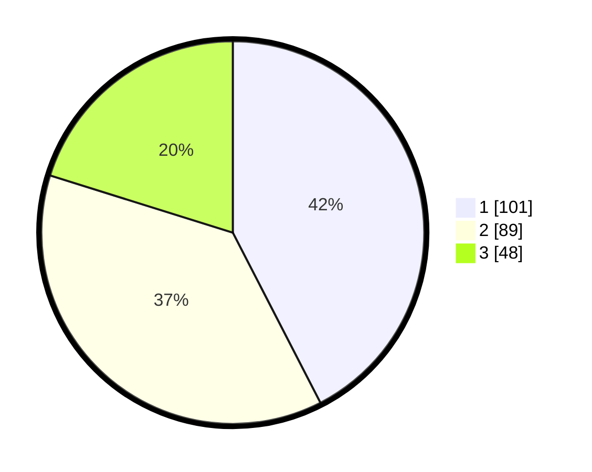

# Hasil

## Grafik

## Tabel

| No.    | Nama Paslon    | Suara | Suara (raw) | Persentase |
|:------ |:-------------- | -----:| -----------:| ----------:|
| 100025 | ANIES MUHAIMIN | 101   | [101][p-1]  | 42,44      |
| 100026 | PRABOWO GIBRAN | 89    | [89][p-2]   | 37,39      |
| 100027 | GANJAR MAHFUD  | 48    | [48][p-3]   | 20,17      |

[p-1]: https://github.com/gigit-pemilu/pemilu-2024/blob/main/pilpres/hitung-suara/sub/31-dki-jakarta/sub/73-jakarta-barat/sub/07-pal-merah/sub/1001-palmerah/sub/065-tps/sub/paslon-1.txt
[p-2]: https://github.com/gigit-pemilu/pemilu-2024/blob/main/pilpres/hitung-suara/sub/31-dki-jakarta/sub/73-jakarta-barat/sub/07-pal-merah/sub/1001-palmerah/sub/065-tps/sub/paslon-2.txt
[p-3]: https://github.com/gigit-pemilu/pemilu-2024/blob/main/pilpres/hitung-suara/sub/31-dki-jakarta/sub/73-jakarta-barat/sub/07-pal-merah/sub/1001-palmerah/sub/065-tps/sub/paslon-3.txt

## Foto C Plano

https://sirekap-obj-formc.kpu.go.id/cf09/pemilu/ppwp/31/73/07/10/01/3173071001065-20240214-222943--8b24bcd9-aec0-401f-bcd5-ef2e4c37d4b7.jpg

https://sirekap-obj-formc.kpu.go.id/cf09/pemilu/ppwp/31/73/07/10/01/3173071001065-20240214-223006--9b282c7c-5035-4948-87af-31d16652c1e2.jpg

https://sirekap-obj-formc.kpu.go.id/cf09/pemilu/ppwp/31/73/07/10/01/3173071001065-20240214-223032--cc9b3926-c4df-4e1c-9f54-0a24d7da17a9.jpg

## Metadata

| Key        | Value               |
| ---------- | ------------------- |
| Time Stamp | 2024-02-16 16:25:10 |

