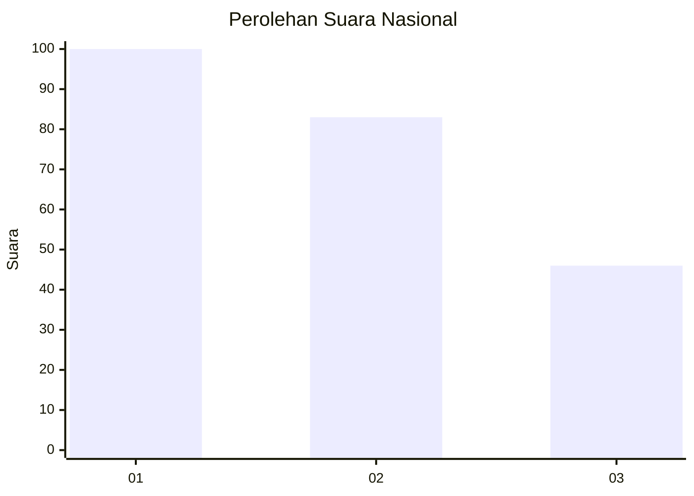
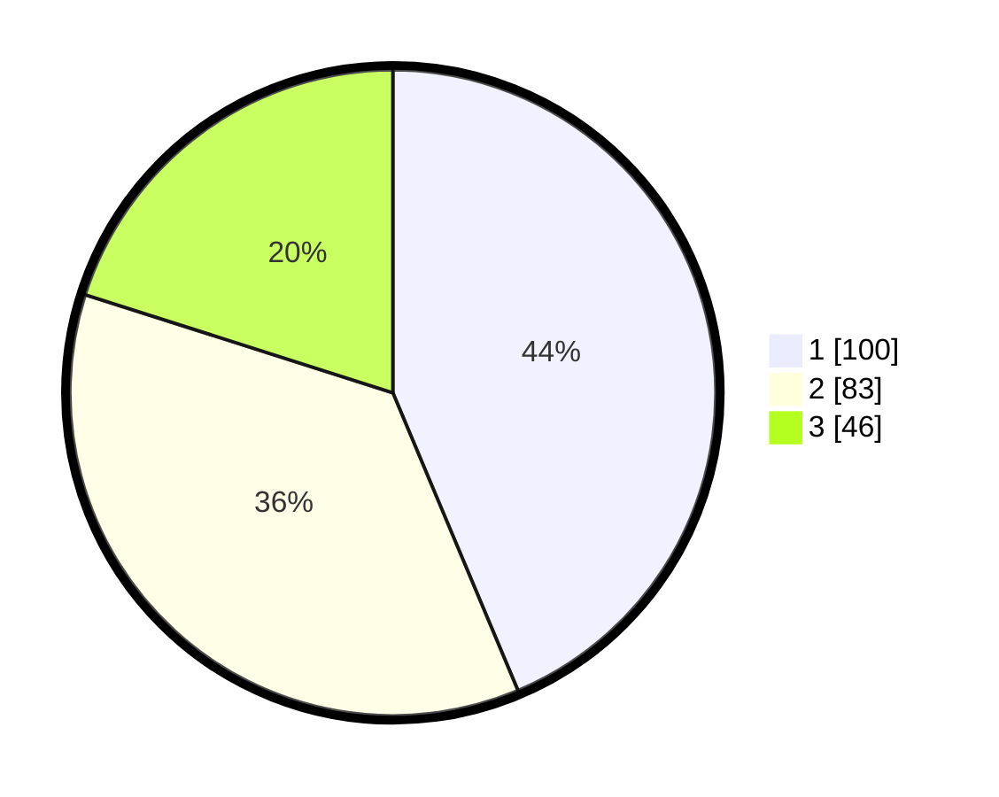

# Hasil

## Grafik

## Tabel

| No.    | Nama Paslon    | Suara | Suara (raw) | Persentase |
|:------ |:-------------- | -----:| -----------:| ----------:|
| 100025 | ANIES MUHAIMIN | 100   | [100][p-1]  | 43,67      |
| 100026 | PRABOWO GIBRAN | 83    | [83][p-2]   | 36,24      |
| 100027 | GANJAR MAHFUD  | 46    | [46][p-3]   | 20,09      |

[p-1]: https://github.com/gigit-pemilu/pemilu-2024/blob/main/pilpres/hitung-suara/sub/31-dki-jakarta/sub/73-jakarta-barat/sub/07-pal-merah/sub/1001-palmerah/sub/068-tps/sub/paslon-1.txt
[p-2]: https://github.com/gigit-pemilu/pemilu-2024/blob/main/pilpres/hitung-suara/sub/31-dki-jakarta/sub/73-jakarta-barat/sub/07-pal-merah/sub/1001-palmerah/sub/068-tps/sub/paslon-2.txt
[p-3]: https://github.com/gigit-pemilu/pemilu-2024/blob/main/pilpres/hitung-suara/sub/31-dki-jakarta/sub/73-jakarta-barat/sub/07-pal-merah/sub/1001-palmerah/sub/068-tps/sub/paslon-3.txt

## Foto C Plano

https://sirekap-obj-formc.kpu.go.id/5045/pemilu/ppwp/31/73/07/10/01/3173071001068-20240215-025203--2e7a0bfd-34e2-4804-b0de-270d99dacef8.jpg

https://sirekap-obj-formc.kpu.go.id/5045/pemilu/ppwp/31/73/07/10/01/3173071001068-20240215-025511--94030c78-e914-4df8-97b1-41ff0edad80c.jpg

https://sirekap-obj-formc.kpu.go.id/5045/pemilu/ppwp/31/73/07/10/01/3173071001068-20240215-003511--8df66840-29ae-4684-9d41-d21c7d66babb.jpg

## Metadata

| Key        | Value               |
| ---------- | ------------------- |
| Time Stamp | 2024-02-16 16:25:10 |

