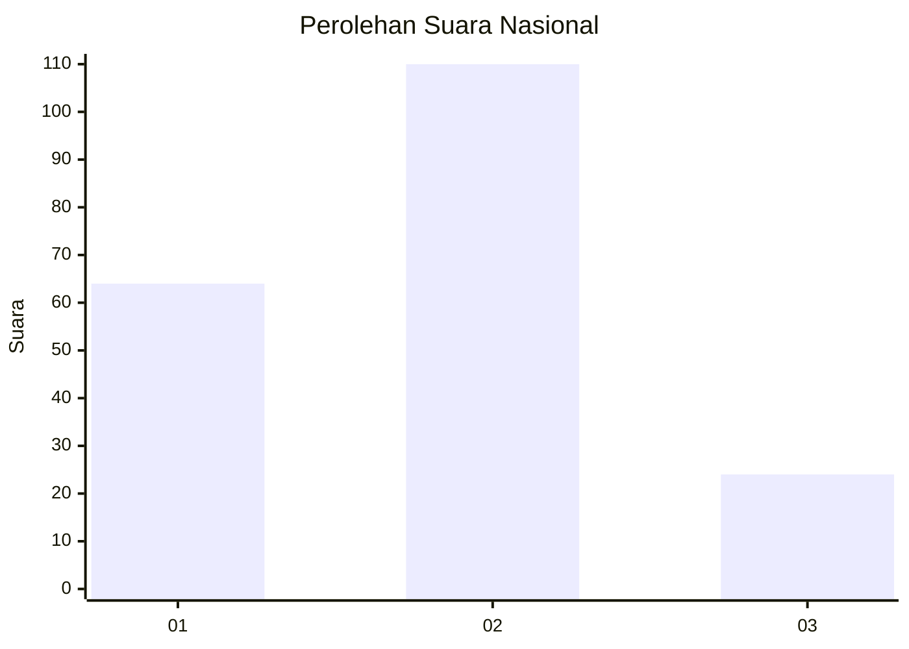
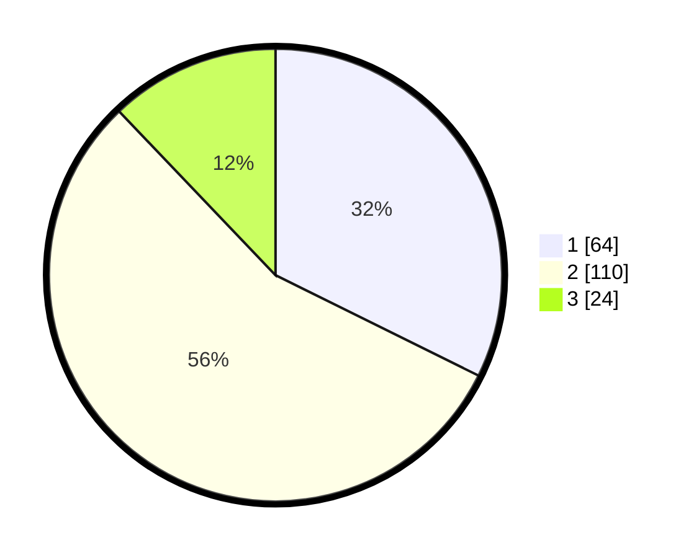

# Hasil

## Grafik

## Tabel

| No.    | Nama Paslon    | Suara | Suara (raw) | Persentase |
|:------ |:-------------- | -----:| -----------:| ----------:|
| 100025 | ANIES MUHAIMIN | 64    | [64][p-1]   | 32,32      |
| 100026 | PRABOWO GIBRAN | 110   | [110][p-2]  | 55,56      |
| 100027 | GANJAR MAHFUD  | 24    | [24][p-3]   | 12,12      |

[p-1]: https://github.com/gigit-pemilu/pemilu-2024/blob/main/pilpres/hitung-suara/sub/31-dki-jakarta/sub/73-jakarta-barat/sub/07-pal-merah/sub/1001-palmerah/sub/077-tps/sub/paslon-1.txt
[p-2]: https://github.com/gigit-pemilu/pemilu-2024/blob/main/pilpres/hitung-suara/sub/31-dki-jakarta/sub/73-jakarta-barat/sub/07-pal-merah/sub/1001-palmerah/sub/077-tps/sub/paslon-2.txt
[p-3]: https://github.com/gigit-pemilu/pemilu-2024/blob/main/pilpres/hitung-suara/sub/31-dki-jakarta/sub/73-jakarta-barat/sub/07-pal-merah/sub/1001-palmerah/sub/077-tps/sub/paslon-3.txt

## Foto C Plano

https://sirekap-obj-formc.kpu.go.id/1c82/pemilu/ppwp/31/73/07/10/01/3173071001077-20240215-062353--aaf68da6-22b3-4bcf-b3ed-bd0dd3cb476a.jpg

https://sirekap-obj-formc.kpu.go.id/1c82/pemilu/ppwp/31/73/07/10/01/3173071001077-20240215-062357--2db7b280-b96e-4b02-bdf1-9544d288c5d9.jpg

https://sirekap-obj-formc.kpu.go.id/1c82/pemilu/ppwp/31/73/07/10/01/3173071001077-20240215-062402--639726f2-dc67-40ae-b656-6a6d48c1c8f2.jpg

## Metadata

| Key        | Value               |
| ---------- | ------------------- |
| Time Stamp | 2024-02-16 16:25:10 |

