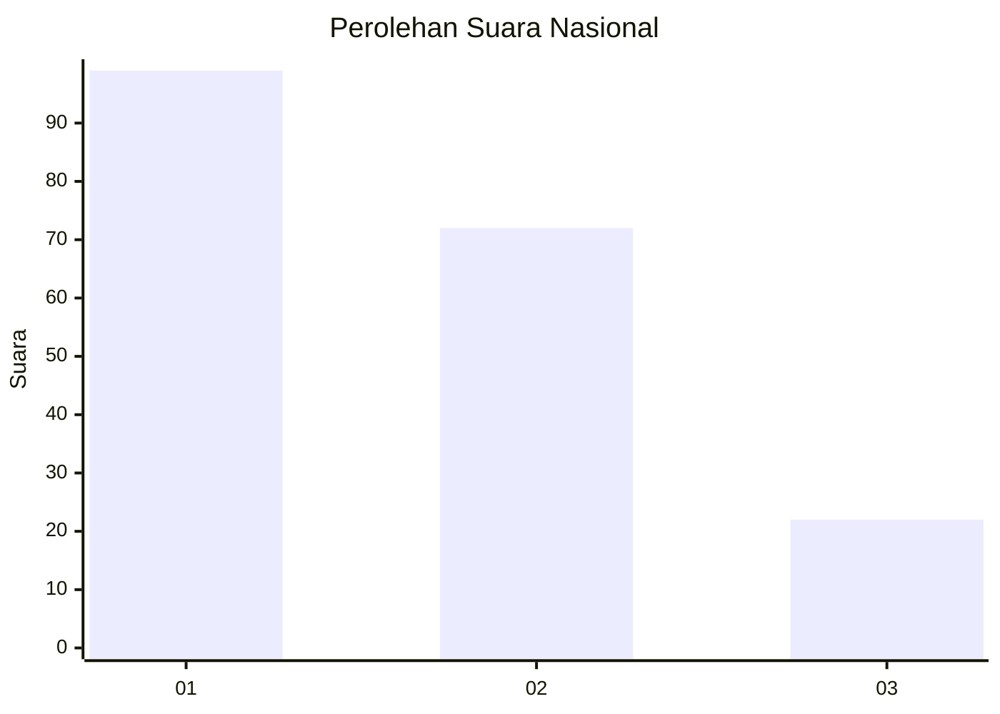
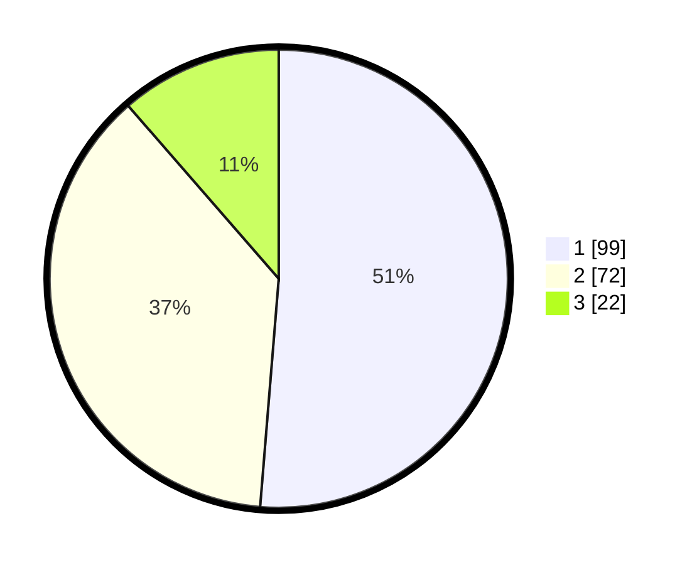

# Hasil

## Grafik

## Tabel

| No.    | Nama Paslon    | Suara | Suara (raw) | Persentase |
|:------ |:-------------- | -----:| -----------:| ----------:|
| 100025 | ANIES MUHAIMIN | 99    | [99][p-1]   | 51,30      |
| 100026 | PRABOWO GIBRAN | 72    | [72][p-2]   | 37,31      |
| 100027 | GANJAR MAHFUD  | 22    | [22][p-3]   | 11,40      |

[p-1]: https://github.com/gigit-pemilu/pemilu-2024/blob/main/pilpres/hitung-suara/sub/31-dki-jakarta/sub/73-jakarta-barat/sub/07-pal-merah/sub/1001-palmerah/sub/080-tps/sub/paslon-1.txt
[p-2]: https://github.com/gigit-pemilu/pemilu-2024/blob/main/pilpres/hitung-suara/sub/31-dki-jakarta/sub/73-jakarta-barat/sub/07-pal-merah/sub/1001-palmerah/sub/080-tps/sub/paslon-2.txt
[p-3]: https://github.com/gigit-pemilu/pemilu-2024/blob/main/pilpres/hitung-suara/sub/31-dki-jakarta/sub/73-jakarta-barat/sub/07-pal-merah/sub/1001-palmerah/sub/080-tps/sub/paslon-3.txt

## Foto C Plano

https://sirekap-obj-formc.kpu.go.id/f6f2/pemilu/ppwp/31/73/07/10/01/3173071001080-20240214-220739--59c1a9c1-f73b-455e-ba5e-cb8dc1f7cf80.jpg

https://sirekap-obj-formc.kpu.go.id/f6f2/pemilu/ppwp/31/73/07/10/01/3173071001080-20240214-221142--448e7e28-e1f7-4846-ab2f-cb0b5a9dccc1.jpg

https://sirekap-obj-formc.kpu.go.id/f6f2/pemilu/ppwp/31/73/07/10/01/3173071001080-20240214-221434--df96e827-24ae-4e8c-953e-1a3c1e7ad7cc.jpg

## Metadata

| Key        | Value               |
| ---------- | ------------------- |
| Time Stamp | 2024-02-16 16:25:10 |

