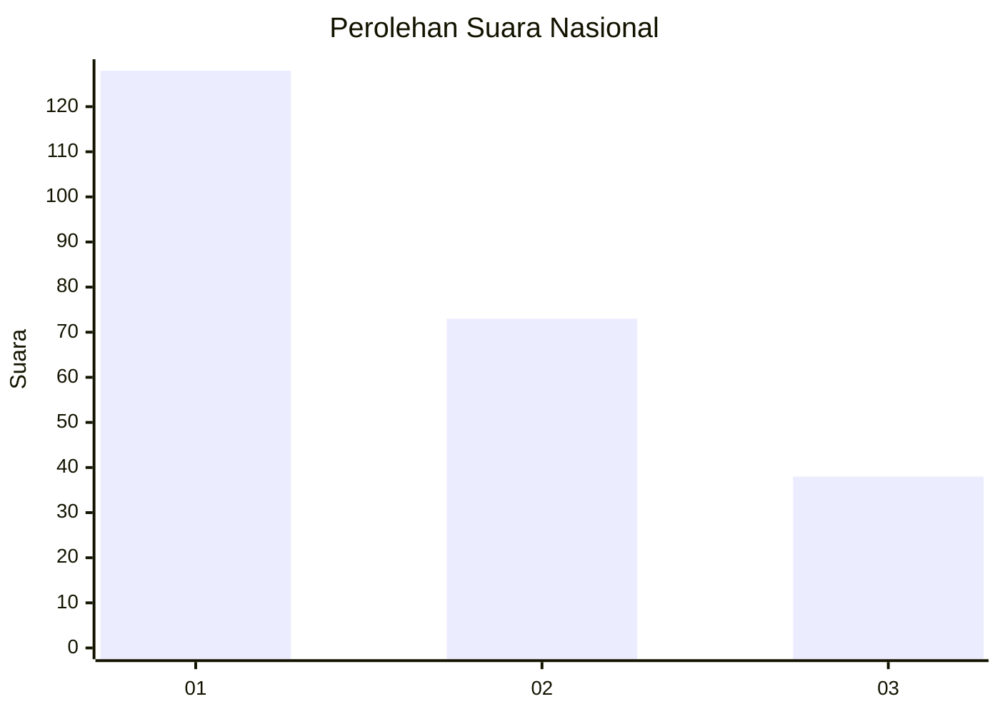
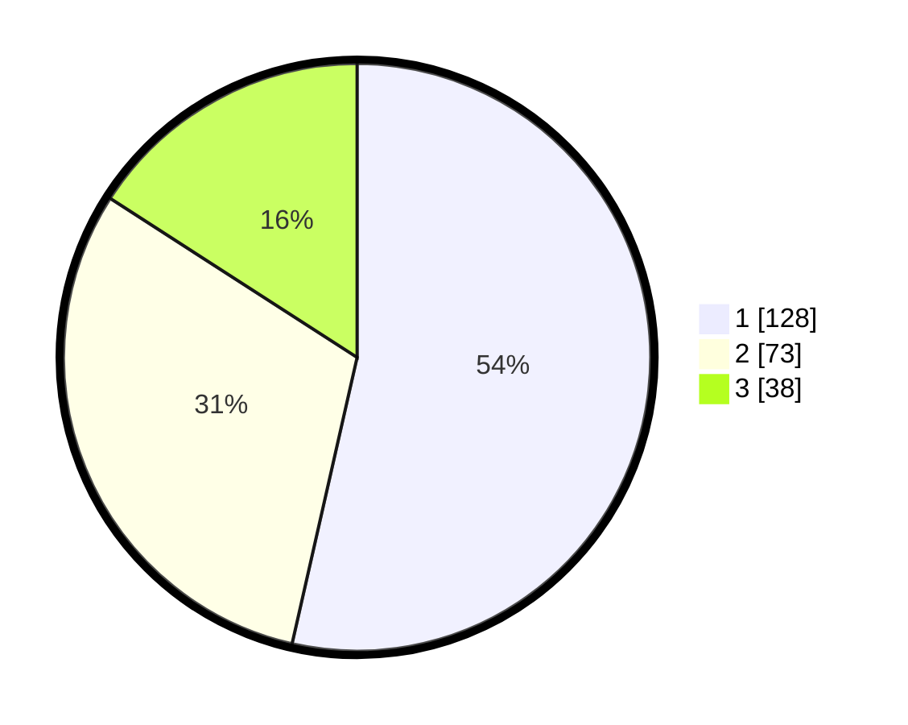

# Hasil

## Grafik

## Tabel

| No.    | Nama Paslon    | Suara | Suara (raw) | Persentase |
|:------ |:-------------- | -----:| -----------:| ----------:|
| 100025 | ANIES MUHAIMIN | 128   | [128][p-1]  | 53,56      |
| 100026 | PRABOWO GIBRAN | 73    | [73][p-2]   | 30,54      |
| 100027 | GANJAR MAHFUD  | 38    | [38][p-3]   | 15,90      |

[p-1]: https://github.com/gigit-pemilu/pemilu-2024/blob/main/pilpres/hitung-suara/sub/31-dki-jakarta/sub/73-jakarta-barat/sub/07-pal-merah/sub/1001-palmerah/sub/100-tps/sub/paslon-1.txt
[p-2]: https://github.com/gigit-pemilu/pemilu-2024/blob/main/pilpres/hitung-suara/sub/31-dki-jakarta/sub/73-jakarta-barat/sub/07-pal-merah/sub/1001-palmerah/sub/100-tps/sub/paslon-2.txt
[p-3]: https://github.com/gigit-pemilu/pemilu-2024/blob/main/pilpres/hitung-suara/sub/31-dki-jakarta/sub/73-jakarta-barat/sub/07-pal-merah/sub/1001-palmerah/sub/100-tps/sub/paslon-3.txt

## Foto C Plano

https://sirekap-obj-formc.kpu.go.id/ae77/pemilu/ppwp/31/73/07/10/01/3173071001100-20240214-215855--b691f550-cf5c-46c6-9a6e-88d3a0d2d29d.jpg

https://sirekap-obj-formc.kpu.go.id/ae77/pemilu/ppwp/31/73/07/10/01/3173071001100-20240214-222300--aa5089eb-0d4e-4b36-93bb-ab79dc40ef07.jpg

https://sirekap-obj-formc.kpu.go.id/ae77/pemilu/ppwp/31/73/07/10/01/3173071001100-20240214-222337--b0c4741d-a2dc-425d-97fa-6741dc7b08d6.jpg

## Metadata

| Key        | Value               |
| ---------- | ------------------- |
| Time Stamp | 2024-02-19 15:00:00 |

