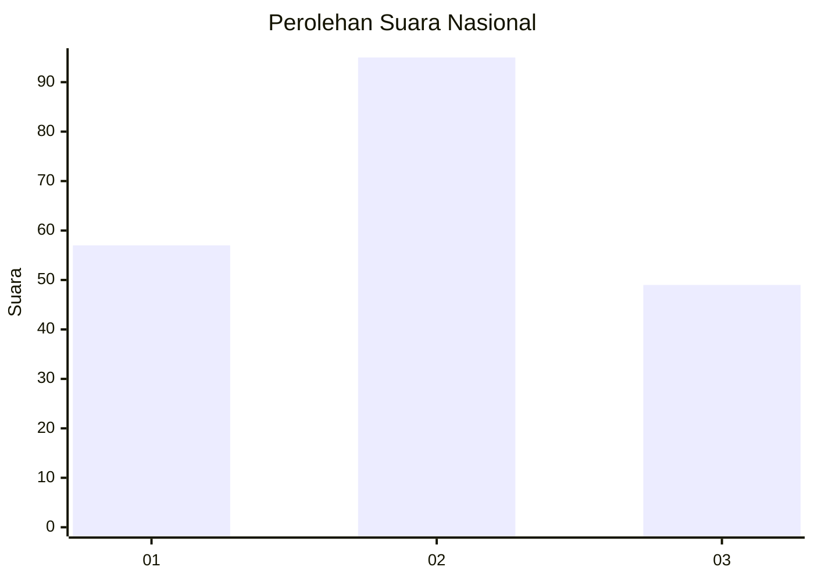
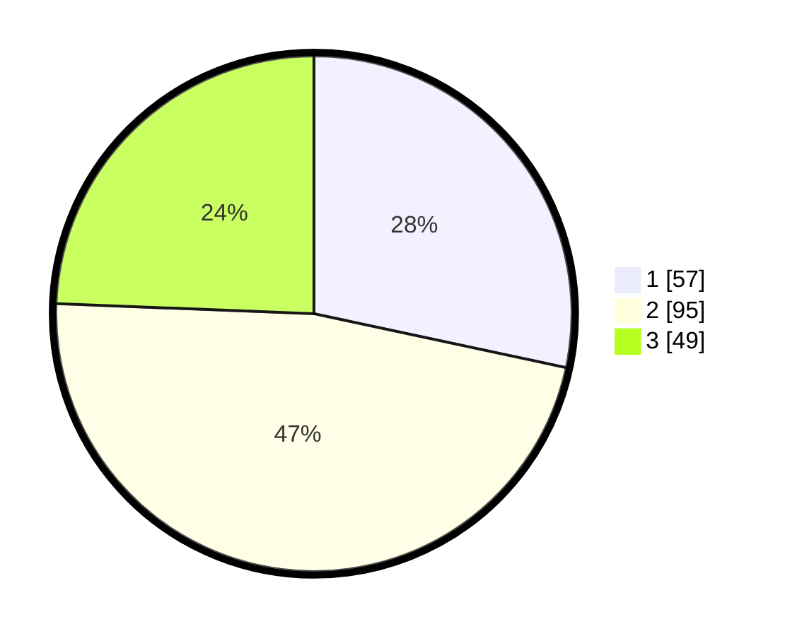

# Hasil

## Grafik

## Tabel

| No.    | Nama Paslon    | Suara | Suara (raw) | Persentase |
|:------ |:-------------- | -----:| -----------:| ----------:|
| 100025 | ANIES MUHAIMIN | 57    | [57][p-1]   | 28,36      |
| 100026 | PRABOWO GIBRAN | 95    | [95][p-2]   | 47,26      |
| 100027 | GANJAR MAHFUD  | 49    | [49][p-3]   | 24,38      |

[p-1]: https://github.com/gigit-pemilu/pemilu-2024/blob/main/pilpres/hitung-suara/sub/31-dki-jakarta/sub/73-jakarta-barat/sub/07-pal-merah/sub/1001-palmerah/sub/103-tps/sub/paslon-1.txt
[p-2]: https://github.com/gigit-pemilu/pemilu-2024/blob/main/pilpres/hitung-suara/sub/31-dki-jakarta/sub/73-jakarta-barat/sub/07-pal-merah/sub/1001-palmerah/sub/103-tps/sub/paslon-2.txt
[p-3]: https://github.com/gigit-pemilu/pemilu-2024/blob/main/pilpres/hitung-suara/sub/31-dki-jakarta/sub/73-jakarta-barat/sub/07-pal-merah/sub/1001-palmerah/sub/103-tps/sub/paslon-3.txt

## Foto C Plano

https://sirekap-obj-formc.kpu.go.id/b525/pemilu/ppwp/31/73/07/10/01/3173071001103-20240214-220326--cab739f9-5539-4b6f-96fc-d337edba28f2.jpg

https://sirekap-obj-formc.kpu.go.id/b525/pemilu/ppwp/31/73/07/10/01/3173071001103-20240214-220415--f9efad43-f347-4511-8e23-54ba357d04e9.jpg

https://sirekap-obj-formc.kpu.go.id/b525/pemilu/ppwp/31/73/07/10/01/3173071001103-20240214-220459--e6f0ec9e-adf1-46c5-9927-f7a4de467dbe.jpg

## Metadata

| Key        | Value               |
| ---------- | ------------------- |
| Time Stamp | 2024-02-19 15:00:00 |

