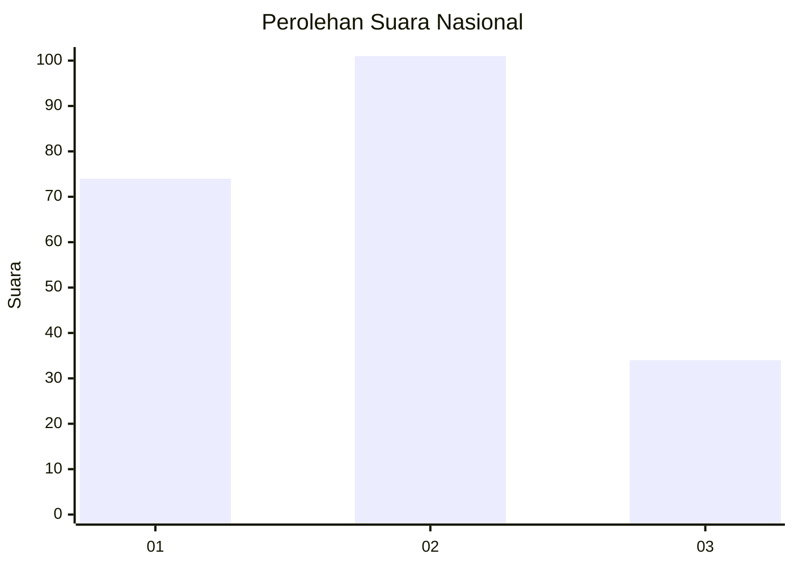
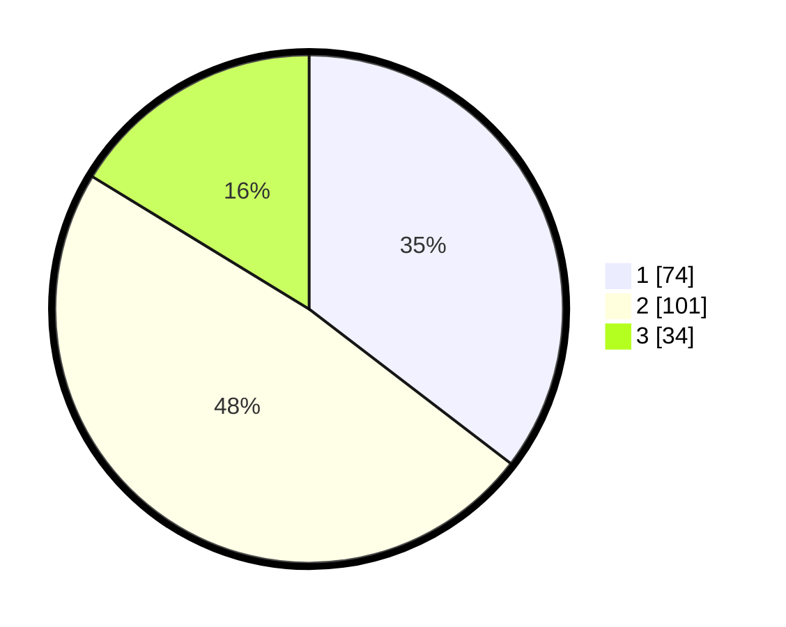

# Hasil

## Grafik

## Tabel

| No.    | Nama Paslon    | Suara | Suara (raw) | Persentase |
|:------ |:-------------- | -----:| -----------:| ----------:|
| 100025 | ANIES MUHAIMIN | 74    | [74][p-1]   | 35,41      |
| 100026 | PRABOWO GIBRAN | 101   | [101][p-2]  | 48,33      |
| 100027 | GANJAR MAHFUD  | 34    | [34][p-3]   | 16,27      |

[p-1]: https://github.com/gigit-pemilu/pemilu-2024/blob/main/pilpres/hitung-suara/sub/31-dki-jakarta/sub/73-jakarta-barat/sub/07-pal-merah/sub/1001-palmerah/sub/108-tps/sub/paslon-1.txt
[p-2]: https://github.com/gigit-pemilu/pemilu-2024/blob/main/pilpres/hitung-suara/sub/31-dki-jakarta/sub/73-jakarta-barat/sub/07-pal-merah/sub/1001-palmerah/sub/108-tps/sub/paslon-2.txt
[p-3]: https://github.com/gigit-pemilu/pemilu-2024/blob/main/pilpres/hitung-suara/sub/31-dki-jakarta/sub/73-jakarta-barat/sub/07-pal-merah/sub/1001-palmerah/sub/108-tps/sub/paslon-3.txt

## Foto C Plano

https://sirekap-obj-formc.kpu.go.id/2dd4/pemilu/ppwp/31/73/07/10/01/3173071001108-20240215-022337--d8a3d258-6b5b-483c-a0a3-e5b1481b0ee0.jpg

https://sirekap-obj-formc.kpu.go.id/2dd4/pemilu/ppwp/31/73/07/10/01/3173071001108-20240215-022507--d8010078-b5b7-48c5-8ee3-a7fb589f4951.jpg

https://sirekap-obj-formc.kpu.go.id/2dd4/pemilu/ppwp/31/73/07/10/01/3173071001108-20240215-022722--177a8f6b-135f-43e3-9915-99ebc779f7bc.jpg

## Metadata

| Key        | Value               |
| ---------- | ------------------- |
| Time Stamp | 2024-02-21 17:00:00 |

