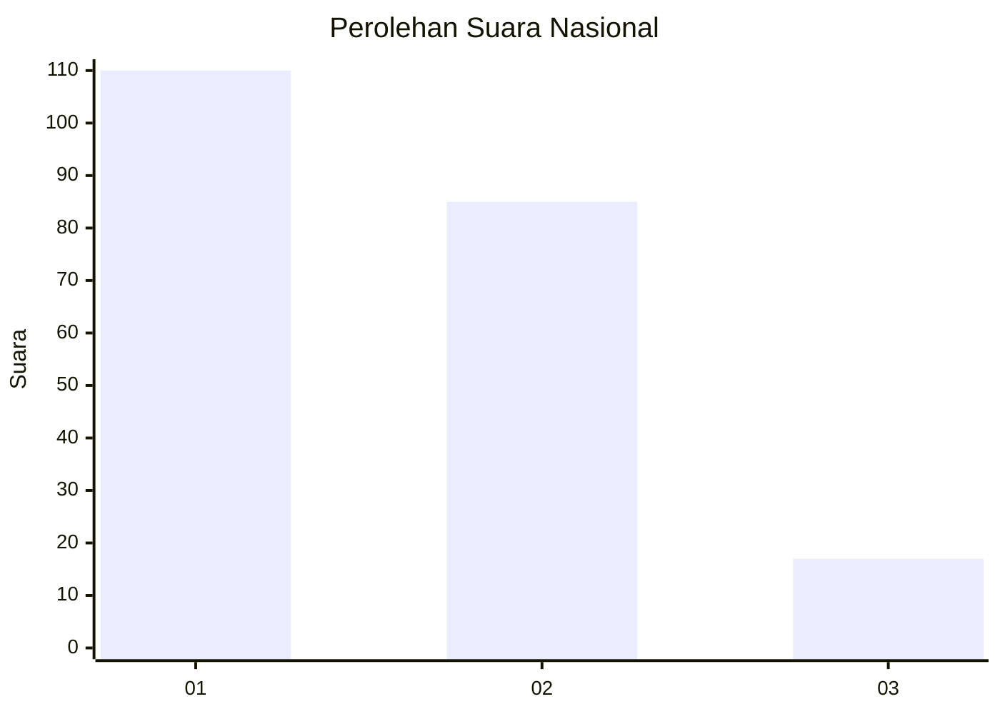
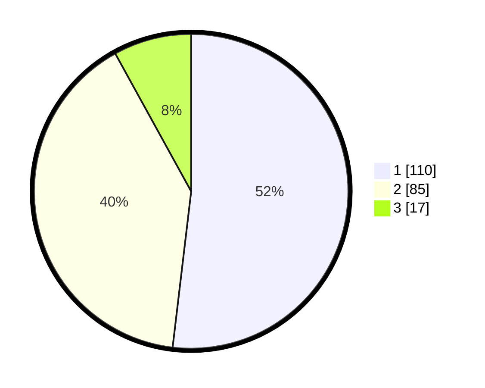

# Hasil

## Grafik

## Tabel

| No.    | Nama Paslon    | Suara | Suara (raw) | Persentase |
|:------ |:-------------- | -----:| -----------:| ----------:|
| 100025 | ANIES MUHAIMIN | 110   | [110][p-1]  | 51,89      |
| 100026 | PRABOWO GIBRAN | 85    | [85][p-2]   | 40,09      |
| 100027 | GANJAR MAHFUD  | 17    | [17][p-3]   | 8,02       |

[p-1]: https://github.com/gigit-pemilu/pemilu-2024/blob/main/pilpres/hitung-suara/sub/31-dki-jakarta/sub/73-jakarta-barat/sub/07-pal-merah/sub/1001-palmerah/sub/111-tps/sub/paslon-1.txt
[p-2]: https://github.com/gigit-pemilu/pemilu-2024/blob/main/pilpres/hitung-suara/sub/31-dki-jakarta/sub/73-jakarta-barat/sub/07-pal-merah/sub/1001-palmerah/sub/111-tps/sub/paslon-2.txt
[p-3]: https://github.com/gigit-pemilu/pemilu-2024/blob/main/pilpres/hitung-suara/sub/31-dki-jakarta/sub/73-jakarta-barat/sub/07-pal-merah/sub/1001-palmerah/sub/111-tps/sub/paslon-3.txt

## Foto C Plano

https://sirekap-obj-formc.kpu.go.id/949a/pemilu/ppwp/31/73/07/10/01/3173071001111-20240214-214803--e2c706d2-cfa7-4bd7-86ac-4efd46e1d3b3.jpg

https://sirekap-obj-formc.kpu.go.id/949a/pemilu/ppwp/31/73/07/10/01/3173071001111-20240214-214846--f4a4f0cf-cf0c-4de4-b7ec-27f1e5f0eca1.jpg

https://sirekap-obj-formc.kpu.go.id/949a/pemilu/ppwp/31/73/07/10/01/3173071001111-20240214-215040--d775dc94-d1f2-4c9f-b8d0-f05dfdfd0486.jpg

## Metadata

| Key        | Value               |
| ---------- | ------------------- |
| Time Stamp | 2024-02-19 15:00:00 |

