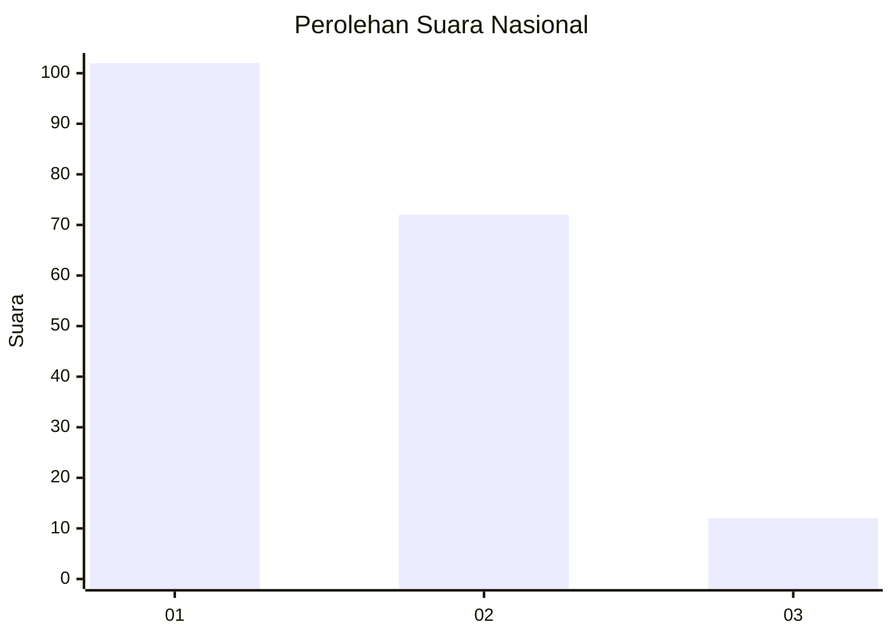
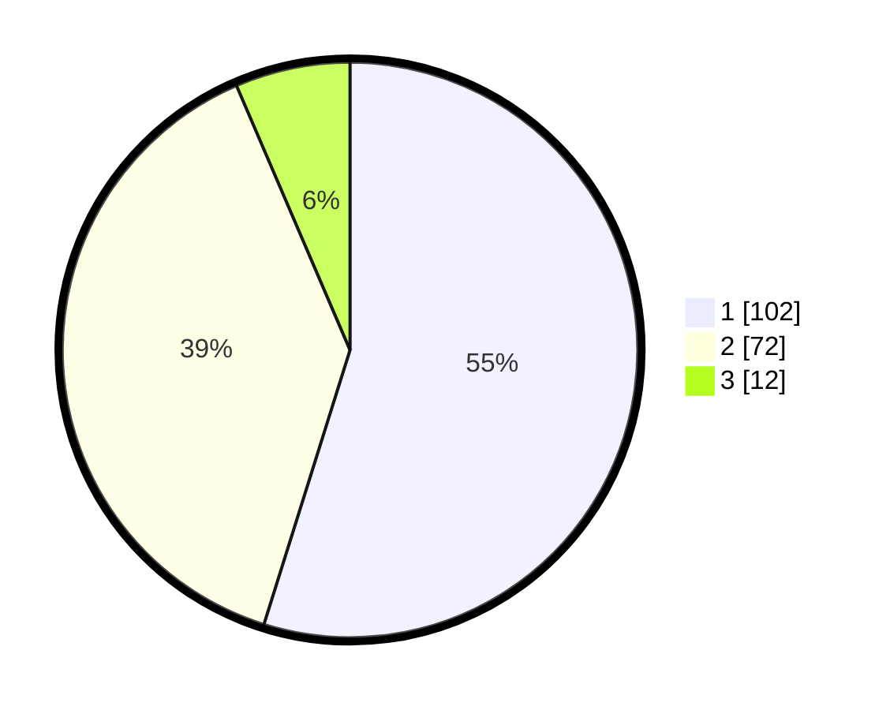

# Hasil

## Grafik

## Tabel

| No.    | Nama Paslon    | Suara | Suara (raw) | Persentase |
|:------ |:-------------- | -----:| -----------:| ----------:|
| 100025 | ANIES MUHAIMIN | 102   | [102][p-1]  | 54,84      |
| 100026 | PRABOWO GIBRAN | 72    | [72][p-2]   | 38,71      |
| 100027 | GANJAR MAHFUD  | 12    | [12][p-3]   | 6,45       |

[p-1]: https://github.com/gigit-pemilu/pemilu-2024/blob/main/pilpres/hitung-suara/sub/31-dki-jakarta/sub/73-jakarta-barat/sub/07-pal-merah/sub/1001-palmerah/sub/114-tps/sub/paslon-1.txt
[p-2]: https://github.com/gigit-pemilu/pemilu-2024/blob/main/pilpres/hitung-suara/sub/31-dki-jakarta/sub/73-jakarta-barat/sub/07-pal-merah/sub/1001-palmerah/sub/114-tps/sub/paslon-2.txt
[p-3]: https://github.com/gigit-pemilu/pemilu-2024/blob/main/pilpres/hitung-suara/sub/31-dki-jakarta/sub/73-jakarta-barat/sub/07-pal-merah/sub/1001-palmerah/sub/114-tps/sub/paslon-3.txt

## Foto C Plano

https://sirekap-obj-formc.kpu.go.id/1b3c/pemilu/ppwp/31/73/07/10/01/3173071001114-20240215-004754--52b1c56f-e0dc-4f7f-abde-4aa94713a2b1.jpg

https://sirekap-obj-formc.kpu.go.id/1b3c/pemilu/ppwp/31/73/07/10/01/3173071001114-20240215-004834--0656cdef-3b32-48a6-84f0-b1aacd9e9b66.jpg

https://sirekap-obj-formc.kpu.go.id/1b3c/pemilu/ppwp/31/73/07/10/01/3173071001114-20240215-004911--a32cdf08-0187-4ef8-9f80-22a4ecd2b8e4.jpg

## Metadata

| Key        | Value               |
| ---------- | ------------------- |
| Time Stamp | 2024-02-21 15:00:00 |

