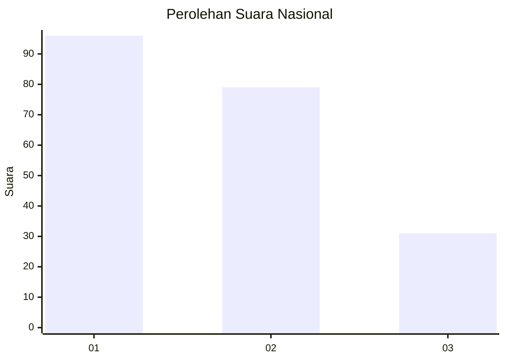
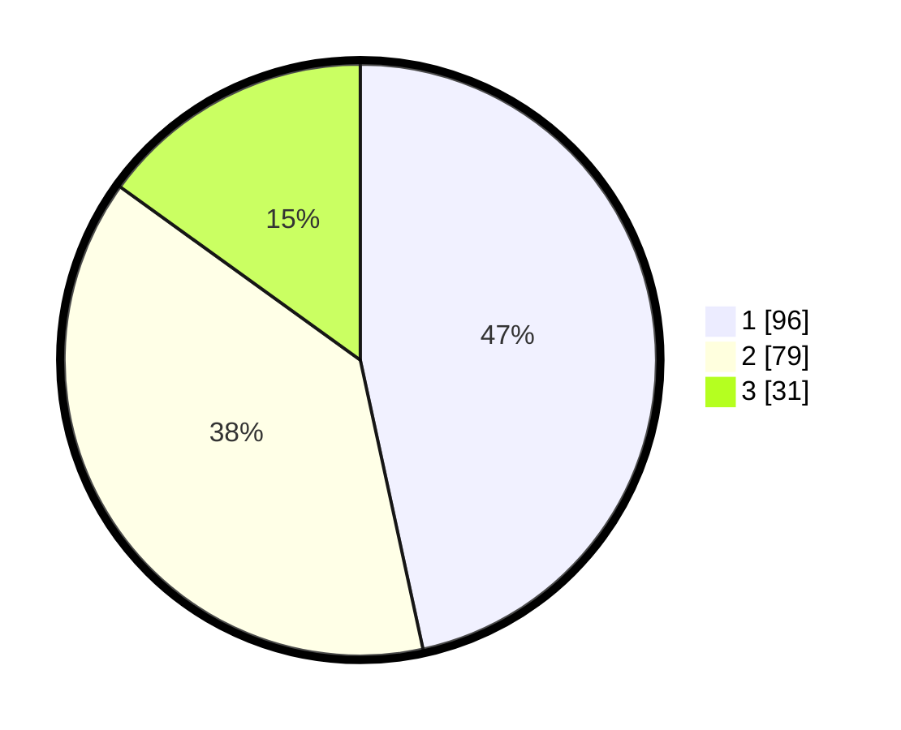

# Hasil

## Grafik

## Tabel

| No.    | Nama Paslon    | Suara | Suara (raw) | Persentase |
|:------ |:-------------- | -----:| -----------:| ----------:|
| 100025 | ANIES MUHAIMIN | 96    | [96][p-1]   | 46,60      |
| 100026 | PRABOWO GIBRAN | 79    | [79][p-2]   | 38,35      |
| 100027 | GANJAR MAHFUD  | 31    | [31][p-3]   | 15,05      |

[p-1]: https://github.com/gigit-pemilu/pemilu-2024/blob/main/pilpres/hitung-suara/sub/31-dki-jakarta/sub/73-jakarta-barat/sub/07-pal-merah/sub/1001-palmerah/sub/119-tps/sub/paslon-1.txt
[p-2]: https://github.com/gigit-pemilu/pemilu-2024/blob/main/pilpres/hitung-suara/sub/31-dki-jakarta/sub/73-jakarta-barat/sub/07-pal-merah/sub/1001-palmerah/sub/119-tps/sub/paslon-2.txt
[p-3]: https://github.com/gigit-pemilu/pemilu-2024/blob/main/pilpres/hitung-suara/sub/31-dki-jakarta/sub/73-jakarta-barat/sub/07-pal-merah/sub/1001-palmerah/sub/119-tps/sub/paslon-3.txt

## Foto C Plano

https://sirekap-obj-formc.kpu.go.id/766e/pemilu/ppwp/31/73/07/10/01/3173071001119-20240214-223614--ed6c3841-ba12-4647-97c7-17b27e36fddc.jpg

https://sirekap-obj-formc.kpu.go.id/766e/pemilu/ppwp/31/73/07/10/01/3173071001119-20240214-223754--277485ff-8169-4ae5-9a16-cfb1654436fb.jpg

https://sirekap-obj-formc.kpu.go.id/766e/pemilu/ppwp/31/73/07/10/01/3173071001119-20240214-211732--0d2ee855-0a98-4457-a997-e5b03ded6126.jpg

## Metadata

| Key        | Value               |
| ---------- | ------------------- |
| Time Stamp | 2024-02-15 18:00:26 |

