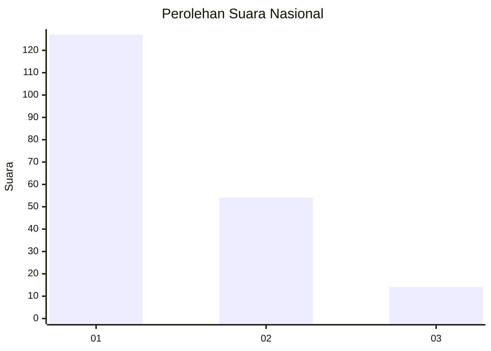
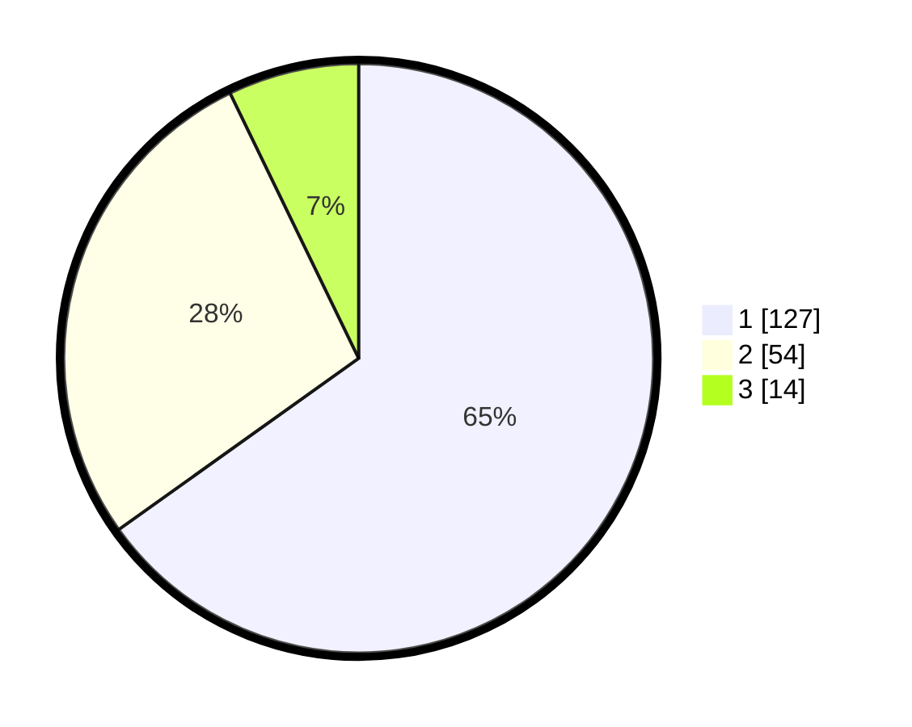

# Hasil

## Grafik

## Tabel

| No.    | Nama Paslon    | Suara | Suara (raw) | Persentase |
|:------ |:-------------- | -----:| -----------:| ----------:|
| 100025 | ANIES MUHAIMIN | 127   | [127][p-1]  | 65,13      |
| 100026 | PRABOWO GIBRAN | 54    | [54][p-2]   | 27,69      |
| 100027 | GANJAR MAHFUD  | 14    | [14][p-3]   | 7,18       |

[p-1]: https://github.com/gigit-pemilu/pemilu-2024/blob/main/pilpres/hitung-suara/sub/31-dki-jakarta/sub/73-jakarta-barat/sub/07-pal-merah/sub/1001-palmerah/sub/132-tps/sub/paslon-1.txt
[p-2]: https://github.com/gigit-pemilu/pemilu-2024/blob/main/pilpres/hitung-suara/sub/31-dki-jakarta/sub/73-jakarta-barat/sub/07-pal-merah/sub/1001-palmerah/sub/132-tps/sub/paslon-2.txt
[p-3]: https://github.com/gigit-pemilu/pemilu-2024/blob/main/pilpres/hitung-suara/sub/31-dki-jakarta/sub/73-jakarta-barat/sub/07-pal-merah/sub/1001-palmerah/sub/132-tps/sub/paslon-3.txt

## Foto C Plano

https://sirekap-obj-formc.kpu.go.id/3199/pemilu/ppwp/31/73/07/10/01/3173071001132-20240215-002044--9e69e7b9-d04f-49cb-9ec6-172958c23e57.jpg

https://sirekap-obj-formc.kpu.go.id/3199/pemilu/ppwp/31/73/07/10/01/3173071001132-20240215-002050--3a2bd366-08f3-4e79-81ac-12a3b7199e34.jpg

https://sirekap-obj-formc.kpu.go.id/3199/pemilu/ppwp/31/73/07/10/01/3173071001132-20240215-002053--82920571-8ed2-4dc0-aa99-0f769de20888.jpg

## Metadata

| Key        | Value               |
| ---------- | ------------------- |
| Time Stamp | 2024-02-16 16:25:10 |

