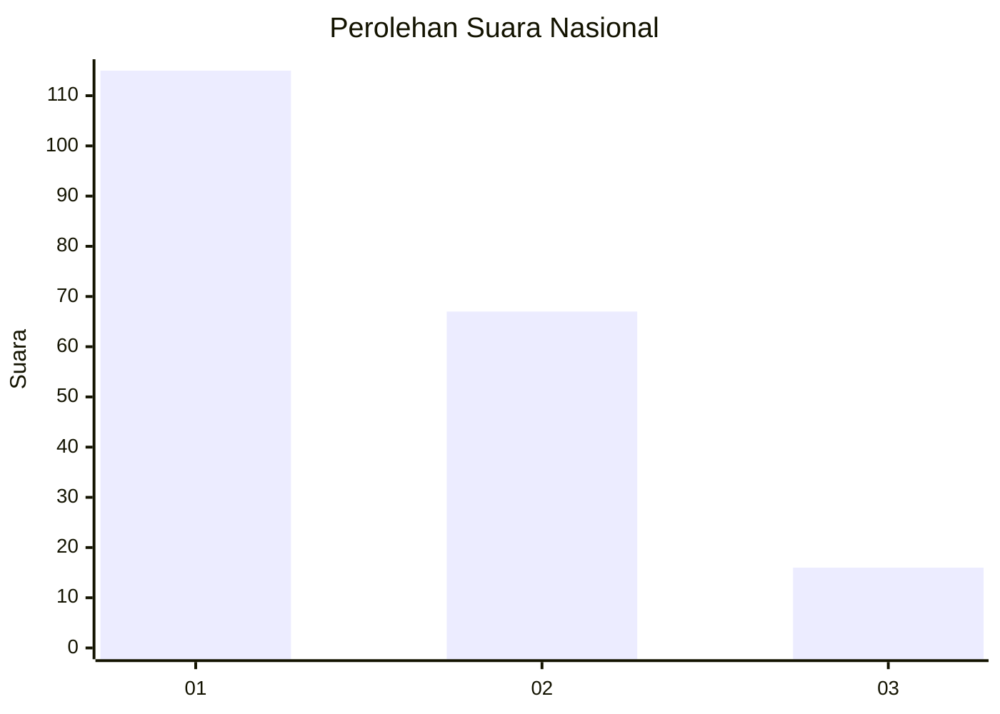
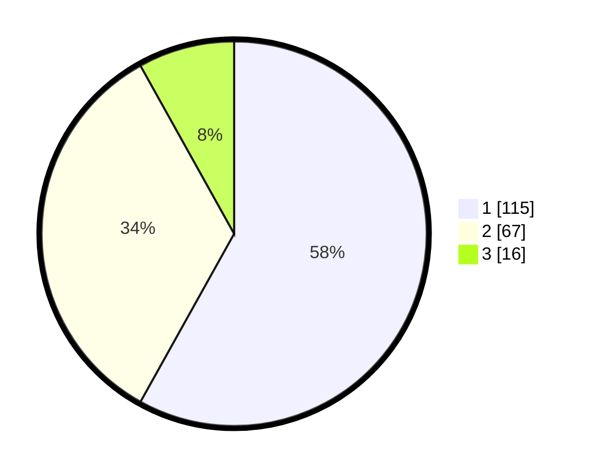

# Hasil

## Grafik

## Tabel

| No.    | Nama Paslon    | Suara | Suara (raw) | Persentase |
|:------ |:-------------- | -----:| -----------:| ----------:|
| 100025 | ANIES MUHAIMIN | 115   | [115][p-1]  | 58,08      |
| 100026 | PRABOWO GIBRAN | 67    | [67][p-2]   | 33,84      |
| 100027 | GANJAR MAHFUD  | 16    | [16][p-3]   | 8,08       |

[p-1]: https://github.com/gigit-pemilu/pemilu-2024/blob/main/pilpres/hitung-suara/sub/31-dki-jakarta/sub/73-jakarta-barat/sub/07-pal-merah/sub/1001-palmerah/sub/144-tps/sub/paslon-1.txt
[p-2]: https://github.com/gigit-pemilu/pemilu-2024/blob/main/pilpres/hitung-suara/sub/31-dki-jakarta/sub/73-jakarta-barat/sub/07-pal-merah/sub/1001-palmerah/sub/144-tps/sub/paslon-2.txt
[p-3]: https://github.com/gigit-pemilu/pemilu-2024/blob/main/pilpres/hitung-suara/sub/31-dki-jakarta/sub/73-jakarta-barat/sub/07-pal-merah/sub/1001-palmerah/sub/144-tps/sub/paslon-3.txt

## Foto C Plano

https://sirekap-obj-formc.kpu.go.id/29cb/pemilu/ppwp/31/73/07/10/01/3173071001144-20240215-022807--00877b2b-cebd-4310-bb9c-79d550238ef0.jpg

https://sirekap-obj-formc.kpu.go.id/29cb/pemilu/ppwp/31/73/07/10/01/3173071001144-20240214-235123--cad55e35-8576-48fc-91a1-417011387386.jpg

https://sirekap-obj-formc.kpu.go.id/29cb/pemilu/ppwp/31/73/07/10/01/3173071001144-20240214-235240--4d443345-b7cf-47e8-8a7a-b647aba84158.jpg

## Metadata

| Key        | Value               |
| ---------- | ------------------- |
| Time Stamp | 2024-02-16 16:25:10 |

