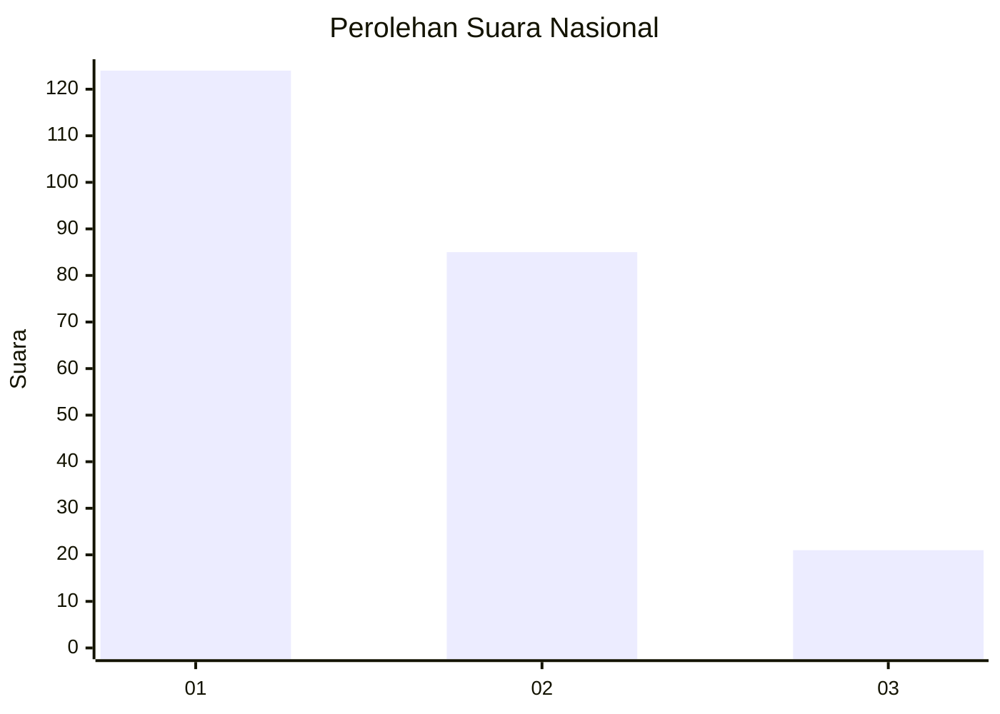
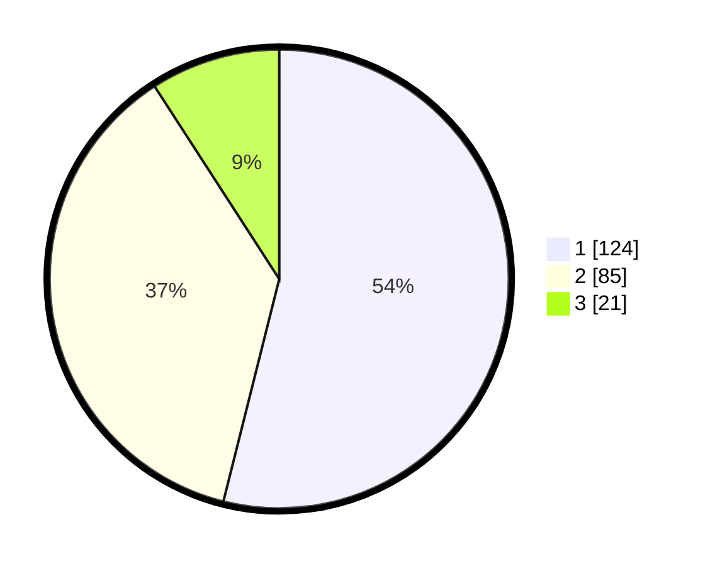

# Hasil

## Grafik

## Tabel

| No.    | Nama Paslon    | Suara | Suara (raw) | Persentase |
|:------ |:-------------- | -----:| -----------:| ----------:|
| 100025 | ANIES MUHAIMIN | 124   | [124][p-1]  | 53,91      |
| 100026 | PRABOWO GIBRAN | 85    | [85][p-2]   | 36,96      |
| 100027 | GANJAR MAHFUD  | 21    | [21][p-3]   | 9,13       |

[p-1]: https://github.com/gigit-pemilu/pemilu-2024/blob/main/pilpres/hitung-suara/sub/31-dki-jakarta/sub/73-jakarta-barat/sub/07-pal-merah/sub/1001-palmerah/sub/147-tps/sub/paslon-1.txt
[p-2]: https://github.com/gigit-pemilu/pemilu-2024/blob/main/pilpres/hitung-suara/sub/31-dki-jakarta/sub/73-jakarta-barat/sub/07-pal-merah/sub/1001-palmerah/sub/147-tps/sub/paslon-2.txt
[p-3]: https://github.com/gigit-pemilu/pemilu-2024/blob/main/pilpres/hitung-suara/sub/31-dki-jakarta/sub/73-jakarta-barat/sub/07-pal-merah/sub/1001-palmerah/sub/147-tps/sub/paslon-3.txt

## Foto C Plano

https://sirekap-obj-formc.kpu.go.id/a084/pemilu/ppwp/31/73/07/10/01/3173071001147-20240214-225547--dbfdafcc-27a6-4e75-9082-3ba6ae273697.jpg

https://sirekap-obj-formc.kpu.go.id/a084/pemilu/ppwp/31/73/07/10/01/3173071001147-20240214-225705--c4d78be3-65a7-45f4-9e00-63742db83fc0.jpg

https://sirekap-obj-formc.kpu.go.id/a084/pemilu/ppwp/31/73/07/10/01/3173071001147-20240214-225810--a9dd0d49-d6d6-4b91-9248-929a1e76b9fc.jpg

## Metadata

| Key        | Value               |
| ---------- | ------------------- |
| Time Stamp | 2024-02-16 16:25:10 |

