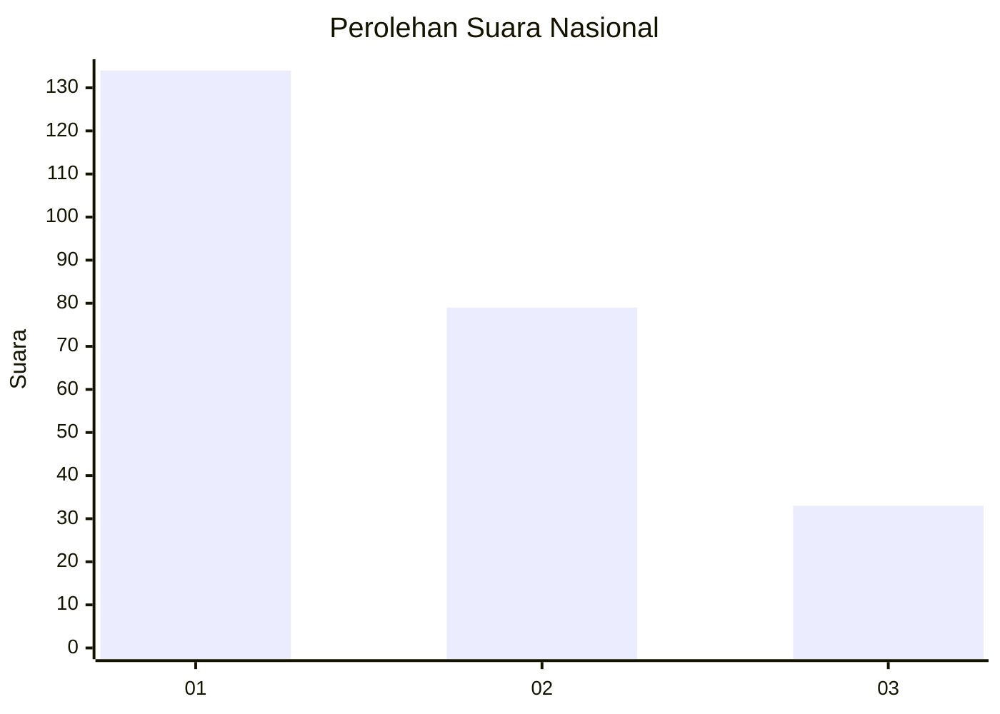
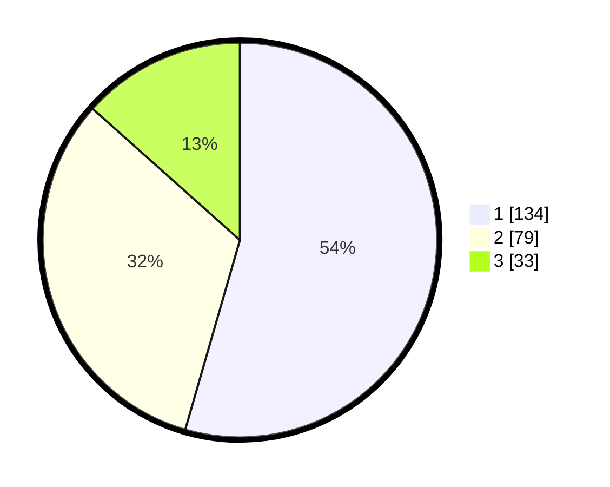

# Hasil

## Grafik

## Tabel

| No.    | Nama Paslon    | Suara | Suara (raw) | Persentase |
|:------ |:-------------- | -----:| -----------:| ----------:|
| 100025 | ANIES MUHAIMIN | 134   | [134][p-1]  | 54,47      |
| 100026 | PRABOWO GIBRAN | 79    | [79][p-2]   | 32,11      |
| 100027 | GANJAR MAHFUD  | 33    | [33][p-3]   | 13,41      |

[p-1]: https://github.com/gigit-pemilu/pemilu-2024/blob/main/pilpres/hitung-suara/sub/31-dki-jakarta/sub/73-jakarta-barat/sub/07-pal-merah/sub/1001-palmerah/sub/155-tps/sub/paslon-1.txt
[p-2]: https://github.com/gigit-pemilu/pemilu-2024/blob/main/pilpres/hitung-suara/sub/31-dki-jakarta/sub/73-jakarta-barat/sub/07-pal-merah/sub/1001-palmerah/sub/155-tps/sub/paslon-2.txt
[p-3]: https://github.com/gigit-pemilu/pemilu-2024/blob/main/pilpres/hitung-suara/sub/31-dki-jakarta/sub/73-jakarta-barat/sub/07-pal-merah/sub/1001-palmerah/sub/155-tps/sub/paslon-3.txt

## Foto C Plano

https://sirekap-obj-formc.kpu.go.id/233c/pemilu/ppwp/31/73/07/10/01/3173071001155-20240214-220819--9862d3f9-3894-40cf-9a34-04c4059fdd32.jpg

https://sirekap-obj-formc.kpu.go.id/233c/pemilu/ppwp/31/73/07/10/01/3173071001155-20240214-220924--afb1e4dd-ad4e-43bb-bdbb-332e8b20716b.jpg

https://sirekap-obj-formc.kpu.go.id/233c/pemilu/ppwp/31/73/07/10/01/3173071001155-20240214-221002--5ed2c7fd-8454-4327-8fad-300eebed6d46.jpg

## Metadata

| Key        | Value               |
| ---------- | ------------------- |
| Time Stamp | 2024-02-16 16:25:10 |

