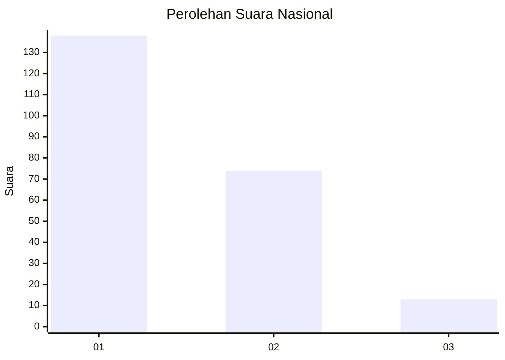
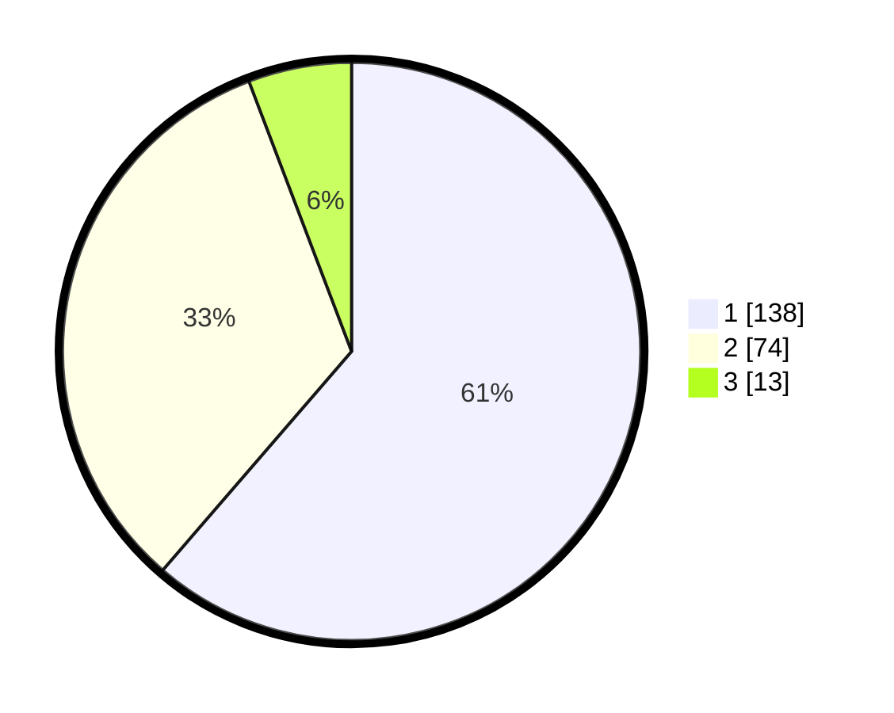

# Hasil

## Grafik

## Tabel

| No.    | Nama Paslon    | Suara | Suara (raw) | Persentase |
|:------ |:-------------- | -----:| -----------:| ----------:|
| 100025 | ANIES MUHAIMIN | 138   | [138][p-1]  | 61,33      |
| 100026 | PRABOWO GIBRAN | 74    | [74][p-2]   | 32,89      |
| 100027 | GANJAR MAHFUD  | 13    | [13][p-3]   | 5,78       |

[p-1]: https://github.com/gigit-pemilu/pemilu-2024/blob/main/pilpres/hitung-suara/sub/31-dki-jakarta/sub/73-jakarta-barat/sub/07-pal-merah/sub/1001-palmerah/sub/162-tps/sub/paslon-1.txt
[p-2]: https://github.com/gigit-pemilu/pemilu-2024/blob/main/pilpres/hitung-suara/sub/31-dki-jakarta/sub/73-jakarta-barat/sub/07-pal-merah/sub/1001-palmerah/sub/162-tps/sub/paslon-2.txt
[p-3]: https://github.com/gigit-pemilu/pemilu-2024/blob/main/pilpres/hitung-suara/sub/31-dki-jakarta/sub/73-jakarta-barat/sub/07-pal-merah/sub/1001-palmerah/sub/162-tps/sub/paslon-3.txt

## Foto C Plano

https://sirekap-obj-formc.kpu.go.id/9c7e/pemilu/ppwp/31/73/07/10/01/3173071001162-20240214-225822--51dcc58b-bd29-4d54-adcb-07836f0934dd.jpg

https://sirekap-obj-formc.kpu.go.id/9c7e/pemilu/ppwp/31/73/07/10/01/3173071001162-20240214-225943--ba49ce1b-0dd3-4442-80cf-0b35737cc9ae.jpg

https://sirekap-obj-formc.kpu.go.id/9c7e/pemilu/ppwp/31/73/07/10/01/3173071001162-20240214-230148--61c72a2d-966c-4b6b-826c-24982d86d960.jpg

## Metadata

| Key        | Value               |
| ---------- | ------------------- |
| Time Stamp | 2024-02-21 17:00:00 |

