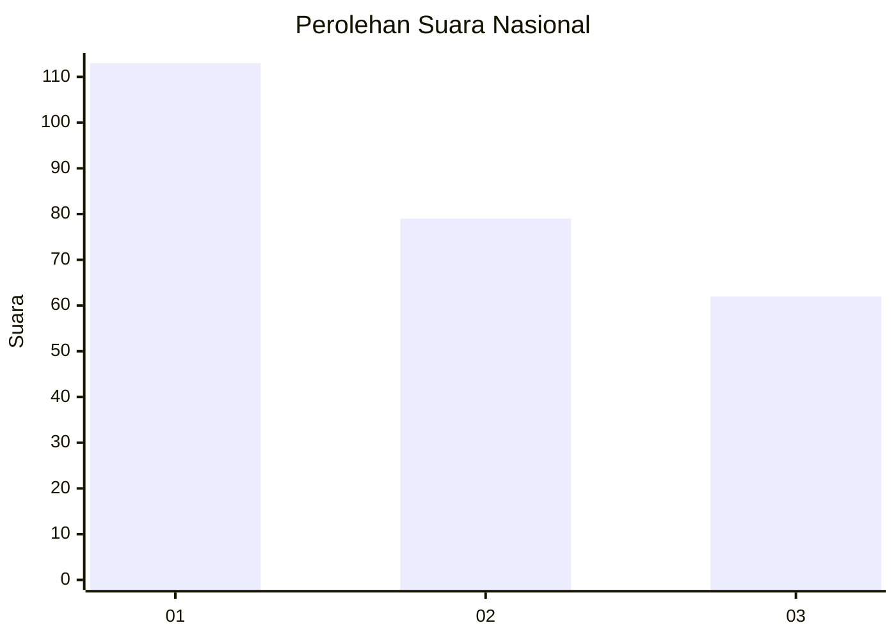
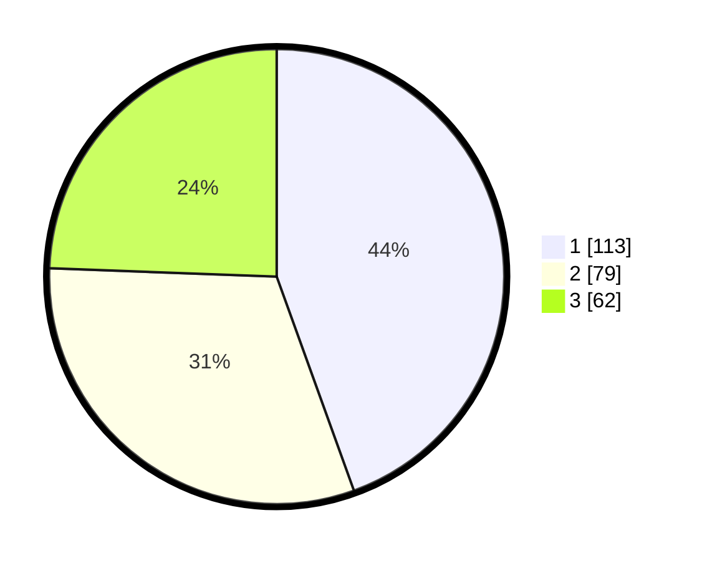

# Hasil

## Grafik

## Tabel

| No. | Nama Paslon    | Suara | Suara (raw) | Persentase |
|:--- |:-------------- | -----:| -----------:| ----------:|
| 1   | ANIES MUHAIMIN | 113   | [113][p-1]  | 44,49      |
| 2   | PRABOWO GIBRAN | 79    | [79][p-2]   | 31,10      |
| 3   | GANJAR MAHFUD  | 62    | [62][p-3]   | 24,41      |

[p-1]: https://github.com/gigit-pemilu/pemilu-2024/blob/main/pilpres/hitung-suara/sub/31-dki-jakarta/sub/73-jakarta-barat/sub/07-pal-merah/sub/1001-palmerah/sub/164-tps/sub/paslon-1.txt
[p-2]: https://github.com/gigit-pemilu/pemilu-2024/blob/main/pilpres/hitung-suara/sub/31-dki-jakarta/sub/73-jakarta-barat/sub/07-pal-merah/sub/1001-palmerah/sub/164-tps/sub/paslon-2.txt
[p-3]: https://github.com/gigit-pemilu/pemilu-2024/blob/main/pilpres/hitung-suara/sub/31-dki-jakarta/sub/73-jakarta-barat/sub/07-pal-merah/sub/1001-palmerah/sub/164-tps/sub/paslon-3.txt

## Foto C Plano

https://sirekap-obj-formc.kpu.go.id/e71f/pemilu/ppwp/31/73/07/10/01/3173071001164-20240215-032136--f3ab51b4-f3ec-419f-8692-ef05dd680362.jpg

https://sirekap-obj-formc.kpu.go.id/e71f/pemilu/ppwp/31/73/07/10/01/3173071001164-20240215-032219--dbf4342a-23e4-4c69-a4e2-d359deddf3b6.jpg

https://sirekap-obj-formc.kpu.go.id/e71f/pemilu/ppwp/31/73/07/10/01/3173071001164-20240215-032026--d5638c10-d551-4bf8-bf37-3894c61d723e.jpg

## Metadata

| Key        | Value               |
| ---------- | ------------------- |
| Time Stamp | 2024-02-19 15:00:00 |

