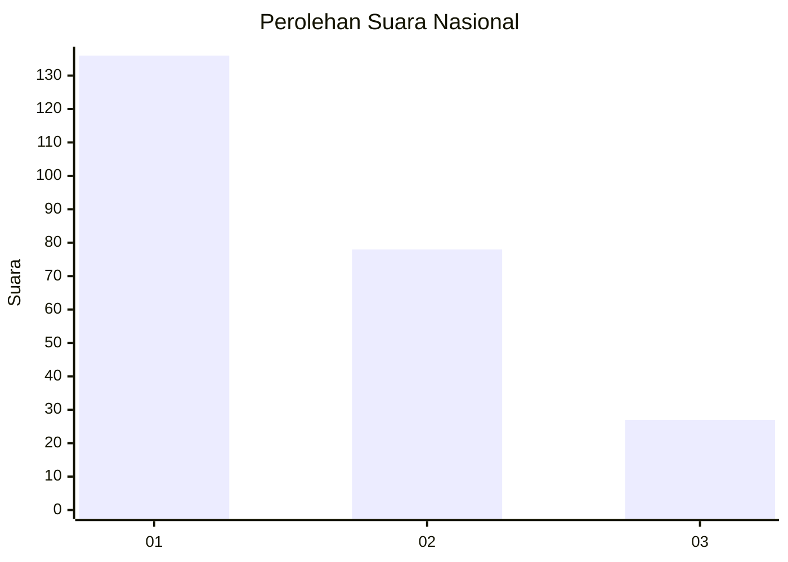
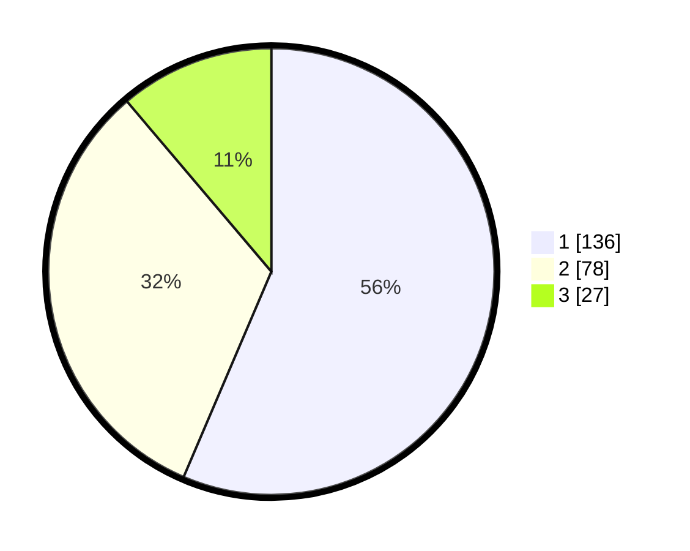

# Hasil

## Grafik

## Tabel

| No.    | Nama Paslon    | Suara | Suara (raw) | Persentase |
|:------ |:-------------- | -----:| -----------:| ----------:|
| 100025 | ANIES MUHAIMIN | 136   | [136][p-1]  | 56,43      |
| 100026 | PRABOWO GIBRAN | 78    | [78][p-2]   | 32,37      |
| 100027 | GANJAR MAHFUD  | 27    | [27][p-3]   | 11,20      |

[p-1]: https://github.com/gigit-pemilu/pemilu-2024/blob/main/pilpres/hitung-suara/sub/31-dki-jakarta/sub/73-jakarta-barat/sub/07-pal-merah/sub/1001-palmerah/sub/166-tps/sub/paslon-1.txt
[p-2]: https://github.com/gigit-pemilu/pemilu-2024/blob/main/pilpres/hitung-suara/sub/31-dki-jakarta/sub/73-jakarta-barat/sub/07-pal-merah/sub/1001-palmerah/sub/166-tps/sub/paslon-2.txt
[p-3]: https://github.com/gigit-pemilu/pemilu-2024/blob/main/pilpres/hitung-suara/sub/31-dki-jakarta/sub/73-jakarta-barat/sub/07-pal-merah/sub/1001-palmerah/sub/166-tps/sub/paslon-3.txt

## Foto C Plano

https://sirekap-obj-formc.kpu.go.id/9c28/pemilu/ppwp/31/73/07/10/01/3173071001166-20240215-001602--62f81a61-289a-47bb-a699-9bcde71edba6.jpg

https://sirekap-obj-formc.kpu.go.id/9c28/pemilu/ppwp/31/73/07/10/01/3173071001166-20240215-001647--9520d9a0-1091-4afe-ac92-e4356d9c0df8.jpg

https://sirekap-obj-formc.kpu.go.id/9c28/pemilu/ppwp/31/73/07/10/01/3173071001166-20240215-001842--b11cad30-db01-49fd-924c-3c7310ff52a2.jpg

## Metadata

| Key        | Value               |
| ---------- | ------------------- |
| Time Stamp | 2024-02-19 15:00:00 |

