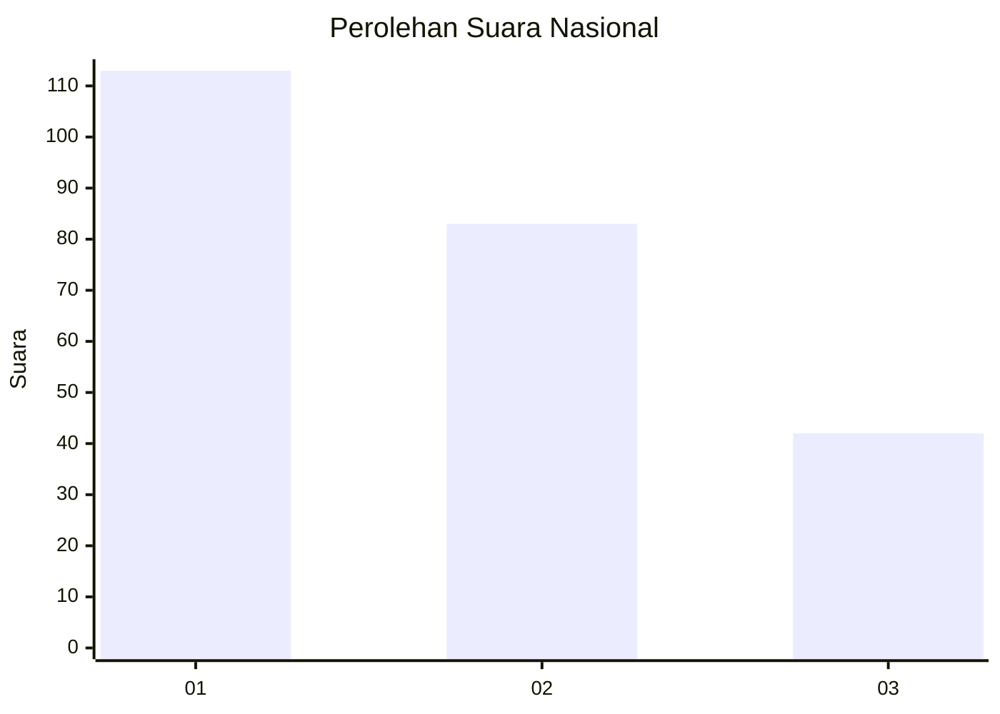
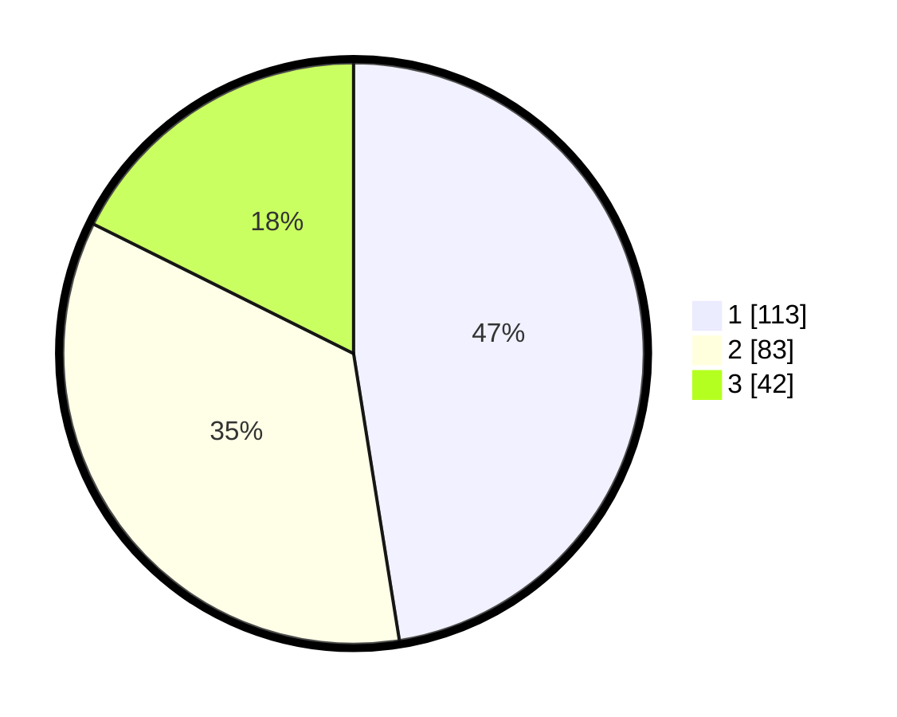

# Hasil

## Grafik

## Tabel

| No.    | Nama Paslon    | Suara | Suara (raw) | Persentase |
|:------ |:-------------- | -----:| -----------:| ----------:|
| 100025 | ANIES MUHAIMIN | 113   | [113][p-1]  | 47,48      |
| 100026 | PRABOWO GIBRAN | 83    | [83][p-2]   | 34,87      |
| 100027 | GANJAR MAHFUD  | 42    | [42][p-3]   | 17,65      |

[p-1]: https://github.com/gigit-pemilu/pemilu-2024/blob/main/pilpres/hitung-suara/sub/31-dki-jakarta/sub/73-jakarta-barat/sub/07-pal-merah/sub/1001-palmerah/sub/172-tps/sub/paslon-1.txt
[p-2]: https://github.com/gigit-pemilu/pemilu-2024/blob/main/pilpres/hitung-suara/sub/31-dki-jakarta/sub/73-jakarta-barat/sub/07-pal-merah/sub/1001-palmerah/sub/172-tps/sub/paslon-2.txt
[p-3]: https://github.com/gigit-pemilu/pemilu-2024/blob/main/pilpres/hitung-suara/sub/31-dki-jakarta/sub/73-jakarta-barat/sub/07-pal-merah/sub/1001-palmerah/sub/172-tps/sub/paslon-3.txt

## Foto C Plano

https://sirekap-obj-formc.kpu.go.id/2151/pemilu/ppwp/31/73/07/10/01/3173071001172-20240214-220727--1ebcdc47-b02c-4ec2-907f-88a0c3d89da4.jpg

https://sirekap-obj-formc.kpu.go.id/2151/pemilu/ppwp/31/73/07/10/01/3173071001172-20240214-220309--b49d99cc-7193-4356-aa8c-656cf53d1900.jpg

https://sirekap-obj-formc.kpu.go.id/2151/pemilu/ppwp/31/73/07/10/01/3173071001172-20240214-220431--409baf7e-f3f5-4b88-8a6c-f8af182a6205.jpg

## Metadata

| Key        | Value               |
| ---------- | ------------------- |
| Time Stamp | 2024-02-19 15:00:00 |

