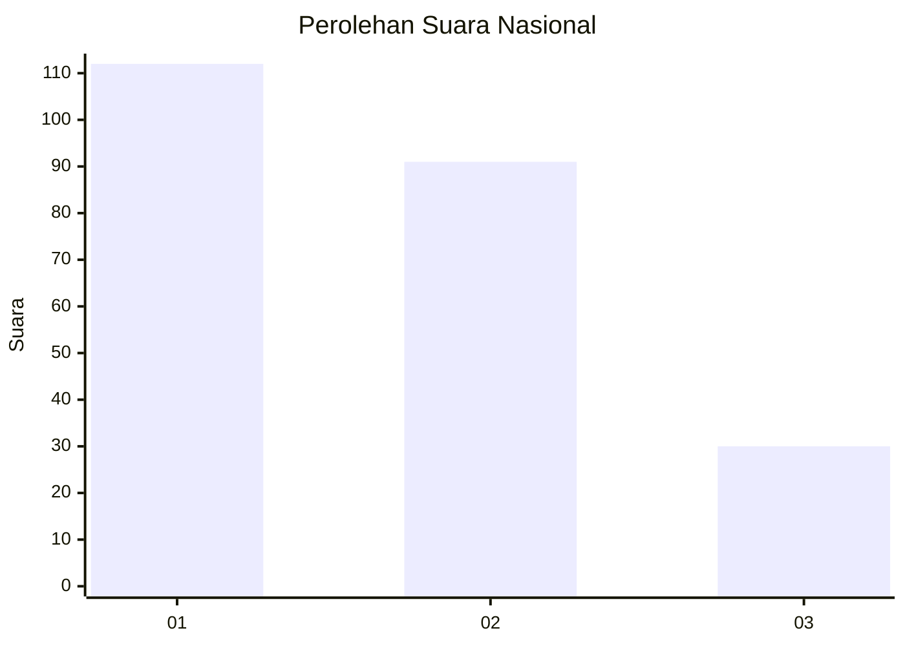
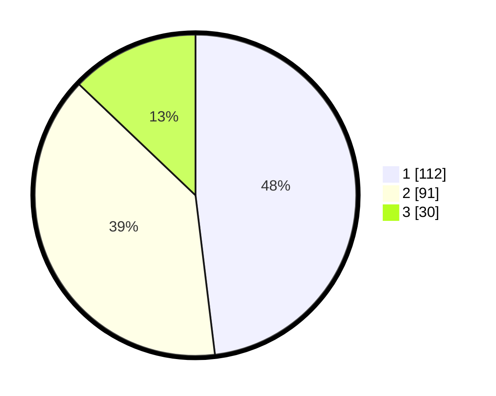

# Hasil

## Grafik

## Tabel

| No.    | Nama Paslon    | Suara | Suara (raw) | Persentase |
|:------ |:-------------- | -----:| -----------:| ----------:|
| 100025 | ANIES MUHAIMIN | 112   | [112][p-1]  | 48,07      |
| 100026 | PRABOWO GIBRAN | 91    | [91][p-2]   | 39,06      |
| 100027 | GANJAR MAHFUD  | 30    | [30][p-3]   | 12,88      |

[p-1]: https://github.com/gigit-pemilu/pemilu-2024/blob/main/pilpres/hitung-suara/sub/31-dki-jakarta/sub/73-jakarta-barat/sub/07-pal-merah/sub/1001-palmerah/sub/178-tps/sub/paslon-1.txt
[p-2]: https://github.com/gigit-pemilu/pemilu-2024/blob/main/pilpres/hitung-suara/sub/31-dki-jakarta/sub/73-jakarta-barat/sub/07-pal-merah/sub/1001-palmerah/sub/178-tps/sub/paslon-2.txt
[p-3]: https://github.com/gigit-pemilu/pemilu-2024/blob/main/pilpres/hitung-suara/sub/31-dki-jakarta/sub/73-jakarta-barat/sub/07-pal-merah/sub/1001-palmerah/sub/178-tps/sub/paslon-3.txt

## Foto C Plano

https://sirekap-obj-formc.kpu.go.id/1fe4/pemilu/ppwp/31/73/07/10/01/3173071001178-20240214-225852--5118b595-b456-4b07-bd14-f74d65760ea0.jpg

https://sirekap-obj-formc.kpu.go.id/1fe4/pemilu/ppwp/31/73/07/10/01/3173071001178-20240214-230001--d530c49a-2b07-4409-90f8-4ee9b814fd84.jpg

https://sirekap-obj-formc.kpu.go.id/1fe4/pemilu/ppwp/31/73/07/10/01/3173071001178-20240214-230103--a832f426-401f-4cb6-8fee-00d942ccdaea.jpg

## Metadata

| Key        | Value               |
| ---------- | ------------------- |
| Time Stamp | 2024-02-16 16:25:10 |

