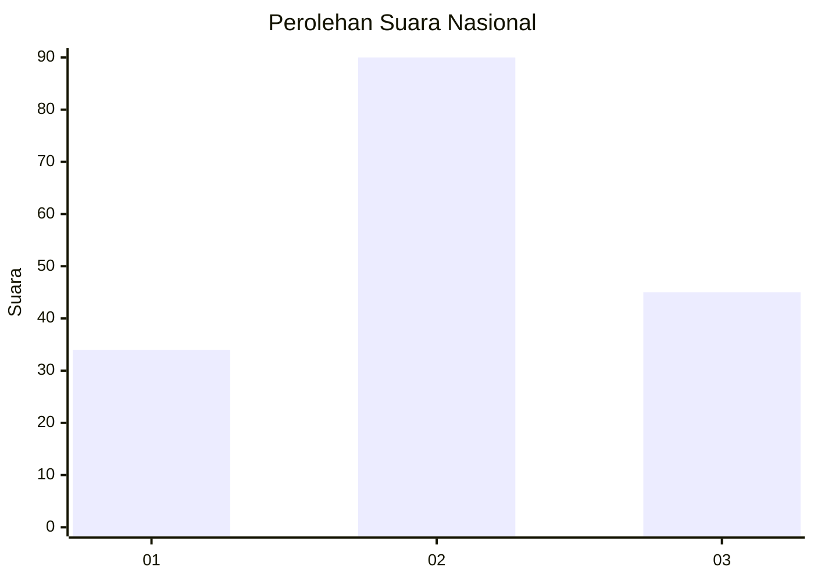
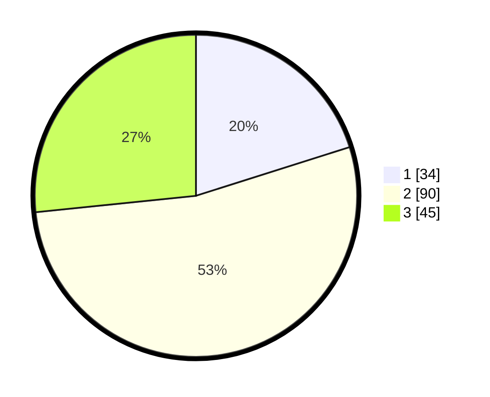

# Hasil

## Grafik

## Tabel

| No.    | Nama Paslon    | Suara | Suara (raw) | Persentase |
|:------ |:-------------- | -----:| -----------:| ----------:|
| 100025 | ANIES MUHAIMIN | 34    | [34][p-1]   | 20,12      |
| 100026 | PRABOWO GIBRAN | 90    | [90][p-2]   | 53,25      |
| 100027 | GANJAR MAHFUD  | 45    | [45][p-3]   | 26,63      |

[p-1]: https://github.com/gigit-pemilu/pemilu-2024/blob/main/pilpres/hitung-suara/sub/31-dki-jakarta/sub/73-jakarta-barat/sub/07-pal-merah/sub/1001-palmerah/sub/183-tps/sub/paslon-1.txt
[p-2]: https://github.com/gigit-pemilu/pemilu-2024/blob/main/pilpres/hitung-suara/sub/31-dki-jakarta/sub/73-jakarta-barat/sub/07-pal-merah/sub/1001-palmerah/sub/183-tps/sub/paslon-2.txt
[p-3]: https://github.com/gigit-pemilu/pemilu-2024/blob/main/pilpres/hitung-suara/sub/31-dki-jakarta/sub/73-jakarta-barat/sub/07-pal-merah/sub/1001-palmerah/sub/183-tps/sub/paslon-3.txt

## Foto C Plano

https://sirekap-obj-formc.kpu.go.id/e7ec/pemilu/ppwp/31/73/07/10/01/3173071001183-20240214-202239--a48b86e1-fda3-4afb-8b0f-b1c83f60b95f.jpg

https://sirekap-obj-formc.kpu.go.id/e7ec/pemilu/ppwp/31/73/07/10/01/3173071001183-20240214-202356--cbe1bbe7-f6c9-42c8-a4d4-49f9acadd410.jpg

https://sirekap-obj-formc.kpu.go.id/e7ec/pemilu/ppwp/31/73/07/10/01/3173071001183-20240214-202532--6ada0b62-7270-4db7-a477-bd40c04c8f87.jpg

## Metadata

| Key        | Value               |
| ---------- | ------------------- |
| Time Stamp | 2024-02-15 15:00:29 |

