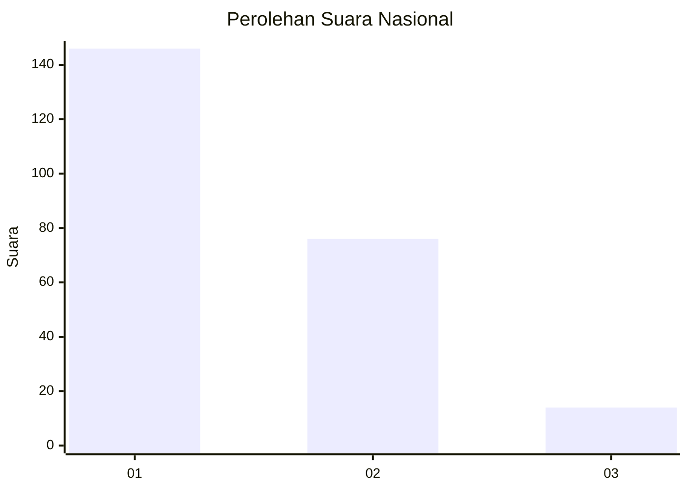
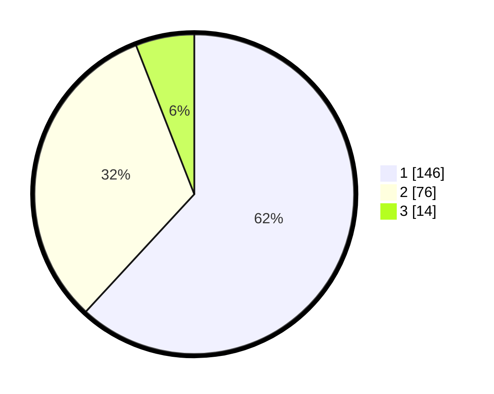

# Hasil

## Grafik

## Tabel

| No.    | Nama Paslon    | Suara | Suara (raw) | Persentase |
|:------ |:-------------- | -----:| -----------:| ----------:|
| 100025 | ANIES MUHAIMIN | 146   | [146][p-1]  | 61,86      |
| 100026 | PRABOWO GIBRAN | 76    | [76][p-2]   | 32,20      |
| 100027 | GANJAR MAHFUD  | 14    | [14][p-3]   | 5,93       |

[p-1]: https://github.com/gigit-pemilu/pemilu-2024/blob/main/pilpres/hitung-suara/sub/31-dki-jakarta/sub/73-jakarta-barat/sub/07-pal-merah/sub/1001-palmerah/sub/188-tps/sub/paslon-1.txt
[p-2]: https://github.com/gigit-pemilu/pemilu-2024/blob/main/pilpres/hitung-suara/sub/31-dki-jakarta/sub/73-jakarta-barat/sub/07-pal-merah/sub/1001-palmerah/sub/188-tps/sub/paslon-2.txt
[p-3]: https://github.com/gigit-pemilu/pemilu-2024/blob/main/pilpres/hitung-suara/sub/31-dki-jakarta/sub/73-jakarta-barat/sub/07-pal-merah/sub/1001-palmerah/sub/188-tps/sub/paslon-3.txt

## Foto C Plano

https://sirekap-obj-formc.kpu.go.id/12cd/pemilu/ppwp/31/73/07/10/01/3173071001188-20240214-230154--16b97231-0f77-4abd-a114-16100b4bd6c7.jpg

https://sirekap-obj-formc.kpu.go.id/12cd/pemilu/ppwp/31/73/07/10/01/3173071001188-20240214-225432--6296010c-0122-40a8-b420-467ca2f2d56f.jpg

https://sirekap-obj-formc.kpu.go.id/12cd/pemilu/ppwp/31/73/07/10/01/3173071001188-20240214-225633--b4cb7370-a33e-4ab7-9def-8d911b24ec92.jpg

## Metadata

| Key        | Value               |
| ---------- | ------------------- |
| Time Stamp | 2024-02-16 16:25:10 |

