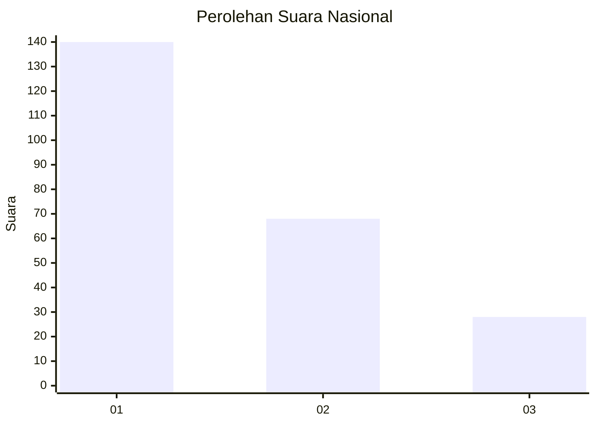
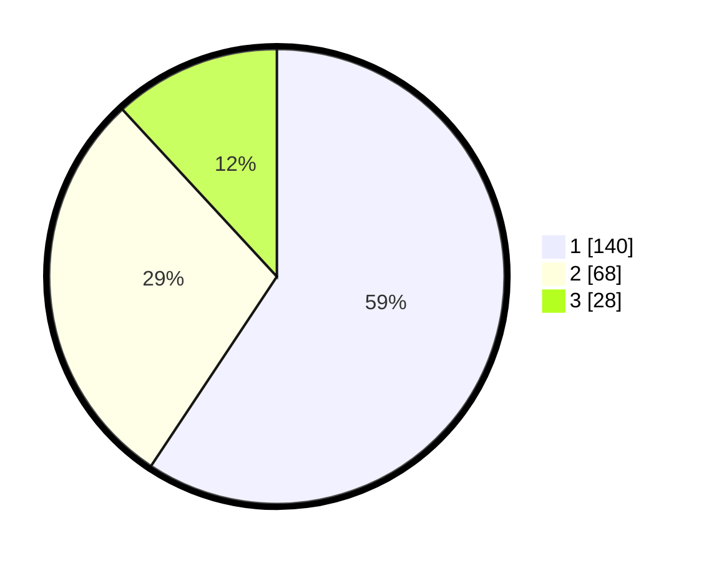

# Hasil

## Grafik

## Tabel

| No.    | Nama Paslon    | Suara | Suara (raw) | Persentase |
|:------ |:-------------- | -----:| -----------:| ----------:|
| 100025 | ANIES MUHAIMIN | 140   | [140][p-1]  | 59,32      |
| 100026 | PRABOWO GIBRAN | 68    | [68][p-2]   | 28,81      |
| 100027 | GANJAR MAHFUD  | 28    | [28][p-3]   | 11,86      |

[p-1]: https://github.com/gigit-pemilu/pemilu-2024/blob/main/pilpres/hitung-suara/sub/31-dki-jakarta/sub/73-jakarta-barat/sub/07-pal-merah/sub/1001-palmerah/sub/190-tps/sub/paslon-1.txt
[p-2]: https://github.com/gigit-pemilu/pemilu-2024/blob/main/pilpres/hitung-suara/sub/31-dki-jakarta/sub/73-jakarta-barat/sub/07-pal-merah/sub/1001-palmerah/sub/190-tps/sub/paslon-2.txt
[p-3]: https://github.com/gigit-pemilu/pemilu-2024/blob/main/pilpres/hitung-suara/sub/31-dki-jakarta/sub/73-jakarta-barat/sub/07-pal-merah/sub/1001-palmerah/sub/190-tps/sub/paslon-3.txt

## Foto C Plano

https://sirekap-obj-formc.kpu.go.id/8d0d/pemilu/ppwp/31/73/07/10/01/3173071001190-20240215-054528--88b9d2dd-e89a-4ec9-8a2f-f92a8a96cc43.jpg

https://sirekap-obj-formc.kpu.go.id/8d0d/pemilu/ppwp/31/73/07/10/01/3173071001190-20240215-054559--35c8feb8-5ff0-4317-a5ae-644609e3f148.jpg

https://sirekap-obj-formc.kpu.go.id/8d0d/pemilu/ppwp/31/73/07/10/01/3173071001190-20240215-054624--b1611a8e-e2e3-4b7d-8b5a-255e2e6c0827.jpg

## Metadata

| Key        | Value               |
| ---------- | ------------------- |
| Time Stamp | 2024-02-19 15:00:00 |

