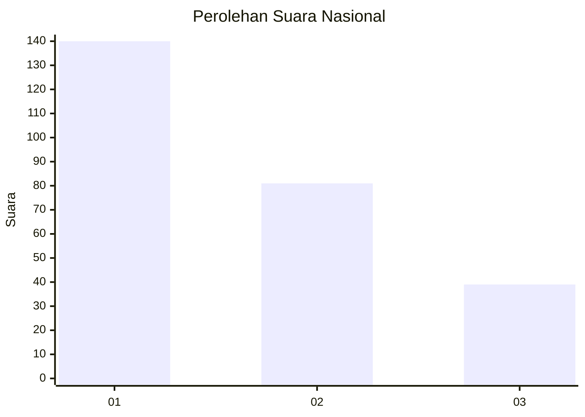
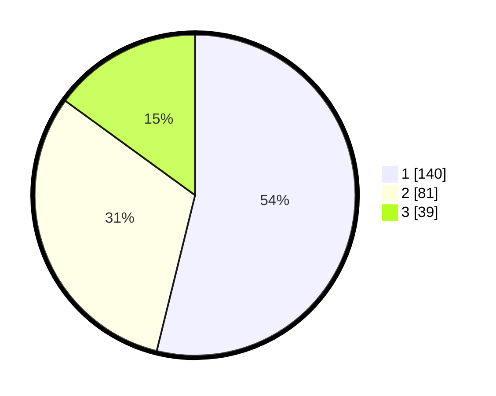

# Hasil

## Grafik

## Tabel

| No.    | Nama Paslon    | Suara | Suara (raw) | Persentase |
|:------ |:-------------- | -----:| -----------:| ----------:|
| 100025 | ANIES MUHAIMIN | 140   | [140][p-1]  | 53,85      |
| 100026 | PRABOWO GIBRAN | 81    | [81][p-2]   | 31,15      |
| 100027 | GANJAR MAHFUD  | 39    | [39][p-3]   | 15,00      |

[p-1]: https://github.com/gigit-pemilu/pemilu-2024/blob/main/pilpres/hitung-suara/sub/31-dki-jakarta/sub/73-jakarta-barat/sub/07-pal-merah/sub/1001-palmerah/sub/192-tps/sub/paslon-1.txt
[p-2]: https://github.com/gigit-pemilu/pemilu-2024/blob/main/pilpres/hitung-suara/sub/31-dki-jakarta/sub/73-jakarta-barat/sub/07-pal-merah/sub/1001-palmerah/sub/192-tps/sub/paslon-2.txt
[p-3]: https://github.com/gigit-pemilu/pemilu-2024/blob/main/pilpres/hitung-suara/sub/31-dki-jakarta/sub/73-jakarta-barat/sub/07-pal-merah/sub/1001-palmerah/sub/192-tps/sub/paslon-3.txt

## Foto C Plano

https://sirekap-obj-formc.kpu.go.id/dfd4/pemilu/ppwp/31/73/07/10/01/3173071001192-20240214-234717--aab5630f-8303-470e-a7db-aa3823b28f79.jpg

https://sirekap-obj-formc.kpu.go.id/dfd4/pemilu/ppwp/31/73/07/10/01/3173071001192-20240214-235019--401c195d-f18c-455c-ba9a-8be85290d16e.jpg

https://sirekap-obj-formc.kpu.go.id/dfd4/pemilu/ppwp/31/73/07/10/01/3173071001192-20240214-235148--714f6e54-2347-4c2e-8c60-b070bc5f5d71.jpg

## Metadata

| Key        | Value               |
| ---------- | ------------------- |
| Time Stamp | 2024-02-16 16:25:10 |

