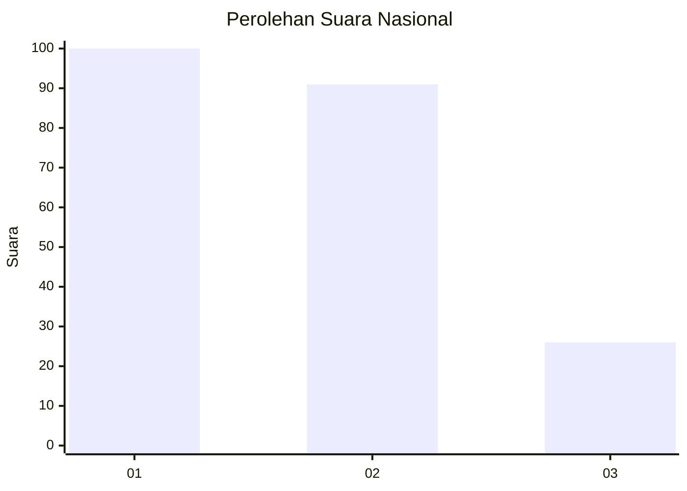
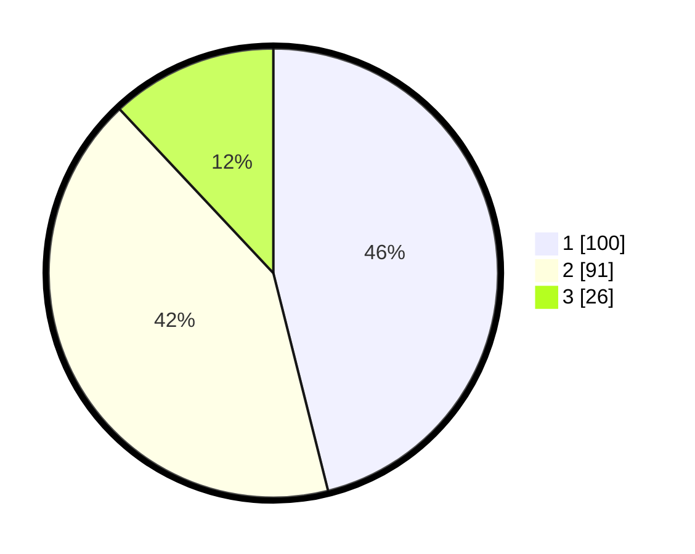

# Hasil

## Grafik

## Tabel

| No.    | Nama Paslon    | Suara | Suara (raw) | Persentase |
|:------ |:-------------- | -----:| -----------:| ----------:|
| 100025 | ANIES MUHAIMIN | 100   | [100][p-1]  | 46,08      |
| 100026 | PRABOWO GIBRAN | 91    | [91][p-2]   | 41,94      |
| 100027 | GANJAR MAHFUD  | 26    | [26][p-3]   | 11,98      |

[p-1]: https://github.com/gigit-pemilu/pemilu-2024/blob/main/pilpres/hitung-suara/sub/31-dki-jakarta/sub/73-jakarta-barat/sub/07-pal-merah/sub/1001-palmerah/sub/201-tps/sub/paslon-1.txt
[p-2]: https://github.com/gigit-pemilu/pemilu-2024/blob/main/pilpres/hitung-suara/sub/31-dki-jakarta/sub/73-jakarta-barat/sub/07-pal-merah/sub/1001-palmerah/sub/201-tps/sub/paslon-2.txt
[p-3]: https://github.com/gigit-pemilu/pemilu-2024/blob/main/pilpres/hitung-suara/sub/31-dki-jakarta/sub/73-jakarta-barat/sub/07-pal-merah/sub/1001-palmerah/sub/201-tps/sub/paslon-3.txt

## Foto C Plano

https://sirekap-obj-formc.kpu.go.id/9aaf/pemilu/ppwp/31/73/07/10/01/3173071001201-20240214-155250--86869766-8ad7-4e09-bd66-6e5064700603.jpg

https://sirekap-obj-formc.kpu.go.id/9aaf/pemilu/ppwp/31/73/07/10/01/3173071001201-20240214-155245--75267c5b-bfad-47b0-90c1-a405a486591b.jpg

https://sirekap-obj-formc.kpu.go.id/9aaf/pemilu/ppwp/31/73/07/10/01/3173071001201-20240214-155603--4e10962e-14cc-4200-a4ca-e4d866d38bf1.jpg

## Metadata

| Key        | Value               |
| ---------- | ------------------- |
| Time Stamp | 2024-02-19 15:00:00 |

