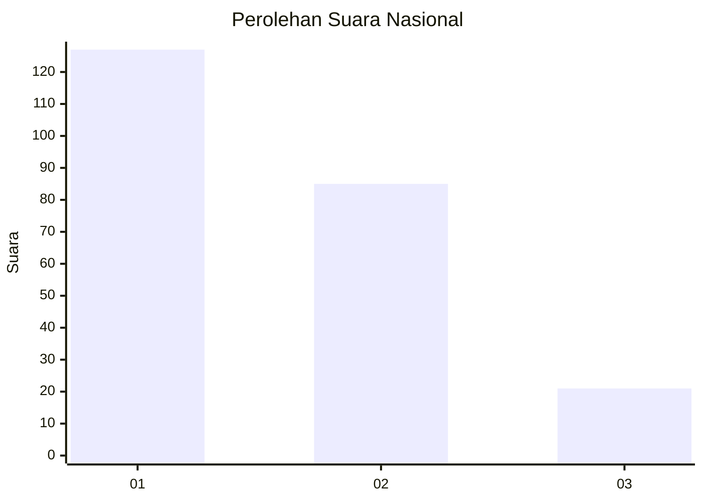
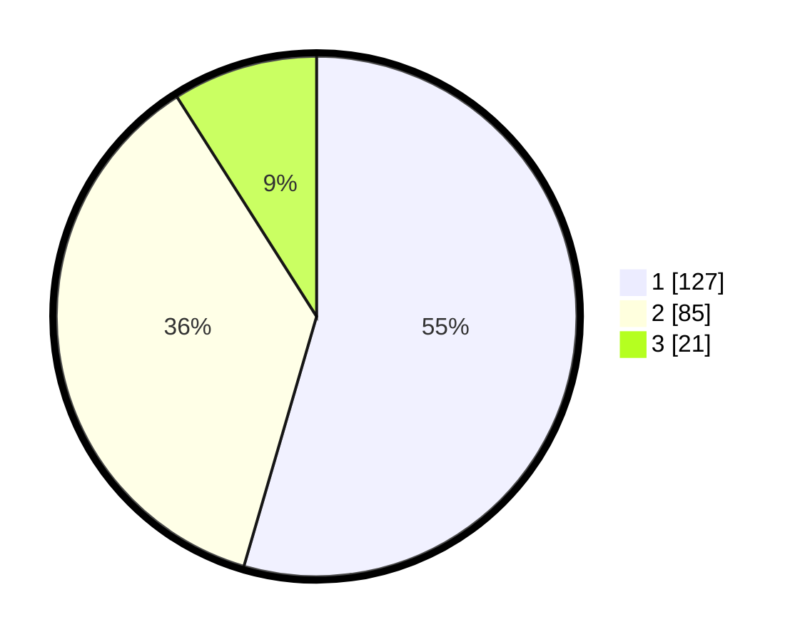

# Hasil

## Grafik

## Tabel

| No.    | Nama Paslon    | Suara | Suara (raw) | Persentase |
|:------ |:-------------- | -----:| -----------:| ----------:|
| 100025 | ANIES MUHAIMIN | 127   | [127][p-1]  | 54,51      |
| 100026 | PRABOWO GIBRAN | 85    | [85][p-2]   | 36,48      |
| 100027 | GANJAR MAHFUD  | 21    | [21][p-3]   | 9,01       |

[p-1]: https://github.com/gigit-pemilu/pemilu-2024/blob/main/pilpres/hitung-suara/sub/31-dki-jakarta/sub/73-jakarta-barat/sub/07-pal-merah/sub/1001-palmerah/sub/202-tps/sub/paslon-1.txt
[p-2]: https://github.com/gigit-pemilu/pemilu-2024/blob/main/pilpres/hitung-suara/sub/31-dki-jakarta/sub/73-jakarta-barat/sub/07-pal-merah/sub/1001-palmerah/sub/202-tps/sub/paslon-2.txt
[p-3]: https://github.com/gigit-pemilu/pemilu-2024/blob/main/pilpres/hitung-suara/sub/31-dki-jakarta/sub/73-jakarta-barat/sub/07-pal-merah/sub/1001-palmerah/sub/202-tps/sub/paslon-3.txt

## Foto C Plano

https://sirekap-obj-formc.kpu.go.id/76d8/pemilu/ppwp/31/73/07/10/01/3173071001202-20240214-162220--fedae1b3-0282-4657-8628-24c6cd8e3264.jpg

https://sirekap-obj-formc.kpu.go.id/76d8/pemilu/ppwp/31/73/07/10/01/3173071001202-20240214-155736--622df328-daf5-4584-9cde-68ddcb48219a.jpg

https://sirekap-obj-formc.kpu.go.id/76d8/pemilu/ppwp/31/73/07/10/01/3173071001202-20240214-155650--1e7d7d33-0a84-4cf6-84e8-679b5b0e8722.jpg

## Metadata

| Key        | Value               |
| ---------- | ------------------- |
| Time Stamp | 2024-02-21 18:00:00 |

