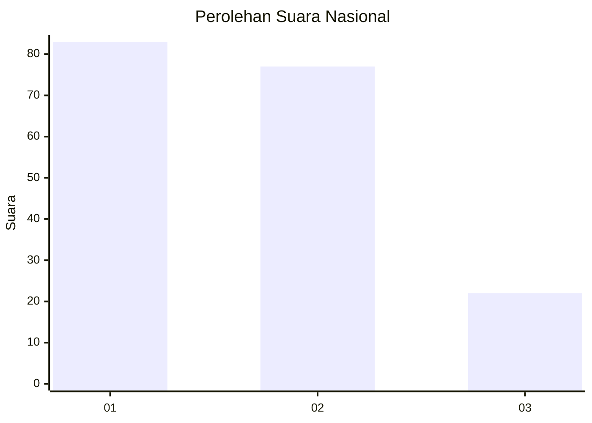
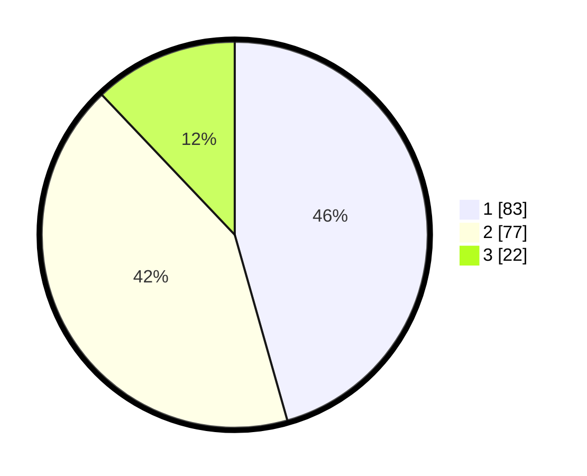

# Hasil

## Grafik

## Tabel

| No.    | Nama Paslon    | Suara | Suara (raw) | Persentase |
|:------ |:-------------- | -----:| -----------:| ----------:|
| 100025 | ANIES MUHAIMIN | 83    | [83][p-1]   | 45,60      |
| 100026 | PRABOWO GIBRAN | 77    | [77][p-2]   | 42,31      |
| 100027 | GANJAR MAHFUD  | 22    | [22][p-3]   | 12,09      |

[p-1]: https://github.com/gigit-pemilu/pemilu-2024/blob/main/pilpres/hitung-suara/sub/31-dki-jakarta/sub/73-jakarta-barat/sub/07-pal-merah/sub/1001-palmerah/sub/217-tps/sub/paslon-1.txt
[p-2]: https://github.com/gigit-pemilu/pemilu-2024/blob/main/pilpres/hitung-suara/sub/31-dki-jakarta/sub/73-jakarta-barat/sub/07-pal-merah/sub/1001-palmerah/sub/217-tps/sub/paslon-2.txt
[p-3]: https://github.com/gigit-pemilu/pemilu-2024/blob/main/pilpres/hitung-suara/sub/31-dki-jakarta/sub/73-jakarta-barat/sub/07-pal-merah/sub/1001-palmerah/sub/217-tps/sub/paslon-3.txt

## Foto C Plano

https://sirekap-obj-formc.kpu.go.id/5ec6/pemilu/ppwp/31/73/07/10/01/3173071001217-20240214-224811--18f5145d-7110-405f-9b50-ef47d89fc0eb.jpg

https://sirekap-obj-formc.kpu.go.id/5ec6/pemilu/ppwp/31/73/07/10/01/3173071001217-20240214-224923--c7603ccc-fb90-43a4-b62d-caff2368d493.jpg

https://sirekap-obj-formc.kpu.go.id/5ec6/pemilu/ppwp/31/73/07/10/01/3173071001217-20240214-221229--2a768f82-5396-471f-9e91-0d8689377762.jpg

## Metadata

| Key        | Value               |
| ---------- | ------------------- |
| Time Stamp | 2024-02-16 21:01:00 |

