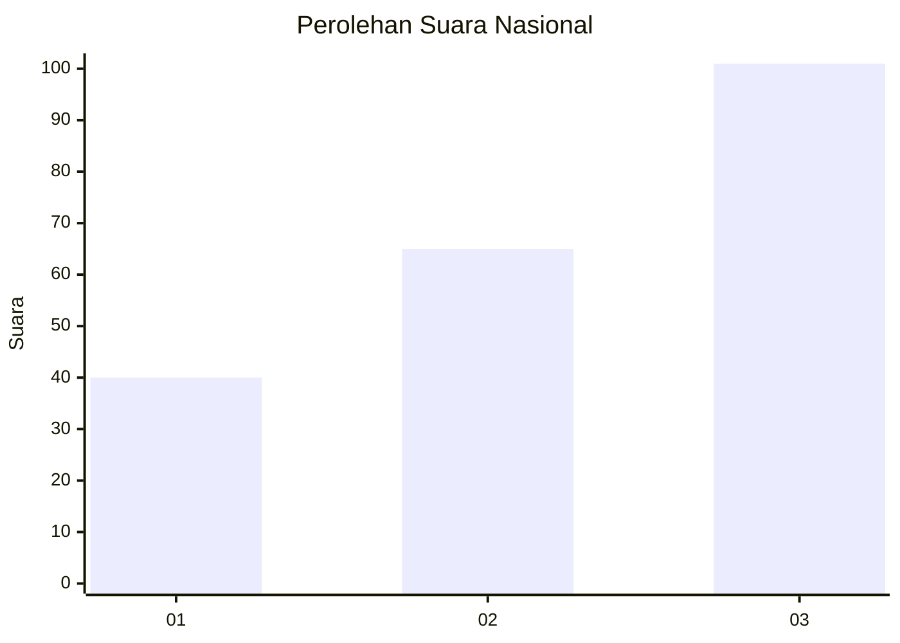
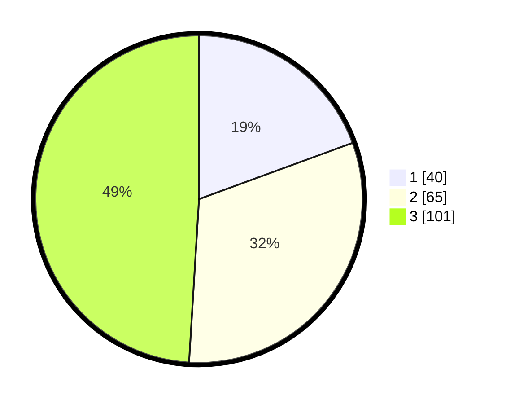

# Hasil

## Grafik

## Tabel

| No.    | Nama Paslon    | Suara | Suara (raw) | Persentase |
|:------ |:-------------- | -----:| -----------:| ----------:|
| 100025 | ANIES MUHAIMIN | 40    | [40][p-1]   | 19,42      |
| 100026 | PRABOWO GIBRAN | 65    | [65][p-2]   | 31,55      |
| 100027 | GANJAR MAHFUD  | 101   | [101][p-3]  | 49,03      |

[p-1]: https://github.com/gigit-pemilu/pemilu-2024/blob/main/pilpres/hitung-suara/sub/31-dki-jakarta/sub/73-jakarta-barat/sub/07-pal-merah/sub/1002-slipi/sub/001-tps/sub/paslon-1.txt
[p-2]: https://github.com/gigit-pemilu/pemilu-2024/blob/main/pilpres/hitung-suara/sub/31-dki-jakarta/sub/73-jakarta-barat/sub/07-pal-merah/sub/1002-slipi/sub/001-tps/sub/paslon-2.txt
[p-3]: https://github.com/gigit-pemilu/pemilu-2024/blob/main/pilpres/hitung-suara/sub/31-dki-jakarta/sub/73-jakarta-barat/sub/07-pal-merah/sub/1002-slipi/sub/001-tps/sub/paslon-3.txt

## Foto C Plano

https://sirekap-obj-formc.kpu.go.id/cd2a/pemilu/ppwp/31/73/07/10/02/3173071002001-20240214-210951--3d63a936-e0ea-4ea5-8dbc-f905913c6e17.jpg

https://sirekap-obj-formc.kpu.go.id/cd2a/pemilu/ppwp/31/73/07/10/02/3173071002001-20240214-211100--9a3ad6c5-7dfa-49f6-a3ed-a69fd594c704.jpg

https://sirekap-obj-formc.kpu.go.id/cd2a/pemilu/ppwp/31/73/07/10/02/3173071002001-20240214-211146--b3322c18-3180-4c95-921c-fce0d468004c.jpg

## Metadata

| Key        | Value               |
| ---------- | ------------------- |
| Time Stamp | 2024-02-16 02:00:27 |

