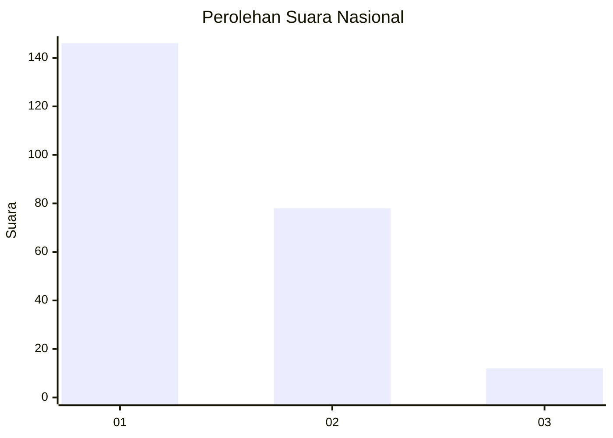
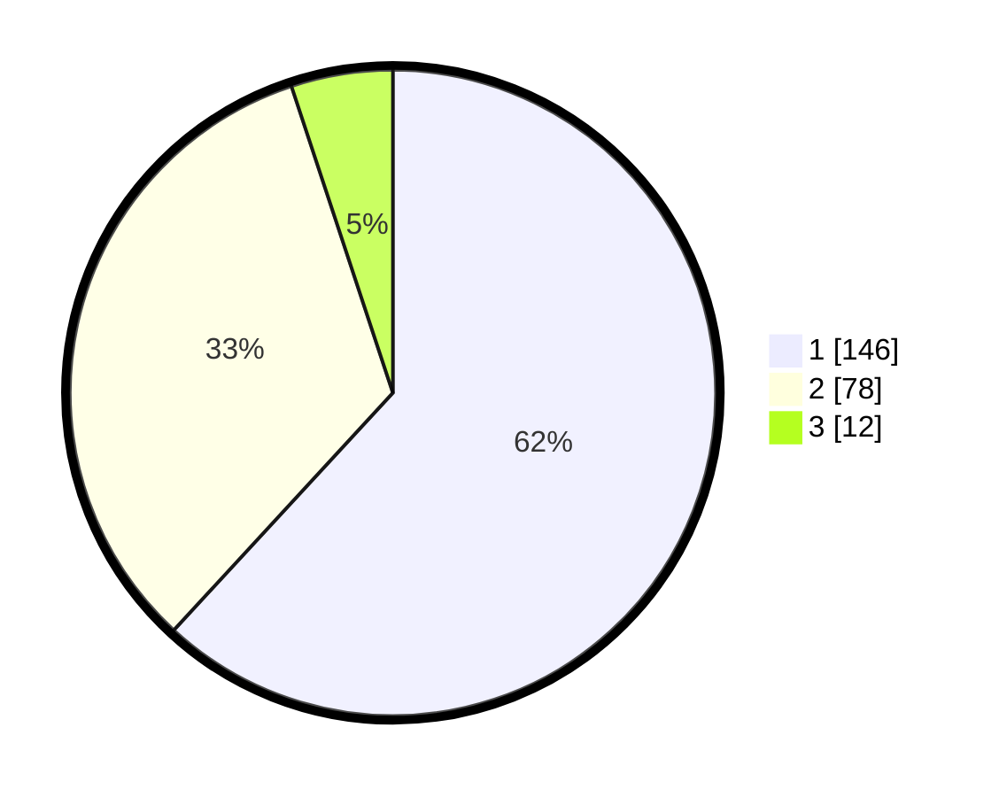

# Hasil

## Grafik

## Tabel

| No.    | Nama Paslon    | Suara | Suara (raw) | Persentase |
|:------ |:-------------- | -----:| -----------:| ----------:|
| 100025 | ANIES MUHAIMIN | 146   | [146][p-1]  | 61,86      |
| 100026 | PRABOWO GIBRAN | 78    | [78][p-2]   | 33,05      |
| 100027 | GANJAR MAHFUD  | 12    | [12][p-3]   | 5,08       |

[p-1]: https://github.com/gigit-pemilu/pemilu-2024/blob/main/pilpres/hitung-suara/sub/31-dki-jakarta/sub/73-jakarta-barat/sub/07-pal-merah/sub/1002-slipi/sub/021-tps/sub/paslon-1.txt
[p-2]: https://github.com/gigit-pemilu/pemilu-2024/blob/main/pilpres/hitung-suara/sub/31-dki-jakarta/sub/73-jakarta-barat/sub/07-pal-merah/sub/1002-slipi/sub/021-tps/sub/paslon-2.txt
[p-3]: https://github.com/gigit-pemilu/pemilu-2024/blob/main/pilpres/hitung-suara/sub/31-dki-jakarta/sub/73-jakarta-barat/sub/07-pal-merah/sub/1002-slipi/sub/021-tps/sub/paslon-3.txt

## Foto C Plano

https://sirekap-obj-formc.kpu.go.id/6a6c/pemilu/ppwp/31/73/07/10/02/3173071002021-20240214-193636--44c79392-4a81-4e51-8c9b-572af0cb5022.jpg

https://sirekap-obj-formc.kpu.go.id/6a6c/pemilu/ppwp/31/73/07/10/02/3173071002021-20240214-193642--de14d888-3d19-4806-b8dd-74d226c8eb3b.jpg

https://sirekap-obj-formc.kpu.go.id/6a6c/pemilu/ppwp/31/73/07/10/02/3173071002021-20240214-193643--cc5ad2d3-ec92-4364-90bc-a193f44e5124.jpg

## Metadata

| Key        | Value               |
| ---------- | ------------------- |
| Time Stamp | 2024-02-19 06:16:00 |

