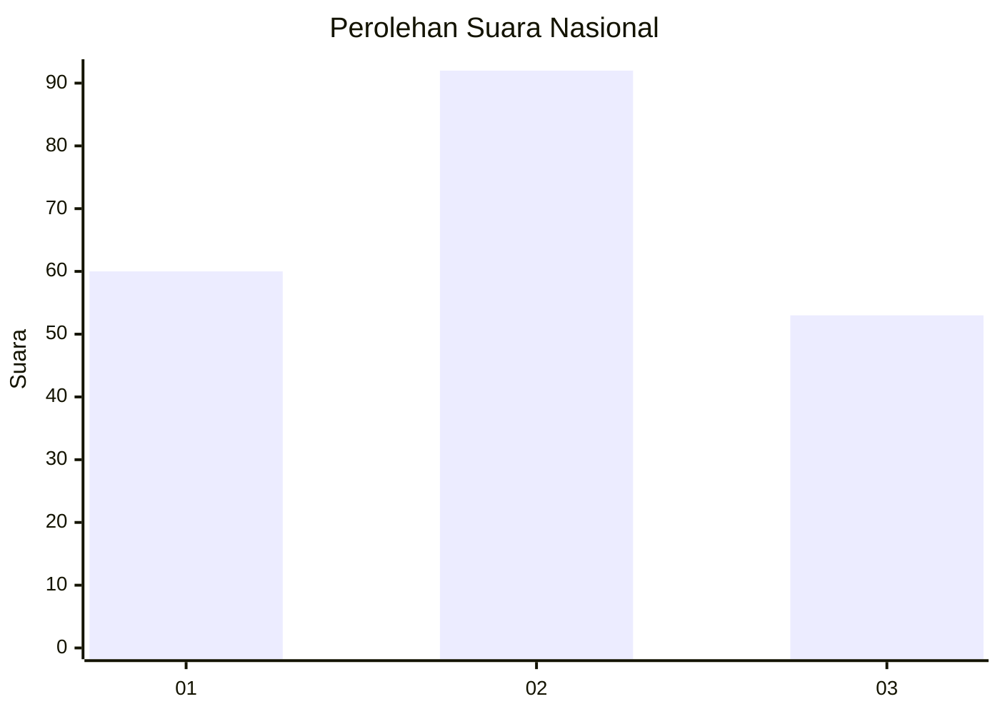
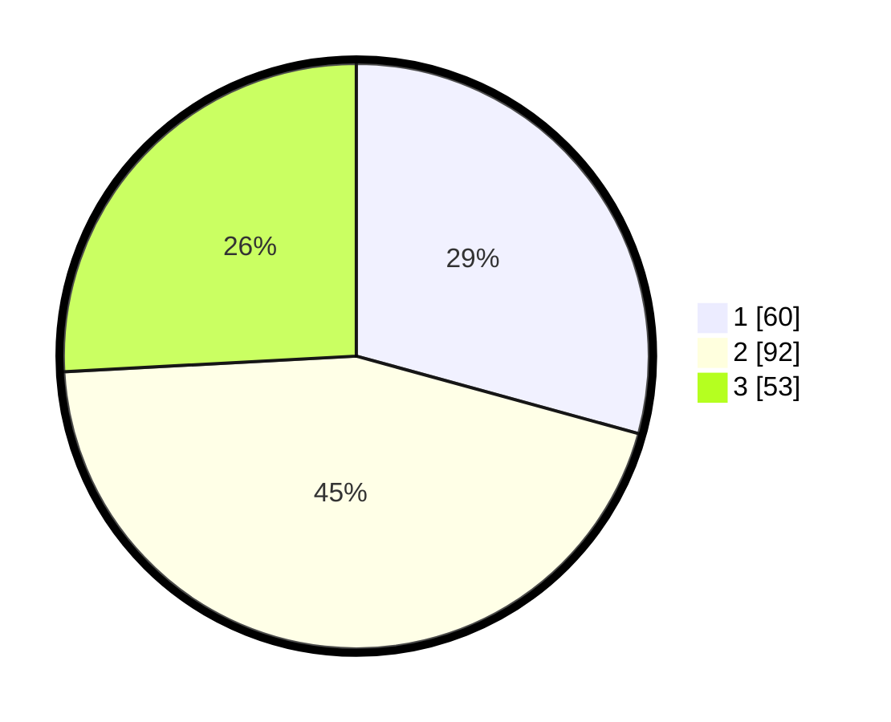

# Hasil

## Grafik

## Tabel

| No.    | Nama Paslon    | Suara | Suara (raw) | Persentase |
|:------ |:-------------- | -----:| -----------:| ----------:|
| 100025 | ANIES MUHAIMIN | 60    | [60][p-1]   | 29,27      |
| 100026 | PRABOWO GIBRAN | 92    | [92][p-2]   | 44,88      |
| 100027 | GANJAR MAHFUD  | 53    | [53][p-3]   | 25,85      |

[p-1]: https://github.com/gigit-pemilu/pemilu-2024/blob/main/pilpres/hitung-suara/sub/31-dki-jakarta/sub/73-jakarta-barat/sub/07-pal-merah/sub/1002-slipi/sub/043-tps/sub/paslon-1.txt
[p-2]: https://github.com/gigit-pemilu/pemilu-2024/blob/main/pilpres/hitung-suara/sub/31-dki-jakarta/sub/73-jakarta-barat/sub/07-pal-merah/sub/1002-slipi/sub/043-tps/sub/paslon-2.txt
[p-3]: https://github.com/gigit-pemilu/pemilu-2024/blob/main/pilpres/hitung-suara/sub/31-dki-jakarta/sub/73-jakarta-barat/sub/07-pal-merah/sub/1002-slipi/sub/043-tps/sub/paslon-3.txt

## Foto C Plano

https://sirekap-obj-formc.kpu.go.id/2955/pemilu/ppwp/31/73/07/10/02/3173071002043-20240214-213002--fbeab5a0-61f2-4698-8fd1-441a7b8b999e.jpg

https://sirekap-obj-formc.kpu.go.id/2955/pemilu/ppwp/31/73/07/10/02/3173071002043-20240214-212820--290fb3d3-af71-48ab-8ca0-98b0e46f1393.jpg

https://sirekap-obj-formc.kpu.go.id/2955/pemilu/ppwp/31/73/07/10/02/3173071002043-20240214-212606--39d9092c-4dbc-4b54-855c-3b311704ec38.jpg

## Metadata

| Key        | Value               |
| ---------- | ------------------- |
| Time Stamp | 2024-02-21 18:00:00 |

