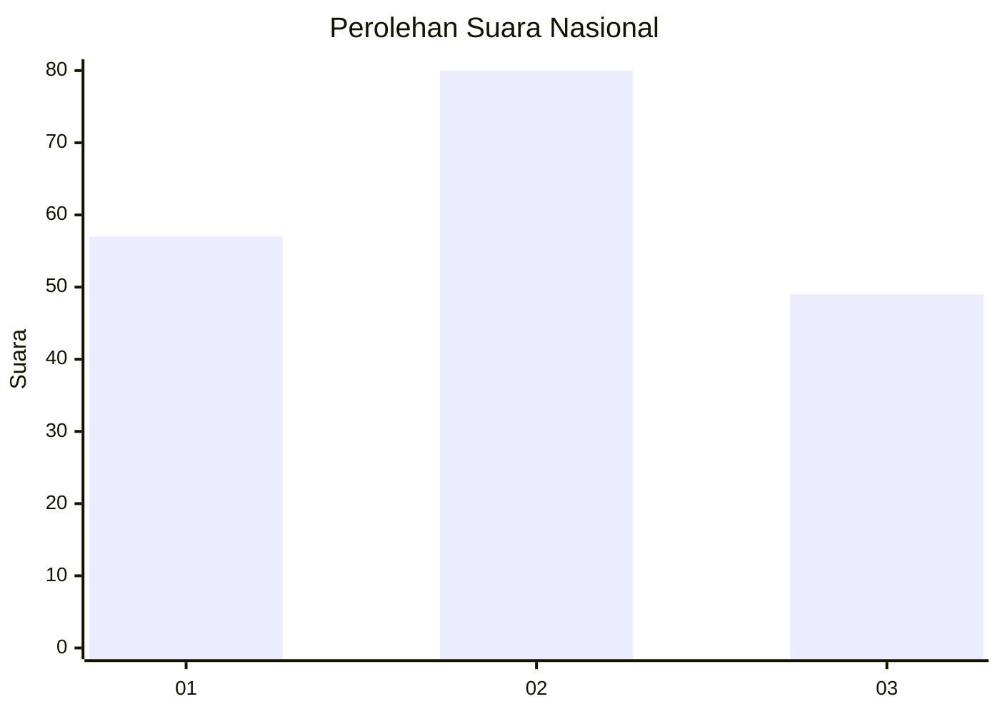
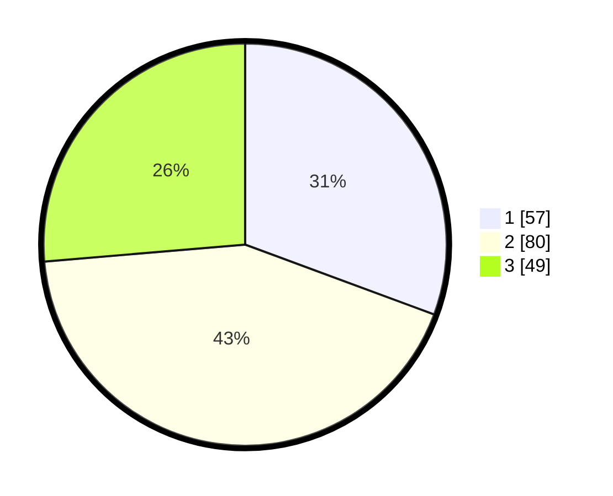

# Hasil

## Grafik

## Tabel

| No.    | Nama Paslon    | Suara | Suara (raw) | Persentase |
|:------ |:-------------- | -----:| -----------:| ----------:|
| 100025 | ANIES MUHAIMIN | 57    | [57][p-1]   | 30,65      |
| 100026 | PRABOWO GIBRAN | 80    | [80][p-2]   | 43,01      |
| 100027 | GANJAR MAHFUD  | 49    | [49][p-3]   | 26,34      |

[p-1]: https://github.com/gigit-pemilu/pemilu-2024/blob/main/pilpres/hitung-suara/sub/31-dki-jakarta/sub/73-jakarta-barat/sub/07-pal-merah/sub/1002-slipi/sub/050-tps/sub/paslon-1.txt
[p-2]: https://github.com/gigit-pemilu/pemilu-2024/blob/main/pilpres/hitung-suara/sub/31-dki-jakarta/sub/73-jakarta-barat/sub/07-pal-merah/sub/1002-slipi/sub/050-tps/sub/paslon-2.txt
[p-3]: https://github.com/gigit-pemilu/pemilu-2024/blob/main/pilpres/hitung-suara/sub/31-dki-jakarta/sub/73-jakarta-barat/sub/07-pal-merah/sub/1002-slipi/sub/050-tps/sub/paslon-3.txt

## Foto C Plano

https://sirekap-obj-formc.kpu.go.id/0b68/pemilu/ppwp/31/73/07/10/02/3173071002050-20240214-225453--ff30c0df-1c9b-46e1-b338-fd6cf6d26d3e.jpg

https://sirekap-obj-formc.kpu.go.id/0b68/pemilu/ppwp/31/73/07/10/02/3173071002050-20240214-225603--9571a86e-a78b-4c85-816e-70a36c99f2f1.jpg

https://sirekap-obj-formc.kpu.go.id/0b68/pemilu/ppwp/31/73/07/10/02/3173071002050-20240214-225701--403df667-75ae-454d-a13e-60d305cd1f5c.jpg

## Metadata

| Key        | Value               |
| ---------- | ------------------- |
| Time Stamp | 2024-02-16 02:00:27 |

