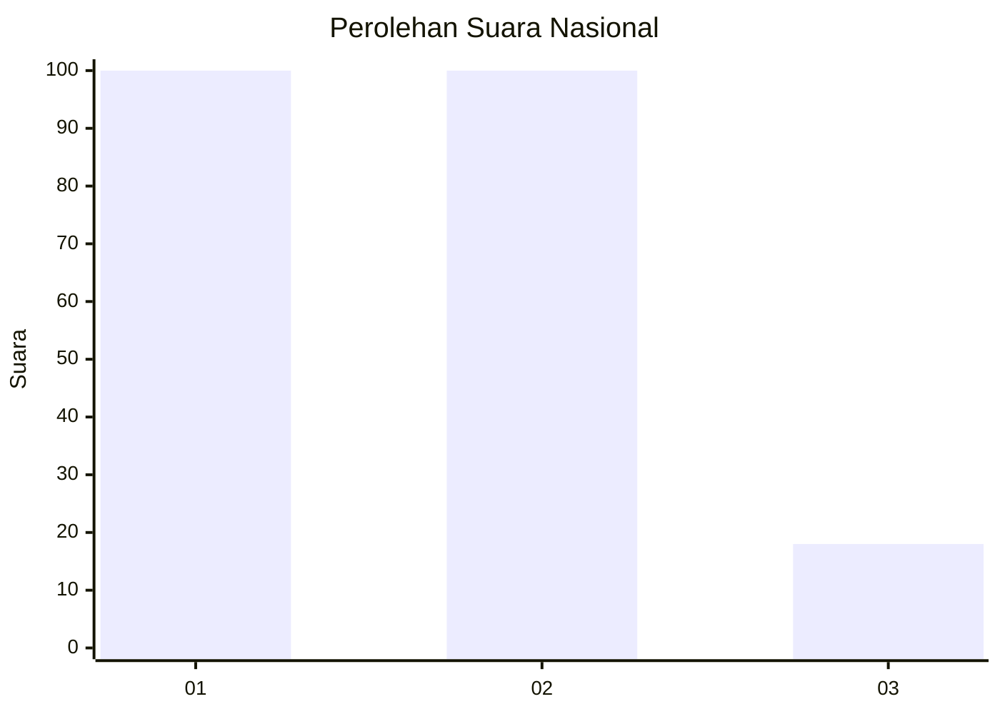
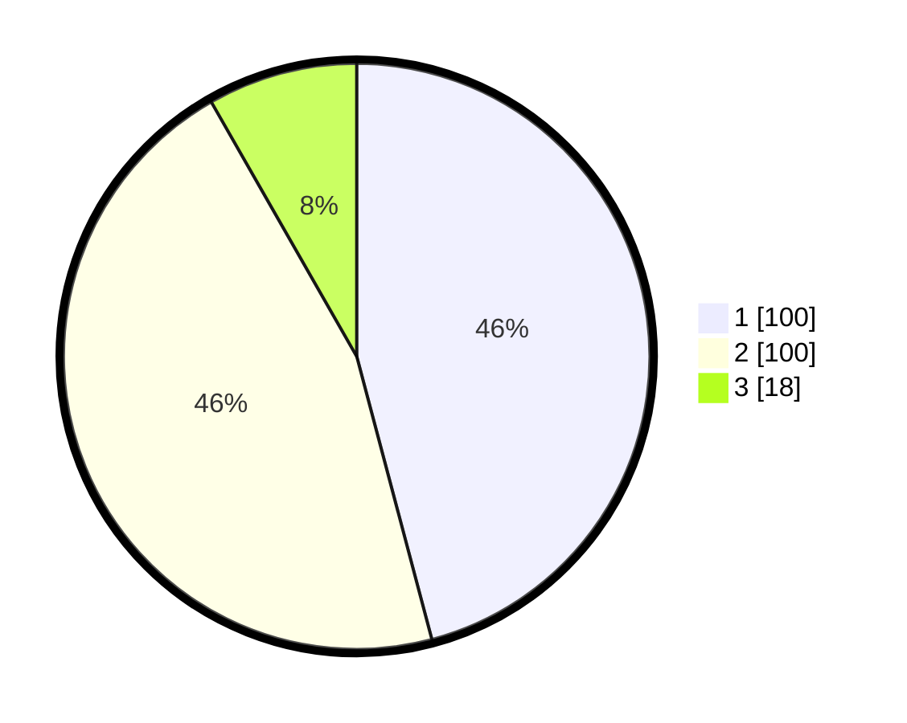

# Hasil

## Grafik

## Tabel

| No.    | Nama Paslon    | Suara | Suara (raw) | Persentase |
|:------ |:-------------- | -----:| -----------:| ----------:|
| 100025 | ANIES MUHAIMIN | 100   | [100][p-1]  | 45,87      |
| 100026 | PRABOWO GIBRAN | 100   | [100][p-2]  | 45,87      |
| 100027 | GANJAR MAHFUD  | 18    | [18][p-3]   | 8,26       |

[p-1]: https://github.com/gigit-pemilu/pemilu-2024/blob/main/pilpres/hitung-suara/sub/31-dki-jakarta/sub/73-jakarta-barat/sub/07-pal-merah/sub/1003-kota-bambu-utara/sub/002-tps/sub/paslon-1.txt
[p-2]: https://github.com/gigit-pemilu/pemilu-2024/blob/main/pilpres/hitung-suara/sub/31-dki-jakarta/sub/73-jakarta-barat/sub/07-pal-merah/sub/1003-kota-bambu-utara/sub/002-tps/sub/paslon-2.txt
[p-3]: https://github.com/gigit-pemilu/pemilu-2024/blob/main/pilpres/hitung-suara/sub/31-dki-jakarta/sub/73-jakarta-barat/sub/07-pal-merah/sub/1003-kota-bambu-utara/sub/002-tps/sub/paslon-3.txt

## Foto C Plano

https://sirekap-obj-formc.kpu.go.id/d667/pemilu/ppwp/31/73/07/10/03/3173071003002-20240215-000310--388c6196-098f-4225-9222-6e6d8ad5d6e9.jpg

https://sirekap-obj-formc.kpu.go.id/d667/pemilu/ppwp/31/73/07/10/03/3173071003002-20240215-000506--c0d130ca-356a-4036-b650-fd541885c3bf.jpg

https://sirekap-obj-formc.kpu.go.id/d667/pemilu/ppwp/31/73/07/10/03/3173071003002-20240215-000623--e5f337e3-d622-4af9-a3e3-767d13c77c57.jpg

## Metadata

| Key        | Value               |
| ---------- | ------------------- |
| Time Stamp | 2024-02-16 16:25:10 |

