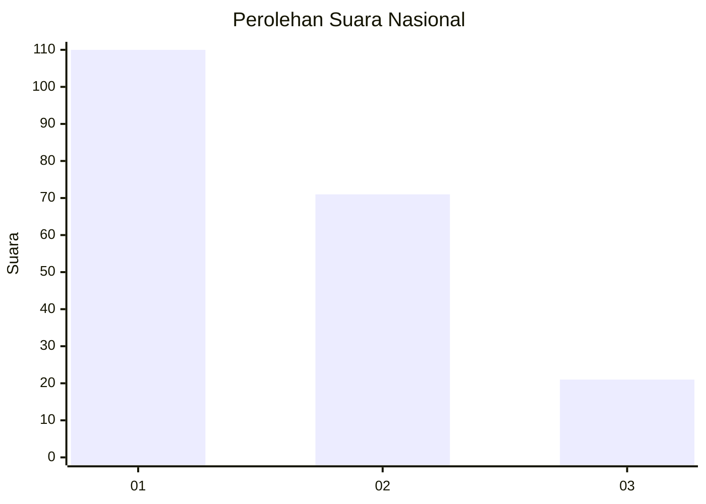
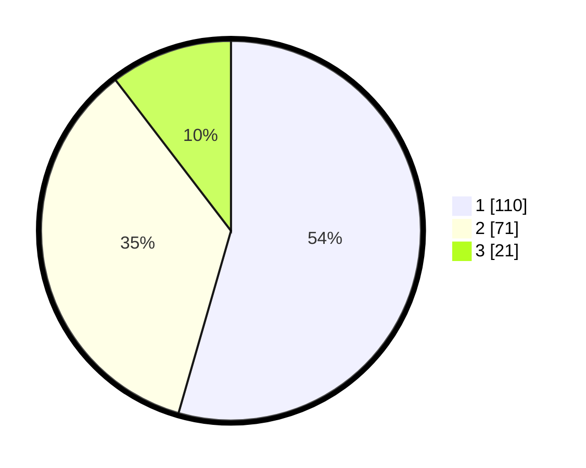

# Hasil

## Grafik

## Tabel

| No.    | Nama Paslon    | Suara | Suara (raw) | Persentase |
|:------ |:-------------- | -----:| -----------:| ----------:|
| 100025 | ANIES MUHAIMIN | 110   | [110][p-1]  | 54,46      |
| 100026 | PRABOWO GIBRAN | 71    | [71][p-2]   | 35,15      |
| 100027 | GANJAR MAHFUD  | 21    | [21][p-3]   | 10,40      |

[p-1]: https://github.com/gigit-pemilu/pemilu-2024/blob/main/pilpres/hitung-suara/sub/31-dki-jakarta/sub/73-jakarta-barat/sub/07-pal-merah/sub/1003-kota-bambu-utara/sub/009-tps/sub/paslon-1.txt
[p-2]: https://github.com/gigit-pemilu/pemilu-2024/blob/main/pilpres/hitung-suara/sub/31-dki-jakarta/sub/73-jakarta-barat/sub/07-pal-merah/sub/1003-kota-bambu-utara/sub/009-tps/sub/paslon-2.txt
[p-3]: https://github.com/gigit-pemilu/pemilu-2024/blob/main/pilpres/hitung-suara/sub/31-dki-jakarta/sub/73-jakarta-barat/sub/07-pal-merah/sub/1003-kota-bambu-utara/sub/009-tps/sub/paslon-3.txt

## Foto C Plano

https://sirekap-obj-formc.kpu.go.id/de1f/pemilu/ppwp/31/73/07/10/03/3173071003009-20240215-004240--786ec464-2c08-42bf-9e97-86581420f4e4.jpg

https://sirekap-obj-formc.kpu.go.id/de1f/pemilu/ppwp/31/73/07/10/03/3173071003009-20240215-004423--288c50b7-c0e3-4986-a109-f6464f656f8e.jpg

https://sirekap-obj-formc.kpu.go.id/de1f/pemilu/ppwp/31/73/07/10/03/3173071003009-20240215-004637--74ea836b-cb8a-43f6-8fc5-2732338b4de7.jpg

## Metadata

| Key        | Value               |
| ---------- | ------------------- |
| Time Stamp | 2024-02-16 16:25:10 |

