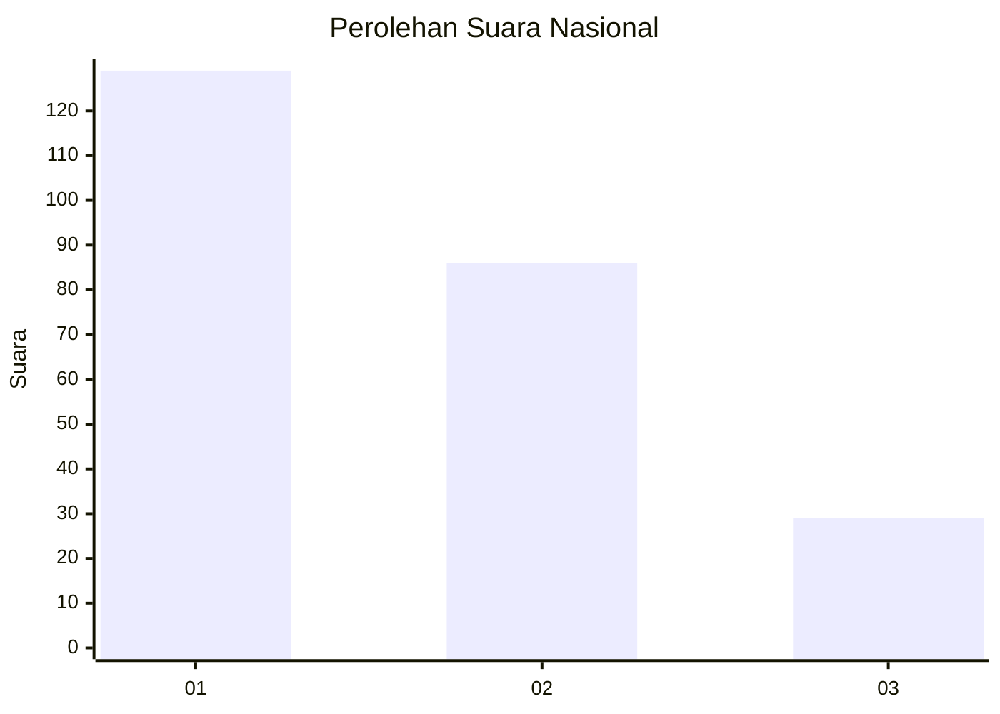
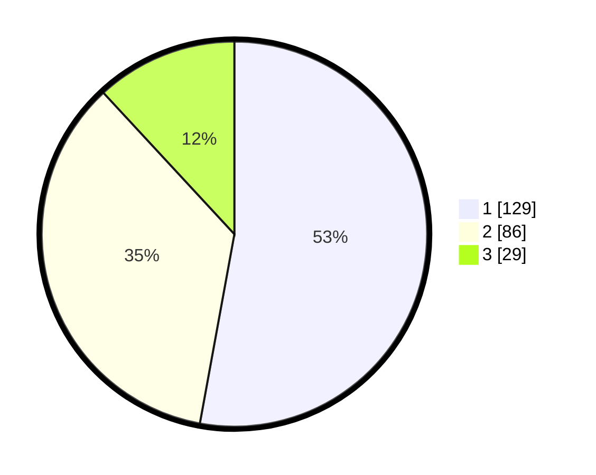

# Hasil

## Grafik

## Tabel

| No.    | Nama Paslon    | Suara | Suara (raw) | Persentase |
|:------ |:-------------- | -----:| -----------:| ----------:|
| 100025 | ANIES MUHAIMIN | 129   | [129][p-1]  | 52,87      |
| 100026 | PRABOWO GIBRAN | 86    | [86][p-2]   | 35,25      |
| 100027 | GANJAR MAHFUD  | 29    | [29][p-3]   | 11,89      |

[p-1]: https://github.com/gigit-pemilu/pemilu-2024/blob/main/pilpres/hitung-suara/sub/31-dki-jakarta/sub/73-jakarta-barat/sub/07-pal-merah/sub/1003-kota-bambu-utara/sub/018-tps/sub/paslon-1.txt
[p-2]: https://github.com/gigit-pemilu/pemilu-2024/blob/main/pilpres/hitung-suara/sub/31-dki-jakarta/sub/73-jakarta-barat/sub/07-pal-merah/sub/1003-kota-bambu-utara/sub/018-tps/sub/paslon-2.txt
[p-3]: https://github.com/gigit-pemilu/pemilu-2024/blob/main/pilpres/hitung-suara/sub/31-dki-jakarta/sub/73-jakarta-barat/sub/07-pal-merah/sub/1003-kota-bambu-utara/sub/018-tps/sub/paslon-3.txt

## Foto C Plano

https://sirekap-obj-formc.kpu.go.id/aab6/pemilu/ppwp/31/73/07/10/03/3173071003018-20240214-225716--d64aaee4-f304-4a3d-84d4-6ff4b645efaf.jpg

https://sirekap-obj-formc.kpu.go.id/aab6/pemilu/ppwp/31/73/07/10/03/3173071003018-20240214-225349--1503576e-c09a-4e2d-8216-1f29b11d002b.jpg

https://sirekap-obj-formc.kpu.go.id/aab6/pemilu/ppwp/31/73/07/10/03/3173071003018-20240214-230229--a1893872-568d-4846-a311-d5f3f172344a.jpg

## Metadata

| Key        | Value               |
| ---------- | ------------------- |
| Time Stamp | 2024-02-19 15:00:00 |

