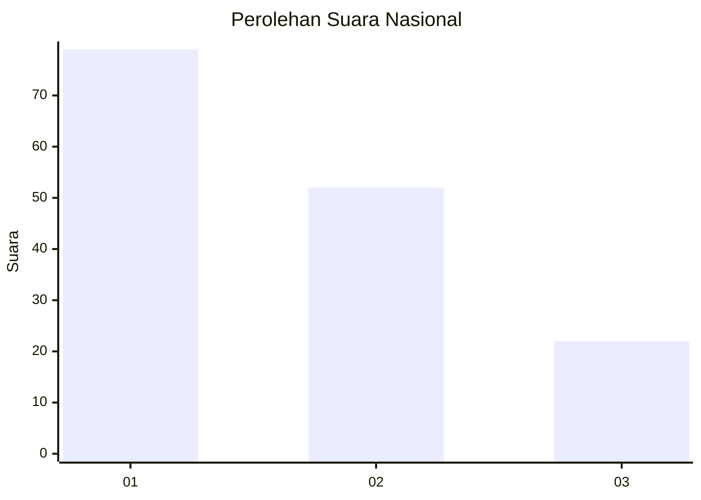
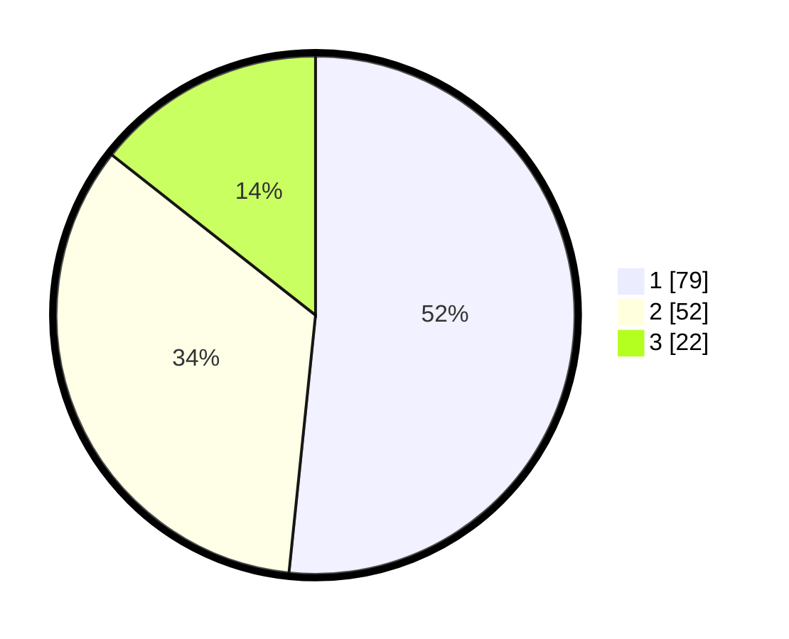

# Hasil

## Grafik

## Tabel

| No.    | Nama Paslon    | Suara | Suara (raw) | Persentase |
|:------ |:-------------- | -----:| -----------:| ----------:|
| 100025 | ANIES MUHAIMIN | 79    | [79][p-1]   | 51,63      |
| 100026 | PRABOWO GIBRAN | 52    | [52][p-2]   | 33,99      |
| 100027 | GANJAR MAHFUD  | 22    | [22][p-3]   | 14,38      |

[p-1]: https://github.com/gigit-pemilu/pemilu-2024/blob/main/pilpres/hitung-suara/sub/31-dki-jakarta/sub/73-jakarta-barat/sub/07-pal-merah/sub/1003-kota-bambu-utara/sub/029-tps/sub/paslon-1.txt
[p-2]: https://github.com/gigit-pemilu/pemilu-2024/blob/main/pilpres/hitung-suara/sub/31-dki-jakarta/sub/73-jakarta-barat/sub/07-pal-merah/sub/1003-kota-bambu-utara/sub/029-tps/sub/paslon-2.txt
[p-3]: https://github.com/gigit-pemilu/pemilu-2024/blob/main/pilpres/hitung-suara/sub/31-dki-jakarta/sub/73-jakarta-barat/sub/07-pal-merah/sub/1003-kota-bambu-utara/sub/029-tps/sub/paslon-3.txt

## Foto C Plano

https://sirekap-obj-formc.kpu.go.id/e7eb/pemilu/ppwp/31/73/07/10/03/3173071003029-20240215-000214--6be20f1e-10bb-4acc-92d1-08e8817e4e6d.jpg

https://sirekap-obj-formc.kpu.go.id/e7eb/pemilu/ppwp/31/73/07/10/03/3173071003029-20240215-000257--d68b9fdc-20ac-4681-a93c-a6b4b4ccd107.jpg

https://sirekap-obj-formc.kpu.go.id/e7eb/pemilu/ppwp/31/73/07/10/03/3173071003029-20240215-000335--83294620-8094-4054-8c1f-64e36e07d135.jpg

## Metadata

| Key        | Value               |
| ---------- | ------------------- |
| Time Stamp | 2024-02-19 15:00:00 |

