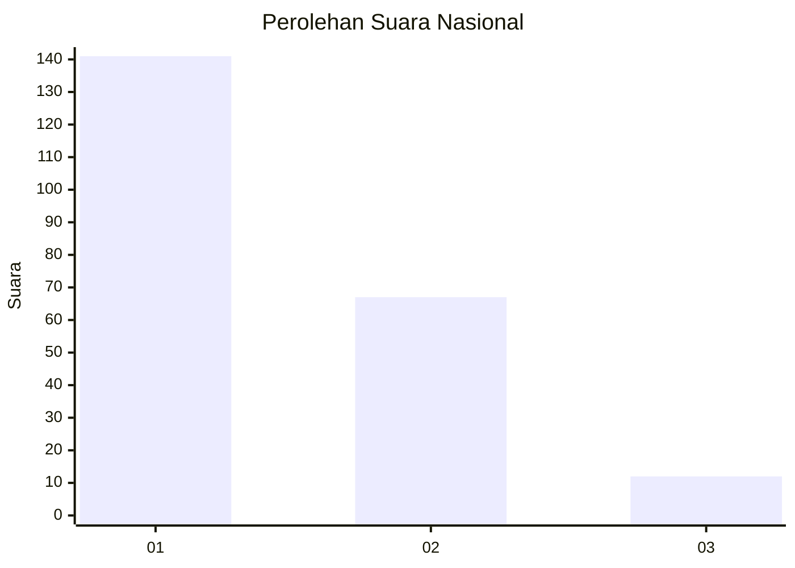
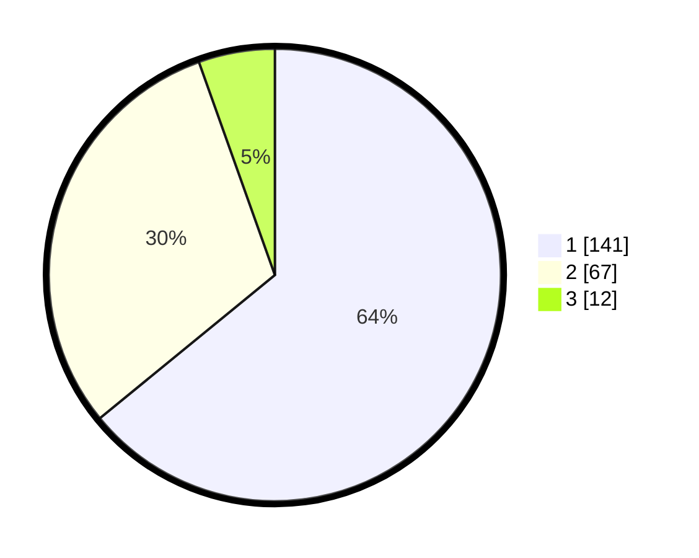

# Hasil

## Grafik

## Tabel

| No.    | Nama Paslon    | Suara | Suara (raw) | Persentase |
|:------ |:-------------- | -----:| -----------:| ----------:|
| 100025 | ANIES MUHAIMIN | 141   | [141][p-1]  | 64,09      |
| 100026 | PRABOWO GIBRAN | 67    | [67][p-2]   | 30,45      |
| 100027 | GANJAR MAHFUD  | 12    | [12][p-3]   | 5,45       |

[p-1]: https://github.com/gigit-pemilu/pemilu-2024/blob/main/pilpres/hitung-suara/sub/31-dki-jakarta/sub/73-jakarta-barat/sub/07-pal-merah/sub/1003-kota-bambu-utara/sub/033-tps/sub/paslon-1.txt
[p-2]: https://github.com/gigit-pemilu/pemilu-2024/blob/main/pilpres/hitung-suara/sub/31-dki-jakarta/sub/73-jakarta-barat/sub/07-pal-merah/sub/1003-kota-bambu-utara/sub/033-tps/sub/paslon-2.txt
[p-3]: https://github.com/gigit-pemilu/pemilu-2024/blob/main/pilpres/hitung-suara/sub/31-dki-jakarta/sub/73-jakarta-barat/sub/07-pal-merah/sub/1003-kota-bambu-utara/sub/033-tps/sub/paslon-3.txt

## Foto C Plano

https://sirekap-obj-formc.kpu.go.id/9a77/pemilu/ppwp/31/73/07/10/03/3173071003033-20240215-023651--28333f9b-d26d-4f67-bbc8-40ea4a482077.jpg

https://sirekap-obj-formc.kpu.go.id/9a77/pemilu/ppwp/31/73/07/10/03/3173071003033-20240215-023941--783e3ea7-a982-43f7-9fcf-c0a6f2445cc8.jpg

https://sirekap-obj-formc.kpu.go.id/9a77/pemilu/ppwp/31/73/07/10/03/3173071003033-20240215-052715--b928f541-e089-4f7b-94f9-f9c84612a0c7.jpg

## Metadata

| Key        | Value               |
| ---------- | ------------------- |
| Time Stamp | 2024-02-19 15:00:00 |

