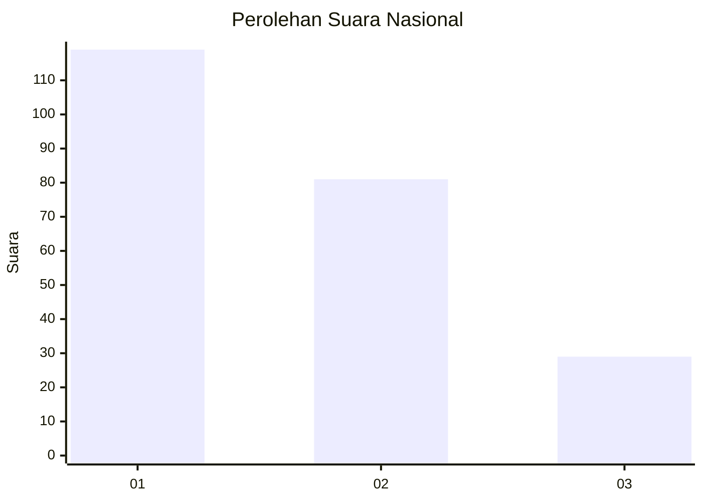
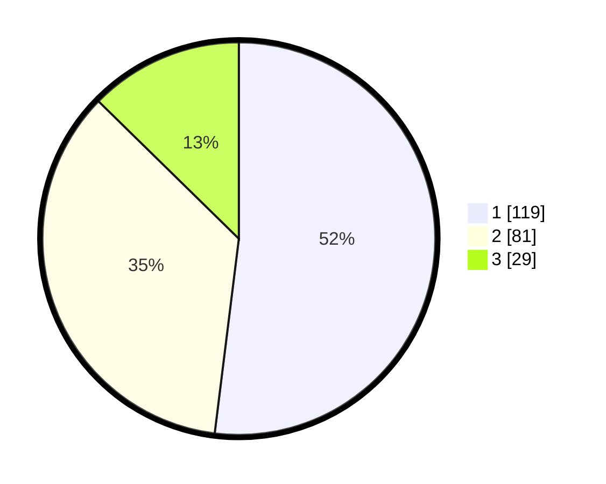

# Hasil

## Grafik

## Tabel

| No.    | Nama Paslon    | Suara | Suara (raw) | Persentase |
|:------ |:-------------- | -----:| -----------:| ----------:|
| 100025 | ANIES MUHAIMIN | 119   | [119][p-1]  | 51,97      |
| 100026 | PRABOWO GIBRAN | 81    | [81][p-2]   | 35,37      |
| 100027 | GANJAR MAHFUD  | 29    | [29][p-3]   | 12,66      |

[p-1]: https://github.com/gigit-pemilu/pemilu-2024/blob/main/pilpres/hitung-suara/sub/31-dki-jakarta/sub/73-jakarta-barat/sub/07-pal-merah/sub/1003-kota-bambu-utara/sub/038-tps/sub/paslon-1.txt
[p-2]: https://github.com/gigit-pemilu/pemilu-2024/blob/main/pilpres/hitung-suara/sub/31-dki-jakarta/sub/73-jakarta-barat/sub/07-pal-merah/sub/1003-kota-bambu-utara/sub/038-tps/sub/paslon-2.txt
[p-3]: https://github.com/gigit-pemilu/pemilu-2024/blob/main/pilpres/hitung-suara/sub/31-dki-jakarta/sub/73-jakarta-barat/sub/07-pal-merah/sub/1003-kota-bambu-utara/sub/038-tps/sub/paslon-3.txt

## Foto C Plano

https://sirekap-obj-formc.kpu.go.id/22da/pemilu/ppwp/31/73/07/10/03/3173071003038-20240214-210336--0b992ef3-5a93-4570-a843-c35d5aed2493.jpg

https://sirekap-obj-formc.kpu.go.id/22da/pemilu/ppwp/31/73/07/10/03/3173071003038-20240214-231311--9e222087-a939-47a7-ab2f-38591742d8f1.jpg

https://sirekap-obj-formc.kpu.go.id/22da/pemilu/ppwp/31/73/07/10/03/3173071003038-20240214-231354--ce9685c2-359f-4383-bc4b-376470ace213.jpg

## Metadata

| Key        | Value               |
| ---------- | ------------------- |
| Time Stamp | 2024-02-19 16:00:00 |

