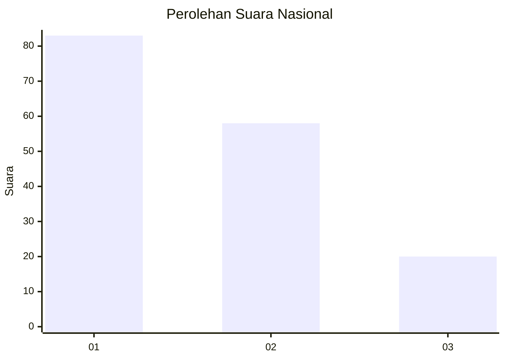
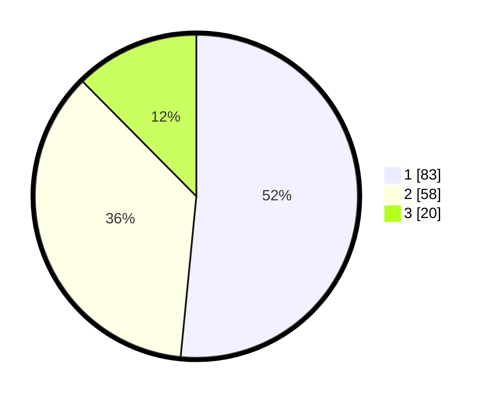

# Hasil

## Grafik

## Tabel

| No.    | Nama Paslon    | Suara | Suara (raw) | Persentase |
|:------ |:-------------- | -----:| -----------:| ----------:|
| 100025 | ANIES MUHAIMIN | 83    | [83][p-1]   | 51,55      |
| 100026 | PRABOWO GIBRAN | 58    | [58][p-2]   | 36,02      |
| 100027 | GANJAR MAHFUD  | 20    | [20][p-3]   | 12,42      |

[p-1]: https://github.com/gigit-pemilu/pemilu-2024/blob/main/pilpres/hitung-suara/sub/31-dki-jakarta/sub/73-jakarta-barat/sub/07-pal-merah/sub/1003-kota-bambu-utara/sub/041-tps/sub/paslon-1.txt
[p-2]: https://github.com/gigit-pemilu/pemilu-2024/blob/main/pilpres/hitung-suara/sub/31-dki-jakarta/sub/73-jakarta-barat/sub/07-pal-merah/sub/1003-kota-bambu-utara/sub/041-tps/sub/paslon-2.txt
[p-3]: https://github.com/gigit-pemilu/pemilu-2024/blob/main/pilpres/hitung-suara/sub/31-dki-jakarta/sub/73-jakarta-barat/sub/07-pal-merah/sub/1003-kota-bambu-utara/sub/041-tps/sub/paslon-3.txt

## Foto C Plano

https://sirekap-obj-formc.kpu.go.id/c1cf/pemilu/ppwp/31/73/07/10/03/3173071003041-20240214-213426--78bee723-e6b9-4867-a830-9b7c162287b7.jpg

https://sirekap-obj-formc.kpu.go.id/c1cf/pemilu/ppwp/31/73/07/10/03/3173071003041-20240214-213503--29dd4a4d-cc38-4795-979a-bd545481d40e.jpg

https://sirekap-obj-formc.kpu.go.id/c1cf/pemilu/ppwp/31/73/07/10/03/3173071003041-20240214-213604--b62a04a5-fd22-4115-b944-c70e746a484d.jpg

## Metadata

| Key        | Value               |
| ---------- | ------------------- |
| Time Stamp | 2024-02-19 15:00:00 |

