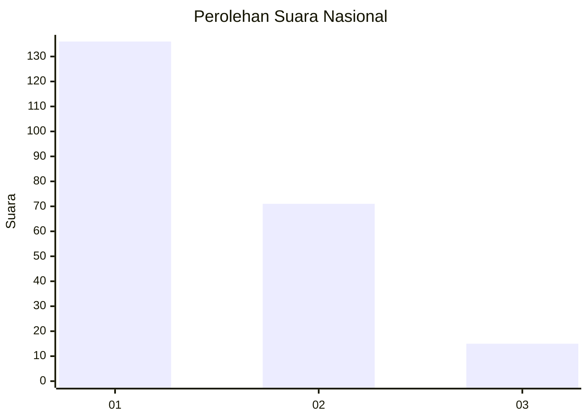
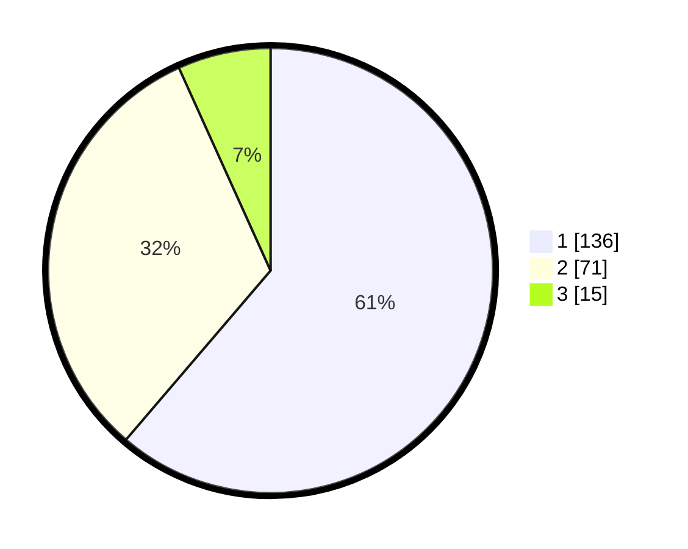

# Hasil

## Grafik

## Tabel

| No.    | Nama Paslon    | Suara | Suara (raw) | Persentase |
|:------ |:-------------- | -----:| -----------:| ----------:|
| 100025 | ANIES MUHAIMIN | 136   | [136][p-1]  | 61,26      |
| 100026 | PRABOWO GIBRAN | 71    | [71][p-2]   | 31,98      |
| 100027 | GANJAR MAHFUD  | 15    | [15][p-3]   | 6,76       |

[p-1]: https://github.com/gigit-pemilu/pemilu-2024/blob/main/pilpres/hitung-suara/sub/31-dki-jakarta/sub/73-jakarta-barat/sub/07-pal-merah/sub/1003-kota-bambu-utara/sub/043-tps/sub/paslon-1.txt
[p-2]: https://github.com/gigit-pemilu/pemilu-2024/blob/main/pilpres/hitung-suara/sub/31-dki-jakarta/sub/73-jakarta-barat/sub/07-pal-merah/sub/1003-kota-bambu-utara/sub/043-tps/sub/paslon-2.txt
[p-3]: https://github.com/gigit-pemilu/pemilu-2024/blob/main/pilpres/hitung-suara/sub/31-dki-jakarta/sub/73-jakarta-barat/sub/07-pal-merah/sub/1003-kota-bambu-utara/sub/043-tps/sub/paslon-3.txt

## Foto C Plano

https://sirekap-obj-formc.kpu.go.id/d283/pemilu/ppwp/31/73/07/10/03/3173071003043-20240214-192645--47beedee-3547-4861-a8ae-369eb5d8a3c6.jpg

https://sirekap-obj-formc.kpu.go.id/d283/pemilu/ppwp/31/73/07/10/03/3173071003043-20240214-234815--588a7ac3-6865-413e-a8cf-70da50c96214.jpg

https://sirekap-obj-formc.kpu.go.id/d283/pemilu/ppwp/31/73/07/10/03/3173071003043-20240214-234833--f530b68e-5e0d-442e-aeb0-ba8839f62816.jpg

## Metadata

| Key        | Value               |
| ---------- | ------------------- |
| Time Stamp | 2024-02-19 15:00:00 |

